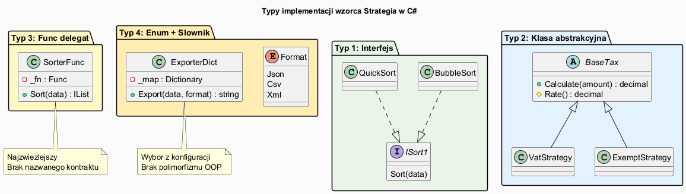
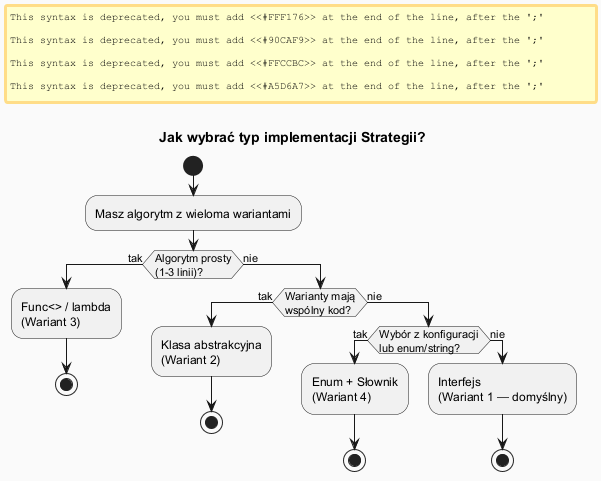

# 04 — Typy Implementacji Wzorca Strategia

## Spis treści

1. [Przegląd typów](#1-przeglad)
2. [Typ 1: Interfejs](#2-typ1)
3. [Typ 2: Klasa abstrakcyjna](#3-typ2)
4. [Typ 3: Delegat / Func<>](#4-typ3)
5. [Typ 4: Enum + Słownik](#5-typ4)
6. [Diagram decyzyjny](#6-diagram)
7. [Uruchamianie](#7-uruchamianie)

---

## 1. Przegląd typów <a name="1-przeglad"></a>



| Typ | Mechanizm | Testowalność | DI | Kiedy |
|-----|-----------|-------------|-----|-------|
| **1. Interfejs** | `interface IStrategy` | ✅ Pełna | ✅ Natywna | Domyślny wybór |
| **2. Klasa abstrakt.** | `abstract class` | ✅ Pełna | ✅ Możliwa | Wspólny kod bazowy |
| **3. Func<>** | `Func<In, Out>` | ⚠️ Inline | ❌ Trudna | Prosta 1-5 linii |
| **4. Enum + Dict** | `Dictionary<Enum, Func>` | ⚠️ Pośrednia | ❌ Trudna | Wybór z konfiguracji |

---

## 2. Typ 1: Interfejs (domyślny) <a name="2-typ1"></a>

```csharp
interface ISortStrategy<T> where T : IComparable<T>
{
    IList<T> Sort(IEnumerable<T> data);
}

class BubbleSortStrategy<T> : ISortStrategy<T> where T : IComparable<T>
{
    public IList<T> Sort(IEnumerable<T> data) { /* ... */ }
}

class Sorter<T>(ISortStrategy<T> strategy) where T : IComparable<T>
{
    public IList<T> Sort(IEnumerable<T> data) => _strategy.Sort(data);
}
```

**Zalety:** Pełny polimorfizm, DI-friendly, testowalny przez mock, IDE podpowiada implementacje.

**Wady:** Każda strategia = osobna klasa.

---

## 3. Typ 2: Klasa abstrakcyjna <a name="3-typ2"></a>

```csharp
abstract class AbstractShippingStrategy
{
    // Wspólna logika w klasie bazowej
    public decimal Calculate(decimal orderValue)
    {
        var cost = ComputeCost(orderValue);
        Log(cost); // wspólne logowanie
        return cost;
    }

    protected abstract decimal ComputeCost(decimal orderValue);
}

class ExpressShipping : AbstractShippingStrategy
{
    protected override decimal ComputeCost(decimal orderValue) => 45m;
}
```

**Zalety:** Kod wspólny w bazie (DRY), Template Method i Strategia razem.

**Wady:** Dziedziczenie — trudniejsza zmiana hierarchii, naruszenie kompozycji.

---

## 4. Typ 3: Delegat / Func<> <a name="4-typ3"></a>

```csharp
class FuncSorter<T>(Func<T[], T[]> strategy)
{
    private Func<T[], T[]> _strategy = strategy;
    public void SetStrategy(Func<T[], T[]> s) => _strategy = s;
    public T[] Sort(T[] data) => _strategy(data);
}

// Użycie bez klas!
var sorter = new FuncSorter<int>(arr => arr.OrderBy(x => x).ToArray());
sorter.SetStrategy(arr => arr.OrderByDescending(x => x).ToArray());
```

**Zalety:** Zwięzłość, brak dodatkowych klas, świetny dla krótkiego algorytmu.

**Wady:** Brak nazwanego kontraktu, trudne mockowanie, brak jawnej dokumentacji.

---

## 5. Typ 4: Enum + Słownik <a name="5-typ4"></a>

```csharp
enum ExportFormat { Json, Csv, Xml }

class ReportService
{
    private readonly Dictionary<ExportFormat, Func<string, string>> _strategies = new()
    {
        [ExportFormat.Json] = data => $"{{\"data\":\"{data}\"}}",
        [ExportFormat.Csv] = data => $"data\n{data}",
        [ExportFormat.Xml] = data => $"<data>{data}</data>",
    };

    public string Export(string data, ExportFormat format)
        => _strategies[format](data);
}
```

**Zalety:** Wybór po enum/string (config, DB), łatwo rozszerzalny przez `RegisterStrategy()`.

**Wady:** Nie jest prawdziwym polimorfizmem, słabszy przez DI.

---

## 6. Diagram decyzyjny <a name="6-diagram"></a>



---

## 7. Uruchamianie <a name="7-uruchamianie"></a>

```bash
cd src/17-strategia/04-typy-implementacji/Examples
dotnet run
```
