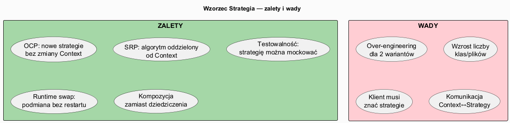
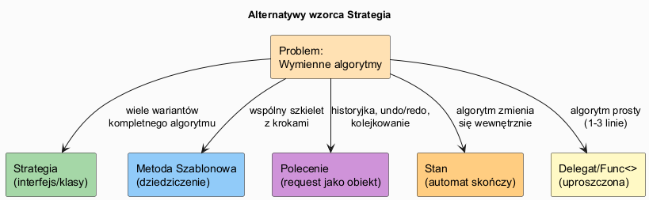

# 05 — Wady i Zalety Wzorca Strategia

## Spis treści

1. [Analiza SOLID](#1-solid)
2. [Szczegółowe zalety](#2-zalety)
3. [Szczegółowe wady](#3-wady)
4. [Kiedy NIE stosować](#4-kiedy-nie)
5. [Alternatywy](#5-alternatywy)
6. [Przewodnik po refaktoryzacji](#6-refaktoryzacja)
7. [Uruchamianie](#7-uruchamianie)

---

## 1. Analiza SOLID <a name="1-solid"></a>

| Zasada | Ocena | Jak Strategia realizuje |
|--------|-------|------------------------|
| **SRP** | ✅ | Context zajmuje się przepływem; strategia — algorytmem |
| **OCP** | ✅✅ | Nowe strategie = nowe klasy, Context niezmieniony |
| **LSP** | ✅ | Każda `ConcreteStrategy` może zastąpić `IStrategy` |
| **ISP** | ✅ | `IStrategy` ma zazwyczaj jedną metodę |
| **DIP** | ✅ | Context zależy od abstrakcji (`IStrategy`), nie od konkretu |

---

## 2. Szczegółowe zalety <a name="2-zalety"></a>



### OCP — Open/Closed Principle

```csharp
// Dodanie nowej strategii nie wymaga modyfikacji PriceCalculator!
class FlashSaleStrategy(decimal percent) : IPricingStrategy
{
    public decimal Apply(decimal price) => price * (1 - percent / 100);
}
// Używamy: calculator.SetStrategy(new FlashSaleStrategy(50));
```

### SRP — Single Responsibility

- `Context` → odpowiada za: przepływ, walidację, logowanie, orkiestrację
- `ConcreteStrategy` → odpowiada TYLKO za: swój algorytm

### Testowalność

```csharp
// Strategia testowalna BEZ Context — szybkie unit testy:
var bubbleSort = new BubbleSortStrategy<int>();
var result = bubbleSort.Sort([3, 1, 2]);
Assert.Equal([1, 2, 3], result);

// Context testowalny z mock strategii:
var mock = new LambdaSortStrategy<int>(data => data); // strategia-stub
var sorter = new LoggingSorter<int>(mock);
```

### Runtime swap

```csharp
// Podmiana algorytmu kompresji bez restartu serwera:
compressor.SetStrategy(config.UseHighCompression
    ? new GzipStrategy()
    : new NoCompressionStrategy());
```

---

## 3. Szczegółowe wady <a name="3-wady"></a>

### Wzrost liczby klas

Problem rośnie gdy mamy wiele Context + wiele Strategii:

```
Navigacja:   CarStrategy, BikeStrategy, WalkStrategy, TransitStrategy
Płatności:   CardStrategy, PayPalStrategy, BankStrategy, BlikStrategy
Rabaty:      NoDiscount, Member10, Member20, Seasonal, FlashSale
Kompresja:   GzipStrategy, ZipStrategy, BzipStrategy, NoCompression
```

*W tym przypadku rozważ Func<> lub enum+słownik.*

### Klient musi znać strategie

```csharp
// Klient nie może być ignorantem — musi wybrać:
new Navigator(new CarStrategy()); // klient zna CarStrategy!

// Mitygacja: fabryka lub IoC
var nav = navigatorFactory.Create("car"); // klient zna tylko string
```

### Komunikacja Context ↔ Strategy

Jeśli strategia potrzebuje wielu danych z Context:

```csharp
// Problematyczne — strategia wie za dużo o Context:
strategy.Execute(ctx.Width, ctx.Height, ctx.Color, ctx.Dpi, ctx.Format);

// Lepiej — przekaż obiekt danych:
strategy.Execute(new RenderContext { Width=..., Height=..., ... });
```

---

## 4. Kiedy NIE stosować <a name="4-kiedy-nie"></a>

```csharp
// ❌ Over-engineering: tylko 2 warianty, nigdy nowych
interface IGreeting { string Greet(string name); }
class FormalGreeting : IGreeting { ... }
class InformalGreeting : IGreeting { ... }

// ✅ Wystarczy:
string Greet(string name, bool formal)
    => formal ? $"Dzień dobry, {name}." : $"Hej, {name}!";
```

**Reguła kciuka:** Zastosuj Strategię gdy:
- Masz **≥ 3 wariantów** algorytmu, LUB
- Algorytm **zmienia się w runtime**, LUB
- Planujesz dodawać nowe warianty w przyszłości

---

## 5. Alternatywy <a name="5-alternatywy"></a>



| Alternatywa | Kiedy zamiast Strategii |
|-------------|------------------------|
| **if/else** | ≤2 warianty, nigdy nie zmieniane |
| **Metoda Szablonowa** | Wspólny szkielet, podklasy wypełniają kroki |
| **Polecenie (Command)** | Potrzebujesz historii, undo/redo, kolejkowania |
| **Stan (State)** | Algorytm zmienia się automatycznie że stanem wewnętrznym |
| **Func<>** | Algorytm 1-5 linii, nie potrzebujesz nazwanego kontraktu |

---

## 6. Przewodnik po refaktoryzacji <a name="6-refaktoryzacja"></a>

Kroki refaktoryzacji **if/switch → Strategia**:

```
1. Zidentyfikuj klasę z "eksplozją if/switch"
2. Wyodrębnij interfejs IStrategy z metodą Execute(...)
3. Dla każdego warunku — stwórz osobną ConcreteStrategy
4. W Context: zastąp if/switch wywołaniem strategy.Execute(...)
5. Dodaj konstruktor/setter przyjmujący IStrategy
6. Klient: utwórz odpowiednią strategię i wstrzyknij
```

---

## 7. Uruchamianie <a name="7-uruchamianie"></a>

```bash
cd src/17-strategia/05-wady-i-zalety/Examples
dotnet run
```
