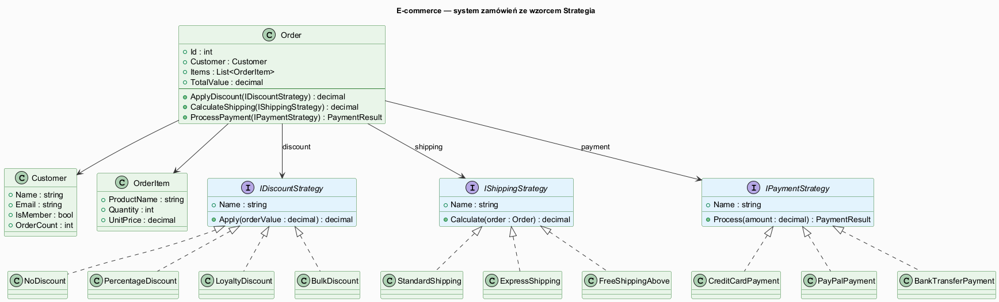
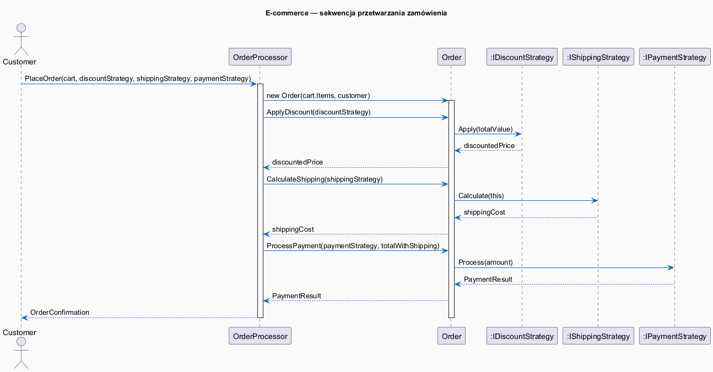

# 06 — Duży Przykład: System Zamówień E-commerce

## Spis treści

1. [Opis przykładu](#1-opis)
2. [Diagram klas](#2-diagram-klas)
3. [Diagram sekwencji](#3-diagram-sekwencji)
4. [Rodziny strategii](#4-strategie)
5. [Scenariusze użycia](#5-scenariusze)
6. [Alternatywy](#6-alternatywy)
7. [Testy](#7-testy)
8. [Uruchamianie](#8-uruchamianie)

---

## 1. Opis przykładu <a name="1-opis"></a>

System przetwarzania zamówień e-commerce z trzema niezależnymi rodzinami strategii:

| Rodzina | Interfejs | Implementacje |
|---------|-----------|---------------|
| Rabaty | `IDiscountStrategy` | `NoDiscount`, `PercentageDiscount`, `LoyaltyDiscount`, `BulkDiscount` |
| Wysyłka | `IShippingStrategy` | `StandardShipping`, `ExpressShipping`, `FreeShippingAbove` |
| Płatność | `IPaymentStrategy` | `CreditCardPayment`, `PayPalPayment`, `BankTransferPayment` |

**Context**: `OrderProcessor` — przyjmuje każdą kombinację strategii, umożliwia podmianę w runtime.

---

## 2. Diagram klas <a name="2-diagram-klas"></a>



---

## 3. Diagram sekwencji <a name="3-diagram-sekwencji"></a>



---

## 4. Rodziny strategii <a name="4-strategie"></a>

### IDiscountStrategy

```csharp
interface IDiscountStrategy
{
    string Name { get; }
    decimal Apply(decimal orderValue);
}

// Przykłady:
new NoDiscount()                         // 0% rabatu
new PercentageDiscount(10)               // -10%
new LoyaltyDiscount(orderCount: 15)      // skalowany (5-20%)
new BulkDiscount(minItems: 5, percent: 15) // hurtowy -15%
```

### IShippingStrategy

```csharp
interface IShippingStrategy
{
    string Name { get; }
    decimal Calculate(Order order);      // Order jako parametr — dostęp do wartości
}

new StandardShipping()                   // zawsze 15 PLN
new ExpressShipping()                    // zawsze 35 PLN
new FreeShippingAbove(threshold: 500m)   // 0 PLN gdy wartość >= 500
```

### IPaymentStrategy

```csharp
interface IPaymentStrategy
{
    string Name { get; }
    PaymentResult Process(decimal amount);
}

new CreditCardPayment("4111-****")
new PayPalPayment("user@example.com")
new BankTransferPayment("PL61...")
```

---

## 5. Scenariusze użycia <a name="5-scenariusze"></a>

```csharp
// Tworzenie procesora z wstrzykniętymi strategiami
var processor = new OrderProcessor(
    discount: new LoyaltyDiscount(15),
    shipping: new FreeShippingAbove(500m),
    payment: new CreditCardPayment("****")
);

// Podmiana strategii w runtime (bez restartu)
processor.SetDiscount(new PercentageDiscount(20));
processor.SetShipping(new ExpressShipping());
```

---

## 6. Alternatywy <a name="6-alternatywy"></a>

### Metoda Szablonowa

```csharp
abstract class AbstractOrderProcessor
{
    public string Process(Order order)        // szkielet
    {
        var discounted = ApplyDiscount(order.TotalValue);
        var shipping = CalculateShipping(order);
        return Pay(discounted + shipping);
    }

    protected abstract decimal ApplyDiscount(decimal value);
    protected abstract decimal CalculateShipping(Order order);
    protected abstract bool Pay(decimal amount);
}
```

**Wada:** Nie można podmienić pojedynczej strategii w runtime — trzeba podklasę z każdą kombinacją.

### Func<> jako strategia

```csharp
var processor = new FuncOrderProcessor(
    discountFn: amount => amount * 0.9m,
    shippingFn: order => order.TotalValue > 500m ? 0m : 15m,
    paymentFn: amount => new PaymentResult(true, $"Zapłacono {amount:C}")
);
```

**Zaleta:** Zwięzłość. **Wada:** Brak nazwanych kontraktów, trudniejsze testowanie.

---

## 7. Testy <a name="7-testy"></a>

Projekt zawiera testy jednostkowe (xUnit) testujące każdą strategię niezależnie i kompozycje:

```bash
cd src/17-strategia/06-duzy-przyklad-i-alternatywy/Tests
dotnet test
```

Testowane scenariusze:
- `NoDiscount` — brak rabatu
- `PercentageDiscount` — rabat procentowy (parametryzowane)
- `LoyaltyDiscount` — skalowanie wg liczby zamówień
- `StandardShipping / ExpressShipping / FreeShippingAbove`
- `OrderProcessor.Process()` — pełna integracja
- Podmiana strategii w runtime (`SetStrategy`)
- Agregacja wielu produktów w zamówieniu

---

## 8. Uruchamianie <a name="8-uruchamianie"></a>

```bash
# Przykłady
cd src/17-strategia/06-duzy-przyklad-i-alternatywy/Examples
dotnet run

# Testy
cd src/17-strategia/06-duzy-przyklad-i-alternatywy/Tests
dotnet test --logger "console;verbosity=normal"
```
