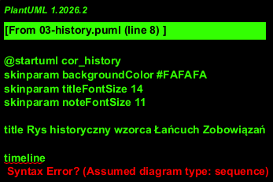
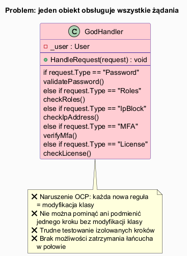
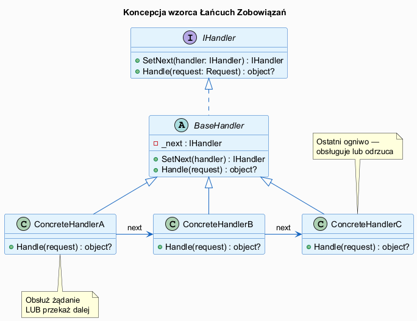

# 01 — Idea i kontekst wzorca Łańcuch Zobowiązań

## Spis treści

1. [Historia i źródła](#1-historia)
2. [Problem, który rozwiązuje](#2-problem)
3. [Koncepcja wzorca](#3-koncepcja)
4. [Definicja GoF](#4-definicja)
5. [Potrzeby, które zaspokaja](#5-potrzeby)
6. [Łańcuch Zobowiązań w .NET](#6-net)
7. [Uruchamianie](#7-uruchamianie)
8. [Zadania](#8-zadania)
9. [Literatura](#9-literatura)

---

## 1. Historia i źródła <a name="1-historia"></a>



Wzorzec **Łańcuch Zobowiązań** (*Chain of Responsibility*, CoR) pochodzi z książki *Design Patterns* (GoF, 1994). Należy do grupy wzorców **behawioralnych** — opisuje sposoby komunikacji między obiektami.

**Kluczowy cytat z GoF:**
> *"Avoid coupling the sender of a request to its receiver by giving more than one object a chance to handle the request. Chain the receiving objects and pass the request along the chain until an object handles it."*

Wzorzec jest bezpośrednio inspirowany **obsługą zdarzeń w interfejsach graficznych** z lat 80. XX wieku (Smalltalk-80): kliknięcie na widżet mogło być obsłużone przez sam widżet, przez jego rodzica, przez okno lub przez aplikację — zależnie od konfiguracji. Tak właśnie działa **event bubbling** (propagacja zdarzeń) w HTML/DOM do dziś.

**Linia ewolucji:**

| Rok | Technologia | Realizacja CoR |
|-----|-------------|----------------|
| 1987 | Smalltalk-80 | Event bubbling w GUI |
| 1994 | GoF | Formalizacja wzorca |
| 2004 | Java EE | `javax.servlet.Filter` — pipeline HTTP |
| 2009 | .NET 4.0 | `HttpModule` / `HttpHandler` |
| 2014 | OWIN | `app.Use()` — delegatowy middleware |
| 2016 | ASP.NET Core | `IMiddleware` / `RequestDelegate` pipeline |
| 2018 | MediatR 4.x | `IPipelineBehavior<TRequest,TResponse>` |

---

## 2. Problem, który rozwiązuje <a name="2-problem"></a>



### Antypattern: „bóg obsługi"

Wyobraź sobie system autoryzacji, w którym jeden obiekt sprawdza **wszystko**:

```csharp
class GodHandler
{
    public void HandleRequest(AuthRequest req)
    {
        if (_blocked.Contains(req.IpAddress))    { /* odrzuć */ return; }
        if (!PasswordValid(req))                 { /* odrzuć */ return; }
        if (!req.MfaPassed)                      { /* odrzuć */ return; }
        if (!HasRole(req, "Admin"))              { /* odrzuć */ return; }
        // ... 10 kolejnych warunków ...
        Grant(req);
    }
}
```

**Symptomy problemu:**

| Symptom | Konsekwencja |
|---------|-------------|
| Nowa reguła = modyfikacja klasy | Naruszenie OCP |
| Nie można pominąć jednego kroku | Brak elastyczności konfiguracji |
| Testy obejmują całą klasę | Trudne testowanie izolowanych reguł |
| Kolejność kroków zahardkodowana | Brak możliwości reorganizacji |
| Brak możliwości dodania logowania między krokami | Brak rozdzielności odpowiedzialności |

---

## 3. Koncepcja wzorca <a name="3-koncepcja"></a>



### Kluczowa idea

1. Każde **ogniwo łańcucha** (handler) wie, jak obsłużyć jedno konkretne żądanie.
2. Jeśli ogniwo **nie może lub nie chce** obsłużyć żądania → **przekazuje je dalej** do następnego ogniwa.
3. Żądanie idzie przez łańcuch, aż któreś ogniwo je obsłuży **lub** łańcuch się skończy.
4. Nadawca żądania **nie zna** konkretnych handlerów — zna tylko interfejs pierwszego ogniwa.

```csharp
// Struktura ogniwa łańcucha — wzorzec fluent builder
interface IHandler
{
    IHandler SetNext(IHandler next);     // ustaw następne ogniwo
    object? Handle(object request);      // obsłuż lub przekaż dalej
}

// Klasa bazowa z logiką przekazywania
abstract class BaseHandler : IHandler
{
    private IHandler? _next;

    public IHandler SetNext(IHandler next)
    {
        _next = next;
        return next;          // fluent: h1.SetNext(h2).SetNext(h3)
    }

    // Podklasa decyduje co zrobić z żądaniem
    public abstract object? Handle(object request);

    protected object? PassToNext(object request)
        => _next?.Handle(request);    // przekaż lub zakończ (null)
}
```

---

## 4. Definicja GoF <a name="4-definicja"></a>

> **Chain of Responsibility** — wzorzec behawioralny, który pozwala przekazywać żądania wzdłuż łańcucha handlerów. Po otrzymaniu żądania każdy handler decyduje, czy je przetworzyć, czy przekazać następnemu handlerowi w łańcuchu.

**Uczestnicy:**

| Uczestnik GoF | Rola | Przykład |
|--------------|------|---------|
| `Handler` | Interfejs z metodą `Handle()` i `SetNext()` | `IAuthHandler` |
| `ConcreteHandler` | Obsługuje jedno konkretne żądanie lub przekazuje dalej | `IpBlockHandler`, `MfaHandler` |
| `Client` | Buduje łańcuch i wysyła pierwsze żądanie | `Program.cs` |

---

## 5. Potrzeby, które zaspokaja <a name="5-potrzeby"></a>

### 5.1 Dekompozycja złożonej logiki walidacyjnej

Zamiast jednej klasy z kilkudziesięcioma `if`-ami — łańcuch małych, testowalnych handlerów.

### 5.2 Konfigurowalny pipeline

Różne środowiska → różna konfiguracja łańcucha:

```csharp
// Środowisko produkcyjne
ipBlock.SetNext(password).SetNext(mfa).SetNext(roles);

// Środowisko testowe (bez MFA)
ipBlock.SetNext(password).SetNext(roles);

// Środowisko developerskie (tylko role)
roles.Handle(devRequest);
```

### 5.3 Rozszerzalność bez modyfikacji

Nowa reguła biznesowa = nowa klasa handlera. Żaden istniejący handler nie jest modyfikowany (OCP).

```csharp
// Dodano nowy wymóg: weryfikacja licencji
var license = new LicenseHandler(validLicenses: ["ENT-001"]);
// Wstaw między MFA a Roles — bez zmian istniejących klas!
audit.SetNext(ipBlock).SetNext(password).SetNext(mfa)
     .SetNext(license).SetNext(roles);
```

### 5.4 Logowanie przekrojowe (cross-cutting concerns)

Handler `AuditLogHandler` otacza cały łańcuch — loguje zarówno żądanie, jak i wynik bez modyfikacji logiki biznesowej.

### 5.5 Short-circuit — wczesne zakończenie

Gdy ogniwo wykryje błąd, natychmiast zwraca `null` / rzuca wyjątek — kolejne ogniwa nie są wywoływane. Wydajne dla kosztownych operacji (np. zapytań do bazy danych).

---

## 6. Łańcuch Zobowiązań w .NET <a name="6-net"></a>

### ASP.NET Core Middleware Pipeline

Najbardziej znana implementacja CoR w .NET — pipeline żądań HTTP:

```csharp
var app = builder.Build();

// Każde Use() dodaje ogniwo do łańcucha
app.UseExceptionHandler("/Error");          // handler 1
app.UseHttpsRedirection();                  // handler 2
app.UseStaticFiles();                       // handler 3
app.UseRouting();                           // handler 4
app.UseAuthentication();                    // handler 5
app.UseAuthorization();                     // handler 6
app.MapControllers();                       // handler 7 (koniec łańcucha)

app.Run();
```

Każdy middleware to ogniwo CoR: może obsłużyć żądanie (np. plik statyczny) lub przekazać dalej przez `await next(context)`.

### MediatR Pipeline Behaviors

```csharp
// Każdy IPipelineBehavior to ogniwo łańcucha dla komend/zapytań CQRS
public class ValidationBehavior<TRequest, TResponse>
    : IPipelineBehavior<TRequest, TResponse>
{
    public async Task<TResponse> Handle(TRequest request,
        RequestHandlerDelegate<TResponse> next,
        CancellationToken cancellationToken)
    {
        // Logika ogniwa — walidacja przed wykonaniem
        Validate(request);
        return await next();   // przekaż dalej
    }
}
```

---

## 7. Uruchamianie <a name="7-uruchamianie"></a>

```bash
cd src/18-lancuch-zobowiazan/01-idea-i-kontekst/Examples
dotnet run
```

**Oczekiwane wyjście (fragment):**

```
═══ CZĘŚĆ 2: Rozwiązanie — Łańcuch Zobowiązań ═══

Próba 1 — poprawne żądanie:
  [IpBlock]  ✔ IP 192.168.1.1 dozwolony
  [Password] ✔ Hasło poprawne dla jan@firma.pl
  [MFA]      ✔ MFA zaliczone
  [Roles]    ✔ Rola 'Admin' OK
  ✅ Autoryzacja zakończona sukcesem: Token:jan@firma.pl:Admin
```

---

## 8. Zadania <a name="8-zadania"></a>

### Zadanie 1 — Dodaj nowe ogniwo
Dodaj `RateLimitHandler`, który odrzuca żądanie, jeśli ten sam e-mail pojawił się więcej niż 3 razy w ciągu ostatnich 10 sekund. Wstaw go między `IpBlockHandler` a `PasswordHandler`.

**Wskazówka:** Użyj `ConcurrentDictionary<string, (int Count, DateTime LastTime)>` do śledzenia prób.

**Rozwiązanie:**
```csharp
class RateLimitHandler : BaseAuthHandler
{
    private readonly ConcurrentDictionary<string, (int Count, DateTime LastTime)> _counts = new();
    private const int MaxAttempts = 3;
    private readonly TimeSpan _window = TimeSpan.FromSeconds(10);

    public override string? Handle(AuthRequest request)
    {
        var now = DateTime.UtcNow;
        _counts.AddOrUpdate(request.Email,
            _ => (1, now),
            (_, old) => now - old.LastTime > _window ? (1, now) : (old.Count + 1, old.LastTime));

        if (_counts[request.Email].Count > MaxAttempts)
        {
            Console.WriteLine($"  [RateLimit] 🚫 Zbyt wiele prób dla {request.Email}");
            return null;
        }
        Console.WriteLine($"  [RateLimit] ✔ Próba {_counts[request.Email].Count}/{MaxAttempts}");
        return PassToNext(request);
    }
}
```

### Zadanie 2 — Zmiana kolejności ogniw
Przestaw kolejność tak, żeby `PasswordHandler` był przed `IpBlockHandler`. Co się zmienia? Jakie są konsekwencje dla wydajności i bezpieczeństwa?

**Rozwiązanie:** Sprawdzanie hasła przed IP jest nieefektywne — atakujący wymusza operacje na bazie danych nawet z zablokowanego IP. Reguła ogólna: najtańsze/najszybsze weryfikacje powinny być na początku łańcucha.

---

## 9. Literatura <a name="9-literatura"></a>

1. **GoF** — Gamma, Helm, Johnson, Vlissides: *Design Patterns: Elements of Reusable Object-Oriented Software*, Addison-Wesley 1994, s. 223–232 — oryginalne omówienie wzorca.
2. **Freeman & Freeman** — *Head First Design Patterns*, O'Reilly 2004, rozdz. 6.
3. **RefactoringGuru** — https://refactoring.guru/design-patterns/chain-of-responsibility — opis z przykładami C# i Java.
4. **Microsoft ASP.NET Core Middleware** — https://learn.microsoft.com/en-us/aspnet/core/fundamentals/middleware — oficjalna dokumentacja pipeline'u middleware.
5. **MediatR Pipeline Behaviors** — https://github.com/jbogard/MediatR/wiki/Behaviors — przykłady CoR w CQRS.
