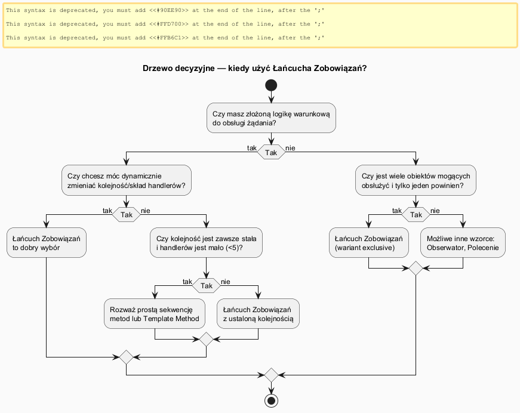
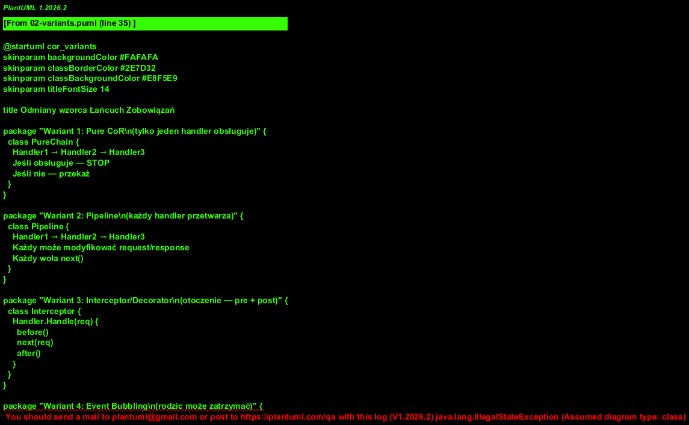

# 02 — Kiedy stosować, zalety i wady

## Spis treści

1. [Sygnały wskazujące na CoR](#1-sygnaly)
2. [Odmiany wzorca](#2-odmiany)
3. [Zalety](#3-zalety)
4. [Wady i pułapki](#4-wady)
5. [Kiedy NIE stosować](#5-kiedy-nie)
6. [Uruchamianie](#6-uruchamianie)
7. [Zadania](#7-zadania)
8. [Literatura](#8-literatura)

---

## 1. Sygnały wskazujące na CoR <a name="1-sygnaly"></a>



### Stosuj Łańcuch Zobowiązań gdy:

| Sygnał | Przykład |
|--------|---------|
| Więcej niż jeden obiekt może obsłużyć żądanie, ale tylko jeden powinien | Zatwierdzenie wniosku przez najniższy szczebel z kompetencją |
| Chcesz odsprzęgnąć nadawcę od odbiorcy | Klient nie wie, kto faktycznie obsłuży żądanie |
| Zestaw handlerów powinien być konfigurowalny w runtime | Różne środowiska (prod/test/dev) z różnymi filtrami |
| Chcesz dodać/usunąć ogniwo bez modyfikacji pozostałych | Nowy wymóg compliance = nowa klasa, zero zmian w istniejących |
| Masz cross-cutting concerns (logowanie, timing, retry) | Każde ogniwo może dodać zachowanie przed/po |

### Nie stosuj gdy:

| Sygnał | Lepsza alternatywa |
|--------|--------------------|
| Zawsze dokładnie jeden handler obsługuje | `switch`/`if-else` lub słownik |
| Łańcuch ma zawsze ten sam skład i kolejność | Metoda szablonowa, prosta sekwencja metod |
| Ważna jest wydajność i łańcuch jest długi | Direct dispatch (słownik/delegat) |
| Potrzebujesz wielu równoległych handlerów | Obserwator (Observer) |

---

## 2. Odmiany wzorca <a name="2-odmiany"></a>



### Odmiana 1 — Pure CoR (klasyczna GoF)

**Zasada:** Pierwsze ogniwo, które obsłuży żądanie, zatrzymuje propagację. Kolejne ogniwa nie są wywoływane.

**Przykład:** Zatwierdzanie wniosków — Team Lead (do 1k), Manager (do 10k), Dyrektor (do 50k), Zarząd (powyżej).

```csharp
// Każdy Approver: obsłuż LUB przekaż
class TeamLeadApprover(decimal limit) : Approver
{
    public override void Handle(PurchaseRequest req)
    {
        if (req.Amount <= limit)
            Console.WriteLine($"TeamLead zatwierdza {req.Amount:C}");
        else
            PassToNext(req);    // nie mogę — przekazuję wyżej
    }
}
```

**Kiedy:** Hierarchia uprawnień, helpdesk (L1 → L2 → L3 support), routing żądań.

---

### Odmiana 2 — Pipeline

**Zasada:** Każde ogniwo **przetwarza** żądanie i **zawsze** przekazuje dalej. Żadne ogniwo nie zatrzymuje łańcucha.

**Przykład:** Pipeline przetwarzania zamówień: sprawdzenie stanu magazynowego → rabat → podatek → powiadomienie.

```csharp
class DiscountStep : BaseOrderStep
{
    public override void Process(Order order)
    {
        order.Discount = order.Quantity >= 5 ? 0.10m : 0m;
        Next(order);    // zawsze przekazuję dalej
    }
}
```

**Kiedy:** ASP.NET Core Middleware, ETL (Extract-Transform-Load), potoki przetwarzania danych.

---

### Odmiana 3 — Interceptor / Decorator

**Zasada:** Ogniwo wykonuje logikę **przed** i **po** wywołaniu następnego ogniwa (wzorzec dekorator w akcji).

```csharp
class LoggingInterceptor(ICommandHandler inner) : ICommandHandler
{
    public void Handle(SaveUserCommand cmd)
    {
        Console.WriteLine($"[LOG] Przed: {cmd.Email}");
        inner.Handle(cmd);                               // wywołaj otoczone
        Console.WriteLine($"[LOG] Po: {cmd.Email} — OK");
    }
}
```

**Kiedy:** Cross-cutting concerns (logowanie, metryki, retry, cache, transakcje).

---

### Odmiana 4 — Event Bubbling

**Zasada:** Zdarzenie propaguje od dziecka do rodzica. Każde ogniwo może zatrzymać propagację (`StopPropagation`).

**Kiedy:** Hierarchie widżetów GUI, propagacja zdarzeń DOM w HTML.

---

## 3. Zalety <a name="3-zalety"></a>

| Zaleta | Wyjaśnienie |
|--------|------------|
| **Zasada SRP** | Każdy handler ma jedną odpowiedzialność |
| **Zasada OCP** | Nowa reguła = nowa klasa, żadna istniejąca klasa nie jest modyfikowana |
| **Elastyczna konfiguracja** | Łańcuch można zmieniać w runtime (dodawać, usuwać, zmieniać kolejność) |
| **Testowalność** | Każdy handler testowany niezależnie, bez potrzeby stawiania całego systemu |
| **Odsprzęgnięcie** | Nadawca żądania nie wie, kto je obsłuży — luźne powiązanie |
| **Cross-cutting concerns** | Logowanie, timing, retry — bez modyfikacji logiki biznesowej |

---

## 4. Wady i pułapki <a name="4-wady"></a>

| Wada | Przykład | Jak uniknąć |
|------|---------|-------------|
| **Brak gwarancji obsługi** | Żądanie może przejść przez cały łańcuch bez obsługi | Dodaj domyślny handler na końcu (`NullObjectHandler`) |
| **Trudna diagnostyka** | Nie wiadomo, które ogniwo odrzuciło żądanie | Loguj w każdym ogniwie lub użyj kontekstu z historią decyzji |
| **Wydajność** | Długi łańcuch dla częstych żądań może być wolny | Skróć łańcuch, optymalizuj kolejność (najtańsze pierwsze) |
| **Niezamierzone zatrzymanie** | Handler w złej kolejności blokuje poprawne żądania | Testy integracyjne całego łańcucha |
| **Ukryta logika** | Trudno zrozumieć całość bez przejrzenia każdego ogniwa | Dokumentuj łańcuch, używaj nazw sugestywnych |

---

## 5. Kiedy NIE stosować <a name="5-kiedy-nie"></a>

### Prosty switch (< 5 wariantów, stały zestaw)

```csharp
// Wystarczy switch — nie potrzebujesz CoR
string HandleDiscount(CustomerType type) => type switch
{
    CustomerType.Premium  => "20%",
    CustomerType.Standard => "5%",
    CustomerType.New      => "10%",
    _                     => "0%"
};
```

### Obserwator (wielu handlerów ma być powiadomionych równocześnie)

```csharp
// CoR: jeden handler obsługuje (zatrzymuje propagację)
// Observer: wszyscy subskrybenci są powiadamiani
event EventHandler<OrderPlacedEvent> OrderPlaced;
OrderPlaced += SendConfirmationEmail;
OrderPlaced += UpdateInventory;
OrderPlaced += NotifyWarehouse;    // wszyscy dostają powiadomienie
```

---

## 6. Uruchamianie <a name="6-uruchamianie"></a>

```bash
cd src/18-lancuch-zobowiazan/02-kiedy-stosowac-zalety-wady/Examples
dotnet run
```

---

## 7. Zadania <a name="7-zadania"></a>

### Zadanie 1 — Pure CoR z fallbackiem
Rozszerz przykład zatwierdzeń o `DefaultRejectApprover` — jeśli żaden approver nie zatwierdził (np. kwota ujemna), wypisz komunikat o odrzuceniu.

**Rozwiązanie:**
```csharp
class DefaultRejectApprover : Approver
{
    public override void Handle(PurchaseRequest req)
        => Console.WriteLine($"ODRZUCONO: kwota {req.Amount:C} nie pasuje do żadnego zakresu");
}
// Dodaj na końcu:
board.SetNext(new DefaultRejectApprover());
```

### Zadanie 2 — Pipeline z warunkiem stop
Zmodyfikuj Pipeline tak, żeby `StockCheckStep` zatrzymał przetwarzanie, gdy produkt jest niedostępny.

**Rozwiązanie:**
```csharp
class StockCheckStep : BaseOrderStep
{
    public override void Process(Order order)
    {
        order.InStock = CheckWarehouse(order.Product);
        if (!order.InStock)
        {
            Console.WriteLine("[StockCheck] BRAK W MAGAZYNIE — stop");
            return;    // nie wywołuje Next() — łańcuch zatrzymany
        }
        Console.WriteLine("[StockCheck] OK");
        Next(order);
    }
}
```

---

## 8. Literatura <a name="8-literatura"></a>

1. **GoF** — *Design Patterns*, s. 223–232 — wzorzec GoF Chain of Responsibility.
2. **Freeman & Freeman** — *Head First Design Patterns*, rozdz. 6.
3. **RefactoringGuru** — https://refactoring.guru/design-patterns/chain-of-responsibility
4. **SourceMaking** — https://sourcemaking.com/design_patterns/chain_of_responsibility
5. **Martin Fowler — Pipeline** — https://martinfowler.com/articles/collection-pipeline/
