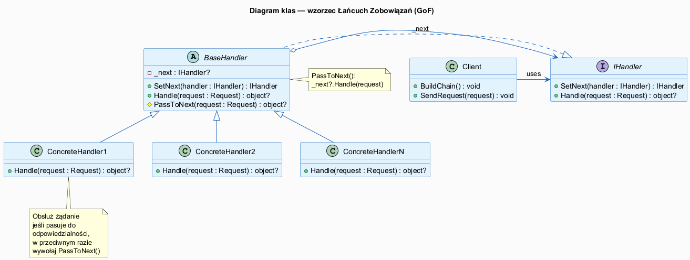
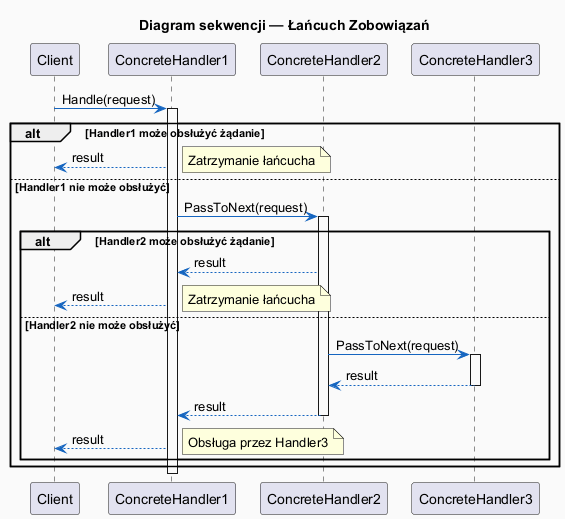
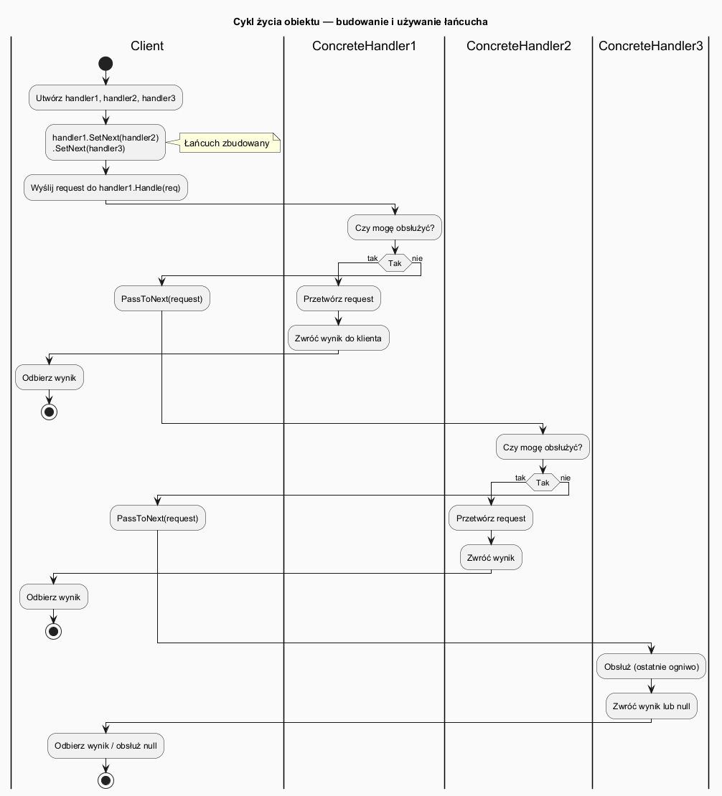

# 03 — Struktura i działanie (GoF)

## Spis treści

1. [Role GoF](#1-role)
2. [Diagram klas](#2-diagram-klas)
3. [Diagram sekwencji](#3-diagram-sekwencji)
4. [Cykl życia obiektów](#4-cykl-zycia)
5. [Mapowanie na C#](#5-mapowanie)
6. [Konsekwencje stosowania](#6-konsekwencje)
7. [Uruchamianie](#7-uruchamianie)
8. [Zadania](#8-zadania)
9. [Literatura](#9-literatura)

---

## 1. Role GoF <a name="1-role"></a>

| Rola GoF | Rola w C# | Opis |
|----------|-----------|------|
| **Handler** | `interface IHandler` | Wspólny kontrakt: `SetNext()` + `Handle()`. Klient zna tylko ten typ. |
| **BaseHandler** | `abstract class BaseHandler : IHandler` | Opcjonalna klasa bazowa z logiką przekazywania do `_next`. Podklasy mogą ją dziedziczyć. |
| **ConcreteHandler** | Klasy dziedziczące z `BaseHandler` | Każda obsługuje **dokładnie jeden** typ żądania lub kryterium. Decyduje: obsłuż lub przekaż. |
| **Client** | `Program.cs` / kompozycja w DI | Buduje łańcuch (ustala kolejność) i wysyła pierwsze żądanie. |

---

## 2. Diagram klas <a name="2-diagram-klas"></a>



### Kluczowe relacje

- `BaseHandler` ◇──▶ `IHandler` — **agregacja**: `_next` jest opcjonalne (`null` na końcu łańcucha)
- `ConcreteHandler` ──▷ `BaseHandler` — **dziedziczenie**: podklasa dostaje `SetNext()` i `PassToNext()` gratis
- `Client` ───▶ `IHandler` — klient zna tylko interfejs, nie konkretną klasę

---

## 3. Diagram sekwencji <a name="3-diagram-sekwencji"></a>



### Przepływ żądania

```
Client → Handler1.Handle(request)
  ↳ Handler1 może obsłużyć?
      TAK  → wynik wraca do Client (stop)
      NIE  → Handler1 → Handler2.Handle(request)
               ↳ Handler2 może obsłużyć?
                    TAK  → wynik wraca przez Handler1 do Client (stop)
                    NIE  → Handler2 → Handler3.Handle(request)
                             ↳ Handler3 obsługuje lub zwraca null
```

---

## 4. Cykl życia obiektów <a name="4-cykl-zycia"></a>



**Fazy:**

1. **Budowanie łańcucha** — klient (lub kontener DI) tworzy handlery i łączy je przez `SetNext()`.
2. **Wysyłanie żądania** — klient wywołuje `Handle()` na **pierwszym** ogniwie.
3. **Propagacja** — każde ogniwo decyduje: obsłuż lub wywołaj `PassToNext()`.
4. **Obsługa** — pierwsze pasujące ogniwo przetwarza żądanie i zwraca wynik.
5. **Brak obsługi** — jeśli żadne ogniwo nie obsłuży, `Handle()` zwraca `null` lub rzuca wyjątek (zależy od designu).

---

## 5. Mapowanie na C# <a name="5-mapowanie"></a>

### Interfejs (GoF: Handler)

```csharp
interface IHandler
{
    // Fluent builder — zwraca przekazany handler dla łatwego chainingu
    IHandler SetNext(IHandler handler);

    // Obsłuż żądanie lub zwróć null (brak obsługi)
    object? Handle(object request);
}
```

### Klasa bazowa (GoF: optional BaseHandler)

```csharp
abstract class BaseHandler : IHandler
{
    private IHandler? _next;

    public IHandler SetNext(IHandler handler)
    {
        _next = handler;
        return handler;          // ← fluent: h1.SetNext(h2).SetNext(h3)
    }

    // Podklasy przesłaniają, ale dostają PassToNext() za darmo
    public abstract object? Handle(object request);

    protected object? PassToNext(object request)
        => _next?.Handle(request);
}
```

### Konkretne ogniwo (GoF: ConcreteHandler)

```csharp
class HtmlReportHandler : BaseHandler
{
    public override object? Handle(object request)
    {
        var req = (ReportRequest)request;

        if (req.Format == "html")
            return $"<html>{req.Title}</html>";    // obsłuż

        return PassToNext(request);                // lub przekaż
    }
}
```

### Budowanie łańcucha przez klienta

```csharp
// Wariant 1: fluent
htmlHandler.SetNext(csvHandler).SetNext(jsonHandler).SetNext(defaultHandler);

// Wariant 2: explicit
htmlHandler.SetNext(csvHandler);
csvHandler.SetNext(jsonHandler);
jsonHandler.SetNext(defaultHandler);
```

---

## 6. Konsekwencje stosowania <a name="6-konsekwencje"></a>

| Konsekwencja | Opis |
|-------------|------|
| **Zmniejszone sprzężenie** | `Client` i `ConcreteHandler` nie znają się wzajemnie |
| **Elastyczność konfiguracji** | Kolejność i skład łańcucha zmienia się w runtime |
| **OCP** | Nowy handler = nowa klasa, brak modyfikacji istniejących |
| **SRP** | Każdy handler = jedna odpowiedzialność |
| **Brak gwarancji obsługi** | Żądanie może nie trafić do żadnego handlera → zawsze dodaj domyślny handler |
| **Trudność śledzenia** | Przepływ przez wiele klas — ważne logowanie i nazwanie handlerów |

---

## 7. Uruchamianie <a name="7-uruchamianie"></a>

```bash
cd src/18-lancuch-zobowiazan/03-struktura-gof/Examples
dotnet run
```

---

## 8. Zadania <a name="8-zadania"></a>

### Zadanie 1 — Fluent vs explicit
Przepisz budowanie łańcucha z wersji fluent na explicit (bez łańcuchowania). Czy wynik jest identyczny?

**Rozwiązanie:** Tak, wynik jest identyczny. Fluent `SetNext(h2).SetNext(h3)` to cukier syntaktyczny — `SetNext(h2)` zwraca `h2`, na którym wywołujemy `SetNext(h3)`.

### Zadanie 2 — NullObject na końcu
Usuń `UnsupportedFormatHandler` z końca łańcucha. Co się dzieje dla formatu `"xml"`? Jak naprawić?

**Rozwiązanie:** `Handle()` zwróci `null`. Napraw przez sprawdzenie `result ?? "Nieobsługiwany format"` po stronie klienta lub dodaj `UnsupportedFormatHandler` z powrotem jako ostatnie ogniwo.

---

## 9. Literatura <a name="9-literatura"></a>

1. **GoF** — *Design Patterns*, s. 223–232.
2. **RefactoringGuru** — https://refactoring.guru/design-patterns/chain-of-responsibility/csharp
3. **SourceMaking** — https://sourcemaking.com/design_patterns/chain_of_responsibility
