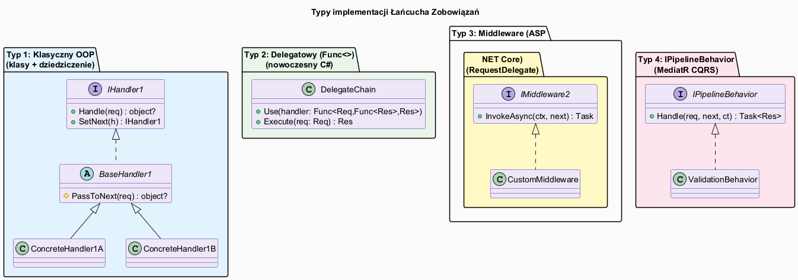
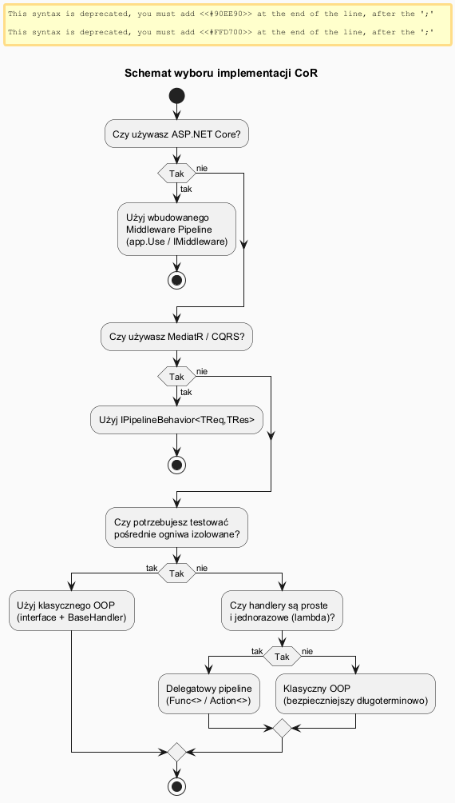

# 04 — Typy implementacji

## Spis treści

1. [Przegląd typów](#1-przeglad)
2. [Typ 1 — Klasyczny OOP](#2-typ1)
3. [Typ 2 — Delegatowy Pipeline (Func<>)](#3-typ2)
4. [Typ 3 — Middleware Pipeline](#4-typ3)
5. [Typ 4 — IPipelineBehavior (MediatR)](#5-typ4)
6. [Schemat wyboru](#6-wybor)
7. [Uruchamianie](#7-uruchamianie)
8. [Zadania](#8-zadania)
9. [Literatura](#9-literatura)

---

## 1. Przegląd typów <a name="1-przeglad"></a>



| Typ | Kiedy stosować | Przykład w .NET |
|-----|---------------|-----------------|
| **Klasyczny OOP** | Złożone handlery z własnym stanem, testy jednostkowe | Autoryzacja, walidacja domenowa |
| **Delegatowy Pipeline** | Proste transformacje, code-first bez klas | Przetwarzanie tekstu/danych |
| **Middleware Pipeline** | Obsługa żądań HTTP, cross-cutting concerns | ASP.NET Core `app.Use()` |
| **IPipelineBehavior** | CQRS, MediatR, dekorowanie komend/zapytań | `ValidationBehavior`, `LoggingBehavior` |

---

## 2. Typ 1 — Klasyczny OOP <a name="2-typ1"></a>

**Schemat:**
```
interface IHandler { SetNext(); Handle(); }
     ↑
abstract BaseHandler { _next; PassToNext(); }
     ↑                ↑
 ConcreteA         ConcreteB
```

**Przykład — walidacja formularza:**

```csharp
IValidator required = new RequiredFieldValidator("Email");
IValidator format   = new EmailFormatValidator("Email");
IValidator unique   = new UniqueEmailValidator("Email", existingEmails);

required.SetNext(format).SetNext(unique);

var error = required.Validate("jan@firma.pl");
// null → poprawny | ValidationResult → błąd
```

**Zalety:** Pełna testowalność, czytelna hierarchia, łatwa rozszerzalność.  
**Wady:** Więcej klas, verbosity dla prostych przypadków.

---

## 3. Typ 2 — Delegatowy Pipeline (Func<>) <a name="3-typ2"></a>

**Schemat:**

```csharp
var pipeline = new DelegatePipeline<TInput, TOutput>();

pipeline.Use((input, next) => {
    // pre-processing
    var result = next(processedInput);
    // post-processing
    return result;
});
```

Ogniwa są **zamknięciami (closures)** — nie potrzeba klas. Łańcuch budowany jest przez składanie funkcji (`fold right`).

**Przykład — przetwarzanie tekstu:**

```csharp
var pipeline = new DelegatePipeline<string, string>();

pipeline
    .Use((s, next) => next(s.Trim()))
    .Use((s, next) => next(s.ToLowerInvariant()))
    .Use((s, next) => next(Regex.Replace(s, @"\s+", " ")));

var result = pipeline.Execute("  Witaj  Świecie  ");
// → "witaj świecie"
```

**Zalety:** Brak klas dla prostych handlerów, kompozycja przez lambdy.  
**Wady:** Trudniejsze testowanie, brak czytelnych nazw ogniw w stack trace.

---

## 4. Typ 3 — Middleware Pipeline (ASP.NET Core) <a name="4-typ3"></a>

ASP.NET Core implementuje CoR jako pipeline `RequestDelegate`. Każde middleware to ogniwo.

```csharp
// Każde Use() dodaje ogniwo do łańcucha
app.Use(async (context, next) =>
{
    // PRE: logika przed obsługą żądania
    Console.WriteLine($"→ {context.Request.Path}");

    await next(context);               // przekaż do następnego ogniwa

    // POST: logika po obsłudze żądania
    Console.WriteLine($"← {context.Response.StatusCode}");
});

app.UseAuthentication();    // wbudowane ogniwa
app.UseAuthorization();
app.MapControllers();       // ostatnie ogniwo — obsługuje żądanie
```

**Kluczowe:** `await next(context)` to odpowiednik `PassToNext(request)` — wywołuje następne ogniwo.

**Middleware terminal** — ogniwo, które **nie woła** `next()`:

```csharp
app.Use(async (ctx, next) =>
{
    if (!IsAuthenticated(ctx))
    {
        ctx.Response.StatusCode = 401;
        return;           // ← nie woła next() — zatrzymuje łańcuch
    }
    await next(ctx);
});
```

---

## 5. Typ 4 — IPipelineBehavior (MediatR) <a name="5-typ4"></a>

W wzorcu CQRS z biblioteką MediatR każda komenda/zapytanie przechodzi przez pipeline zachowań (behaviors).

```csharp
// Ogniwo pipeline — walidacja przed wykonaniem komendy
public class ValidationBehavior<TRequest, TResponse>
    : IPipelineBehavior<TRequest, TResponse>
    where TRequest : notnull
{
    private readonly IEnumerable<IValidator<TRequest>> _validators;

    public ValidationBehavior(IEnumerable<IValidator<TRequest>> validators)
        => _validators = validators;

    public async Task<TResponse> Handle(
        TRequest request,
        RequestHandlerDelegate<TResponse> next,   // następne ogniwo
        CancellationToken cancellationToken)
    {
        var failures = _validators
            .SelectMany(v => v.Validate(request).Errors)
            .Where(f => f != null)
            .ToList();

        if (failures.Any())
            throw new ValidationException(failures);

        return await next();    // przekaż do następnego ogniwa
    }
}

// Rejestracja w DI
services.AddTransient(typeof(IPipelineBehavior<,>), typeof(LoggingBehavior<,>));
services.AddTransient(typeof(IPipelineBehavior<,>), typeof(ValidationBehavior<,>));
services.AddTransient(typeof(IPipelineBehavior<,>), typeof(RetryBehavior<,>));
```

**Kolejność:** Zachowania są wywoływane w odwrotnej kolejności rejestracji (ostatnie = na zewnątrz).

---

## 6. Schemat wyboru <a name="6-wybor"></a>



| Pytanie | Odpowiedź → Typ |
|---------|----------------|
| Używasz ASP.NET Core? | → Wbudowany Middleware Pipeline |
| Używasz MediatR / CQRS? | → `IPipelineBehavior` |
| Handlery mają własny stan lub wymagają izolowanych testów? | → Klasyczny OOP |
| Handlery to jednolinijkowe transformacje? | → Delegatowy Pipeline (`Func<>`) |

---

## 7. Uruchamianie <a name="7-uruchamianie"></a>

```bash
cd src/18-lancuch-zobowiazan/04-typy-implementacji/Examples
dotnet run
```

---

## 8. Zadania <a name="8-zadania"></a>

### Zadanie 1 — Nowy walidator
Dodaj `MinLengthValidator`, który sprawdza, czy email ma co najmniej 8 znaków. Wstaw go między `EmailFormatValidator` a `UniqueEmailValidator`.

**Rozwiązanie:**
```csharp
class MinLengthValidator(string fieldName, int minLength) : BaseValidator(fieldName)
{
    public override ValidationResult? Validate(string value)
    {
        if (value.Length < minLength)
            return new(FieldName, $"Minimalna długość: {minLength} znaków");
        return PassToNext(value);
    }
}
```

### Zadanie 2 — Pipeline delegatowy z pomiarem czasu
Dodaj ogniwo do `DelegatePipeline<string, string>`, które mierzy czas wykonania pozostałych ogniw.

**Rozwiązanie:**
```csharp
pipeline.Use((input, next) => {
    var sw = Stopwatch.StartNew();
    var result = next(input);
    Console.WriteLine($"[Timing] {sw.ElapsedMilliseconds} ms");
    return result;
});
```

---

## 9. Literatura <a name="9-literatura"></a>

1. **Microsoft ASP.NET Core Middleware** — https://learn.microsoft.com/en-us/aspnet/core/fundamentals/middleware
2. **MediatR Pipeline Behaviors** — https://github.com/jbogard/MediatR/wiki/Behaviors
3. **RefactoringGuru** — https://refactoring.guru/design-patterns/chain-of-responsibility/csharp
4. **Functional Pipeline C#** — https://medium.com/@ericjvandenberg/chain-of-responsibility-with-net-delegates-1a32c61e3b85
