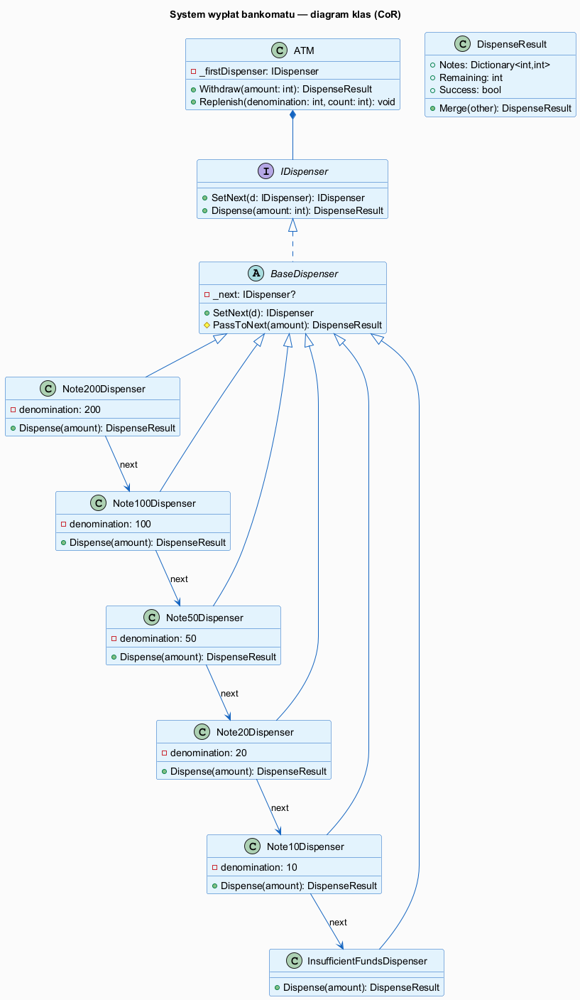
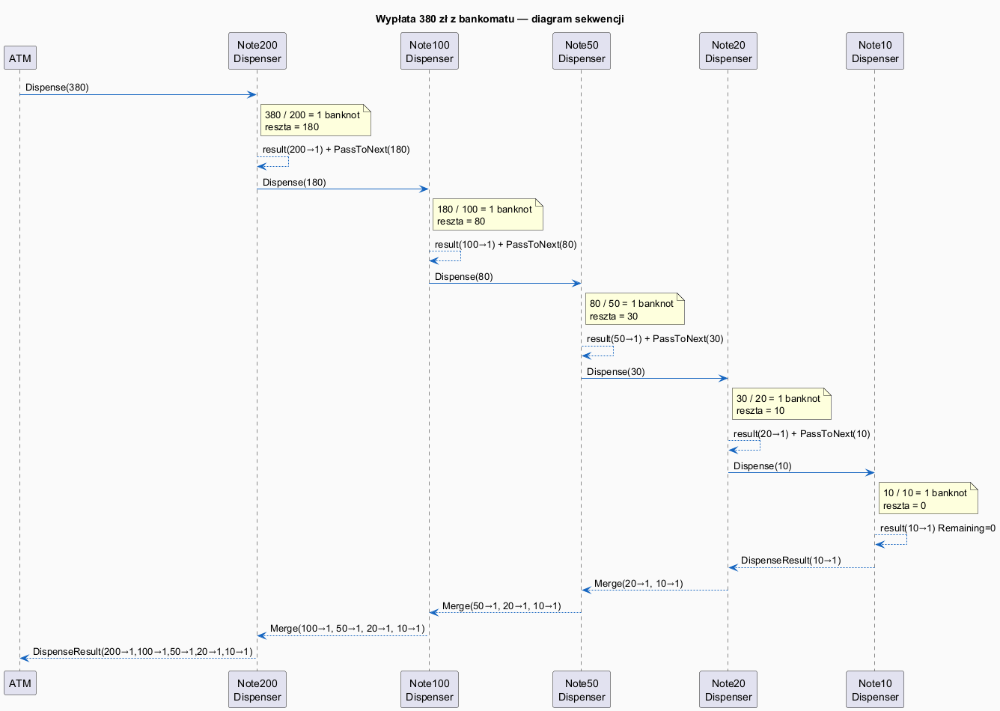

# 05 — Większy przykład — System wypłat bankomatowych

## Spis treści

1. [Opis scenariusza](#1-scenariusz)
2. [Dlaczego CoR?](#2-dlaczego-cor)
3. [Diagram klas](#3-diagram-klas)
4. [Diagram sekwencji](#4-diagram-sekwencji)
5. [Implementacja — krok po kroku](#5-implementacja)
6. [Uruchamianie](#6-uruchamianie)
7. [Testy jednostkowe](#7-testy)
8. [Zadania](#8-zadania)

---

## 1. Opis scenariusza <a name="1-scenariusz"></a>

Bankomat musi wydać żądaną kwotę używając dostępnych banknotów. Denominacje: 200, 100, 50, 20, 10 zł.

**Problem:** jak dobrać banknoty tak, by:
- używać jak największych nominałów,
- wydać dokładnie żądaną kwotę (lub zgłosić błąd),
- nie przekroczyć stanu kasy dla danego nominału?

**Rozwiązanie CoR:** każdy nominał to oddzielne ogniwo łańcucha. Żądanie przechodzi kolejno przez ogniwa — każde wydaje tyle banknotów danego nominału, ile może, i przekazuje **resztę** do następnego ogniwa.

---

## 2. Dlaczego CoR? <a name="2-dlaczego-cor"></a>

| Alternatywa | Problem |
|-------------|---------|
| `if-else` cascade | Trudno dodać nowy nominał, brak rozszerzalności |
| `switch` + pętle | Zmieszana odpowiedzialność — jeden blok robi wszystko |
| CoR | Każdy nominał jako niezależna klasa → Open/Closed Principle |

---

## 3. Diagram klas <a name="3-diagram-klas"></a>



### Role GoF w tym przykładzie

| Rola GoF | Klasa w przykładzie |
|---------|-------------------|
| Handler (interface) | `IDispenser` |
| BaseHandler | `BaseDispenser` |
| ConcreteHandler × 5 | `NoteDispenser(200)`, `NoteDispenser(100)`, ..., `NoteDispenser(10)` |
| NullObject / Terminator | `InsufficientFundsDispenser` |
| Client | `ATM` (fasada buduje łańcuch) |

---

## 4. Diagram sekwencji <a name="4-diagram-sekwencji"></a>



Wypłata 380 zł:

```
ATM → D200 → Dispense(380)
        │ 1×200, reszta=180
        └→ D100 → Dispense(180)
               │ 1×100, reszta=80
               └→ D50 → Dispense(80)
                      │ 1×50, reszta=30
                      └→ D20 → Dispense(30)
                             │ 1×20, reszta=10
                             └→ D10 → Dispense(10)
                                    │ 1×10, reszta=0
                                    └→ wynik scalany w górę
```

---

## 5. Implementacja — krok po kroku <a name="5-implementacja"></a>

### 5.1. Wynik jako Value Object

```csharp
public class DispenseResult
{
    public Dictionary<int, int> Notes { get; } = new();
    public bool Success     { get; private set; }
    public string? ErrorMessage { get; private set; }

    // Fabryki statyczne (zamiast konstruktorów)
    public static DispenseResult WithNote(int denomination, int count, int remaining) { ... }
    public static DispenseResult Failure(string message) { ... }

    // Scalenie wyników dwóch ogniw
    public DispenseResult Merge(DispenseResult other) { ... }
}
```

### 5.2. Handler i BaseHandler

```csharp
public interface IDispenser
{
    IDispenser SetNext(IDispenser next);   // fluent API
    DispenseResult Dispense(int amount);
}

public abstract class BaseDispenser : IDispenser
{
    private IDispenser? _next;

    public IDispenser SetNext(IDispenser next) { _next = next; return next; }

    protected DispenseResult PassToNext(int amount)
        => _next?.Dispense(amount) ?? DispenseResult.Failure("brak banknotów");
}
```

### 5.3. ConcreteHandler

```csharp
public class NoteDispenser(int denomination, int count) : BaseDispenser(denomination, count)
{
    public override DispenseResult Dispense(int amount)
    {
        if (amount <= 0) return DispenseResult.Empty(0);

        // Ile banknotów tego nominału możemy wydać?
        TryDispenseNotes(amount, out int noteCount, out int remaining);

        var myResult = DispenseResult.WithNote(Denomination, noteCount, remaining);

        // Jeśli jest reszta — przekaż dalej i scal
        return remaining > 0
            ? myResult.Merge(PassToNext(remaining))
            : myResult;
    }
}
```

### 5.4. Null Object (ogniwo końcowe)

```csharp
// Zamiast sprawdzać if (_next != null) — używamy Null Object Pattern
public class InsufficientFundsDispenser : IDispenser
{
    public DispenseResult Dispense(int amount)
        => DispenseResult.Failure($"Nie można wydać {amount} zł");
}
```

### 5.5. Fasada ATM

```csharp
public class ATM
{
    private readonly NoteDispenser[] _dispensers;

    public ATM(Dictionary<int, int> denominationsAndCounts)
    {
        _dispensers = denominationsAndCounts
            .OrderByDescending(kv => kv.Key)    // od największego nominału
            .Select(kv => new NoteDispenser(kv.Key, kv.Value))
            .ToArray();

        // Zbuduj łańcuch
        for (int i = 0; i < _dispensers.Length - 1; i++)
            _dispensers[i].SetNext(_dispensers[i + 1]);
        _dispensers[^1].SetNext(new InsufficientFundsDispenser());
    }
}
```

---

## 6. Uruchamianie <a name="6-uruchamianie"></a>

```bash
cd src/18-lancuch-zobowiazan/05-wiekszy-przyklad/Examples
dotnet run
```

---

## 7. Testy jednostkowe <a name="7-testy"></a>

Testy (xUnit) znajdują się w `Tests/ATMTests.cs`. Pokrycie:

| Klasa testów | Co testuje |
|---|---|
| `NoteDispenserTests` | Pojedyncze ogniwa w izolacji |
| `ChainIntegrationTests` | Cały łańcuch (ATM) — kombinacje kwot |
| `InsufficientFundsDispenserTests` | Ogniwo końcowe (Null Object) |

```bash
cd src/18-lancuch-zobowiazan/05-wiekszy-przyklad/Tests
dotnet test
```

---

## 8. Zadania <a name="8-zadania"></a>

### Zadanie 1 — Nowy nominał 500 zł
Dodaj obsługę banknotu 500 zł. Co jest potrzebne?

**Rozwiązanie:** Wystarczy przekazać `[500] = n` do słownika `ATM`. Łańcuch buduje się automatycznie.

### Zadanie 2 — Stan graniczny
Napisz test sprawdzający, że przy próbie wypłaty 200 zł z bankomatem z `[200]=0` wynik jest `Success=false`.

**Rozwiązanie:**
```csharp
[Fact]
public void Withdraw_WhenNoNotes_Fails()
{
    var atm = new ATM(new() { [200]=0, [100]=0, [50]=0, [20]=0, [10]=0 });
    var result = atm.Withdraw(200);
    Assert.False(result.Success);
}
```
