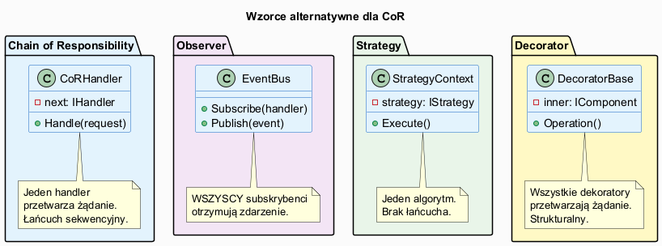
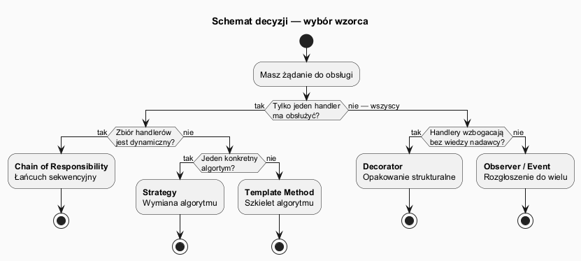

# 06 — Alternatywy i decyzja

## Spis treści

1. [Kontekst porównania](#1-kontekst)
2. [Chain of Responsibility vs Observer](#2-cor-vs-observer)
3. [Chain of Responsibility vs Strategy](#3-cor-vs-strategy)
4. [Chain of Responsibility vs Decorator](#4-cor-vs-decorator)
5. [Chain of Responsibility vs Template Method](#5-cor-vs-template)
6. [Macierz decyzyjna](#6-macierz)
7. [Schemat decyzji](#7-schemat)
8. [Uruchamianie](#8-uruchamianie)
9. [Zadania](#9-zadania)

---

## 1. Kontekst porównania <a name="1-kontekst"></a>



Wszystkie cztery wzorce obsługują **przetwarzanie żądań przez wiele obiektów**, ale różnią się kluczową cechą: **kto ostatecznie obsługuje żądanie?**

---

## 2. CoR vs Observer <a name="2-cor-vs-observer"></a>

| | CoR | Observer |
|--|-----|---------|
| Kto obsługuje? | Dokładnie **jeden** (lub żaden) | **Wszyscy** subskrybenci |
| Można przerwać łańcuch? | Tak — ogniwo nie woła `next` | Nie — wszyscy zawsze notyfikowani |
| Relacja nadawca–odbiorca | Nadawca zna interfejs handlera | Nadawca nie zna odbiorców |
| Kiedy użyć CoR? | Gdy tylko jeden z N handlerów ma odpowiedzieć | — |
| Kiedy użyć Observer? | Gdy **wszyscy** zainteresowani muszą być poinformowani | — |

**Przykład:**
- CoR: walidacja formularza — pierwszy błąd zatrzymuje
- Observer: zdarzenie `OrderPlaced` — e-mail + SMS + baza + analityka **równocześnie**

```csharp
// Observer — wszyscy obsługują
eventBus.Subscribe(o => SendEmail(o));
eventBus.Subscribe(o => SaveToDb(o));
eventBus.Subscribe(o => SendSms(o));
eventBus.Publish(order);     // wywołane 3 razy

// CoR — zatrzymuje się na pierwszym obsługującym
chain.Handle(order);         // wywołane: 1, 2 lub 3 razy (w zależności od warunku)
```

---

## 3. CoR vs Strategy <a name="3-cor-vs-strategy"></a>

| | CoR | Strategy |
|--|-----|---------|
| Ile algorytmów działa? | Kilka po kolei | Dokładnie jeden |
| Wybór algorithm? | Dynamiczny (przechodzi przez łańcuch) | Jawny wybór przez klienta |
| Composability | Wysoka (łączenie ogniw) | Niska (jeden zamiennik) |

**Przykład:**
- CoR: middleware pipeline — każde ogniwo coś robi z żądaniem
- Strategy: sortowanie — wybieramy jeden algorytm (`QuickSort` lub `BubbleSort`)

```csharp
// Strategy — wybieramy JEDEN algorytm
INotificationStrategy strategy = order.IsUrgent
    ? new UrgentStrategy()
    : new StandardStrategy();

strategy.Notify(order);    // jeden blok logiki

// CoR — kilka ogniw kolejno
email.SetNext(sms).SetNext(db);
email.Handle(order);       // email → sms → db (lub z warunkami)
```

---

## 4. CoR vs Decorator <a name="4-cor-vs-decorator"></a>

| | CoR | Decorator |
|--|-----|---------|
| Cel | Behawioralny (kto obsłuży?) | Strukturalny (owijanie funkcjonalności) |
| Wszystkie ogniwa działają? | Opcjonalnie — można przerwać | Tak — wszystkie dekoratory działają |
| Typ komponowania | Łańcuch z przerwaniem | Hierarchia owijania (zawsze do końca) |
| Zmiana zachowania w runtime? | Tak | Tak (dodawanie/usuwanie dekoratorów) |

**Kluczowa różnica konceptualna:**
- Decorator: komponent **nie wie** o dekoratorach — dodajesz nowe zachowanie bez modyfikacji klasy
- CoR: handler **wie** o interfejsie następnika — decyduje, czy przekazać

```csharp
// Decorator — każdy opakowuje i ZAWSZE woła inner
IProcessor p = new AuditDecorator(new EmailDecorator(new CoreProcessor()));
p.Process(order);   // AuditDecorator → EmailDecorator → CoreProcessor

// CoR — ogniwo może PRZERWAĆ łańcuch
chain.Handle(order);   // może się zatrzymać w połowie
```

---

## 5. CoR vs Template Method <a name="5-cor-vs-template"></a>

| | CoR | Template Method |
|--|-----|---------|
| Zmienność | Dynamiczna — ogniwa wymieniane w runtime | Statyczna — kroki zdefiniowane w klasie bazowej |
| Wiele klas | Tak — każde ogniwo to oddzielna klasa | Nie — jedna klasa bazowa + podklasy |
| Kiedy użyć? | Różni obsługujący, nieznani w czasie kompilacji | Szkielet algorytmu znany, kroki zmienne |

---

## 6. Macierz decyzyjna <a name="6-macierz"></a>

| Pytanie | CoR | Observer | Strategy | Decorator |
|---------|:---:|:--------:|:--------:|:---------:|
| Tylko jeden handler odpowiada | ✔ | ✗ | ✔ | ✗ |
| Łańcuch można przerwać | ✔ | ✗ | n/d | ✗ |
| Zbiór handlerów dynamiczny | ✔ | ✔ | ✔ | ✔ |
| Handlery nie znają siebie nawzajem | ✔ | ✔ | ✗ | ✔ |
| Wzorzec strukturalny | ✗ | ✗ | ✗ | ✔ |
| Cel: zastąpienie algorytmu | ✗ | ✗ | ✔ | ✗ |

---

## 7. Schemat decyzji <a name="7-schemat"></a>



---

## 8. Uruchamianie <a name="8-uruchamianie"></a>

```bash
cd src/18-lancuch-zobowiazan/06-alternatywy-i-decyzja/Examples
dotnet run
```

---

## 9. Zadania <a name="9-zadania"></a>

### Zadanie 1 — Zamień CoR na Observer
W przykładzie z tematem 01 (pipeline autoryzacyjny) zamień implementację CoR na Event Bus. Co się zmienia? Czy nadal możesz zatrzymać przetwarzanie przy nieautoryzowanym IP?

**Odpowiedź:** Z Observerem nie możesz łatwo zatrzymać łańcucha — wszystkie handlery zostaną wywołane, chyba że dodasz osobny mechanizm anulowania (np. `CancellationToken` lub flagę w kontekście zdarzenia). CoR jest tu lepszym wyborem.

### Zadanie 2 — Kiedy Decorator jest lepszy od CoR?
Podaj przykład scenariusza, gdzie Decorator byłby lepszym wyborem niż CoR.

**Odpowiedź:** Logowanie zapytań do bazy danych — każde zapytanie **zawsze** powinno być logowane i mierzone. Żaden dekorator nie powinien być pomijany. Użyj Decorator. CoR byłby złym wyborem, bo stworzyłby ryzyko pominięcia loggera.
