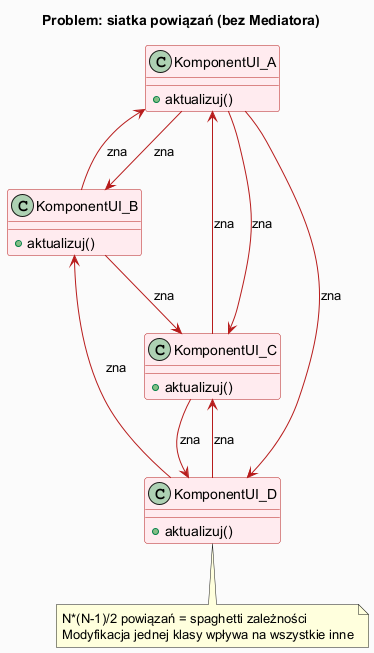
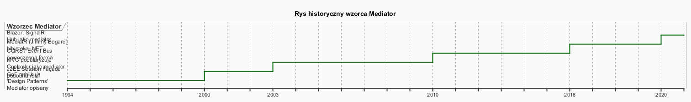
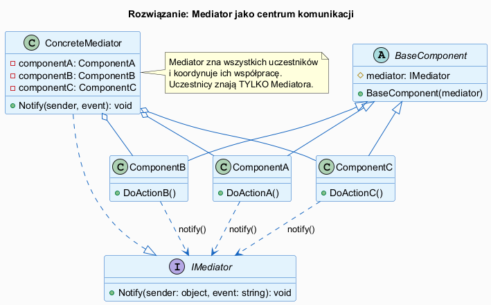

# 01 — Idea i kontekst

## Spis treści

1. [Problem, który rozwiązuje Mediator](#1-problem)
2. [Rys historyczny](#2-historia)
3. [Idea i koncepcja](#3-idea)
4. [Definicja GoF](#4-definicja)
5. [Przykłady w .NET](#5-przyklady-dotnet)
6. [Uruchamianie](#6-uruchamianie)
7. [Zadania](#7-zadania)
8. [Literatura](#8-literatura)

---

## 1. Problem, który rozwiązuje Mediator <a name="1-problem"></a>

### Siatka powiązań

W złożonych systemach UI lub modułach biznesowych komponenty zaczynają **bezpośrednio zależeć** od siebie nawzajem.



Przy N komponentach liczba potencjalnych powiązań wynosi **N·(N−1)/2**. Dla 5 komponentów to już 10 dwukierunkowych zależności.

**Skutki:**
- Modyfikacja jednej klasy zmusza do modyfikacji wielu innych
- Klasy trudno testować w izolacji
- Klasy trudno ponownie wykorzystać w innym kontekście
- Kod klasy rozrasta się o logikę "obcych" komponentów

### Przykład problemu (C#):

```csharp
class Button
{
    private TextInput _input;       // zna input
    private MessageLabel _msg;      // zna etykietę
    private Checkbox _rememberMe;   // zna checkbox

    public void Click()
    {
        // Przycisk musi znać wszystkich
        if (string.IsNullOrEmpty(_input.Text))
            _msg.Show("Błąd!");
        else
            _msg.Show($"OK: {_input.Text} | zapamiętaj={_rememberMe.IsChecked}");
    }
}
```

---

## 2. Rys historyczny <a name="2-historia"></a>



| Rok | Wydarzenie |
|-----|-----------|
| **1994** | GoF publikują *Design Patterns* — Mediator jako jeden z 23 wzorców |
| **1995–2000** | Popularyzacja w Smalltalk, Java — wzorzec MVC: Controller pełni rolę mediatora |
| **2003** | J2EE Session Façade — serwer fasady/mediatora w warstwie aplikacyjnej |
| **2010** | Pojawienie się wzorca CQRS — Command Bus jako Mediator dla komend |
| **2016** | **MediatR** — biblioteka Jimmy Bogarda dla .NET, wbudowany wzorzec Mediator |
| **2019** | ASP.NET Core Blazor — `EventCallback`, hub SignalR jako mediator w czasie rzeczywistym |

**Inspiracje historyczne:**
- **Wzorzec kontrolera lotniczego** (air traffic control) — najczęściej cytowany analogiczny system: każdy samolot komunikuje się z wieżą (mediator), nie bezpośrednio z innymi samolotami
- **Giełda papierów wartościowych** — giełda jako mediator między kupującymi i sprzedającymi

---

## 3. Idea i koncepcja <a name="3-idea"></a>



Mediator **centralizuje komunikację**: zamiast bezpośrednich powiązań między komponentami, każdy komponent komunikuje się **wyłącznie przez Mediatora**.

```
BEZ MEDIATORA:
  A ←→ B ←→ C ←→ D
  A ←→ C ←→ D
  A ←→ D

Z MEDIATOREM:
  A → Mediator → B
  B → Mediator → C
  C → Mediator → A
```

**Kluczowe właściwości:**

1. **Luźne sprzężenie (loose coupling)** — komponenty znają tylko interfejs mediatora
2. **Centralna logika koordynacji** — logika współpracy jest w jednym miejscu
3. **Reużywalność komponentów** — komponent bez powiązań można użyć w innym kontekście
4. **Zmiany w mediatorze** — nowe reguły koordynacji bez modyfikacji komponentów

---

## 4. Definicja GoF <a name="4-definicja"></a>

> **Wzorzec Mediator** — definiuje obiekt, który hermetyzuje sposób, w jaki zbiór obiektów
> ze sobą współdziała. Mediator promuje luźne sprzężenie, uniemożliwiając obiektom
> bezpośrednie odwoływanie się do siebie, co pozwala na niezależne modyfikowanie
> ich wzajemnych relacji.
>
> — *Gamma, Helm, Johnson, Vlissides, Design Patterns (1994)*

**Uczestnicy GoF:**

| Rola | Opis |
|------|------|
| **Mediator** | Interfejs definiujący operacje komunikacji z uczestnikami |
| **ConcreteMediator** | Implementacja mediatora — zna wszystkich uczestników, koordynuje ich |
| **Colleague** | Abstrakcja uczestnika — zna tylko interfejs mediatora |
| **ConcreteColleague** | Konkretny uczestnik — komunikuje się wyłącznie przez mediatora |

---

## 5. Przykłady w .NET <a name="5-przyklady-dotnet"></a>

### 5.1 ASP.NET Core — MediatR

```csharp
// Komenda — uczestnik (Colleague)
public record CreateOrderCommand(string ProductId, int Quantity) 
    : IRequest<OrderResult>;

// Handler — zastępuje ConcreteMediator dla danego komunikatu
public class CreateOrderHandler : IRequestHandler<CreateOrderCommand, OrderResult>
{
    public Task<OrderResult> Handle(
        CreateOrderCommand request, CancellationToken ct)
    {
        // Logika tworzenia zamówienia
        return Task.FromResult(new OrderResult(Guid.NewGuid()));
    }
}

// Użycie — sender zna tylko IMediator, nie zna HandleRA
public class OrderController(IMediator mediator) : ControllerBase
{
    [HttpPost]
    public async Task<IActionResult> Create(CreateOrderCommand cmd)
        => Ok(await mediator.Send(cmd));
}
```

### 5.2 SignalR Hub (mediator czasu rzeczywistego)

```csharp
// Hub = Mediator dla połączonych klientów
public class ChatHub : Hub
{
    // Klient wysyła do Huba (mediatora)
    public async Task SendMessage(string user, string message)
    {
        // Hub rozsyła do wszystkich klientów
        await Clients.All.SendAsync("ReceiveMessage", user, message);
    }
}
```

### 5.3 EventAggregator (MVVM, Prism)

```csharp
// Wydawca nie zna subskrybentów
_eventAggregator.GetEvent<UserLoggedInEvent>().Publish(user);

// Subskrybent nie zna wydawcy
_eventAggregator.GetEvent<UserLoggedInEvent>()
    .Subscribe(user => UpdateDashboard(user));
```

---

## 6. Uruchamianie <a name="6-uruchamianie"></a>

```bash
cd src/19-mediator/01-idea-i-kontekst/Examples
dotnet run
```

---

## 7. Zadania <a name="7-zadania"></a>

### Zadanie 1 — Dodaj komponent
Do przykładu z `LoginDialogMediator` dodaj komponent `ProgressBar`, który pojawia się podczas logowania (po kliknięciu przycisku) i ukrywa się po zakończeniu.

**Wskazówka:** Dodaj nowy `UIComponent`, zarejestruj go w mediatorze i obsłuż event `"login_start"` / `"login_done"`.

### Zadanie 2 — Policz zależności
Masz dialog z komponentami: Button, TextInput, PasswordInput, Checkbox, MessageLabel, ProgressBar (6 komponentów). Ile bezpośrednich powiązań by było bez mediatora (worst case)? Ile jest z mediatorem?

**Odpowiedź:** Bez: 6×5/2 = **15 powiązań**. Z mediatorem: **6 powiązań** (każdy ↔ mediator).

---

## 8. Literatura <a name="8-literatura"></a>

1. **GoF** — Gamma, Helm, Johnson, Vlissides: *Design Patterns*, Addison-Wesley 1994, s. 273–282
2. **RefactoringGuru** — https://refactoring.guru/design-patterns/mediator
3. **MediatR** — https://github.com/jbogard/MediatR
4. **Microsoft MVVM EventAggregator** — https://learn.microsoft.com/en-us/dotnet/communitytoolkit/mvvm/messenger
