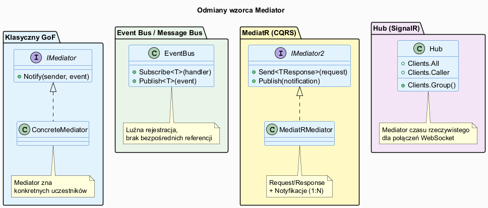
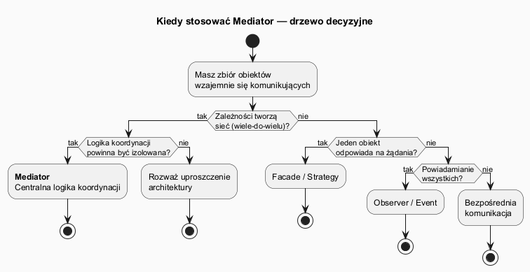

# 02 — Kiedy stosować, zalety i wady

## Spis treści

1. [Sygnały wskazujące na Mediator](#1-sygnaly)
2. [Sygnały ostrzegające](#2-ostrzezenia)
3. [Odmiany wzorca](#3-odmiany)
4. [Zalety](#4-zalety)
5. [Wady](#5-wady)
6. [Schemat decyzji](#6-schemat)
7. [Uruchamianie](#7-uruchamianie)
8. [Zadania](#8-zadania)

---

## 1. Sygnały wskazujące na Mediator <a name="1-sygnaly"></a>

Zastosuj Mediator, gdy widzisz:

| Sygnał | Opis | Przykład |
|--------|------|---------|
| **Siatka zależności** | Klasy tworzą sieć wzajemnych referencji | 5 komponentów UI znających się nawzajem |
| **Trudna ponowna używalność** | Komponent nie działa bez innych | `Button` wymaga `TextInput`, `MessageLabel`... |
| **Rozproszony protokół** | Logika interakcji rozsiana po wielu klasach | Walidacja w 4 różnych miejscach |
| **Brak testów jednostkowych** | Komponent trudno testować w izolacji | Mock wymaga 10 zależności |

### Przykład sygnału — siatka zależności:

```csharp
// SYGNAŁ: Button zna zbyt wiele klas
class Button
{
    private TextInput _input;         // ← zależy od
    private PasswordInput _password;  // ← zależy od
    private Checkbox _remember;       // ← zależy od
    private MessageLabel _message;    // ← zależy od
    private ProgressBar _progress;    // ← zależy od
    // ... i 5 więcej
}
// → Zastosuj Mediator
```

---

## 2. Sygnały ostrzegające — kiedy NIE stosować <a name="2-ostrzezenia"></a>

| Sygnał | Problem | Alternatywa |
|--------|---------|-------------|
| Tylko 2 obiekty | Mediator przesadza | Bezpośrednia referencja |
| Logika sekwencyjna | CoR lepsza | Chain of Responsibility |
| Jeden algorytm | Mediator niepotrzebny | Strategy |
| Wszyscy muszą być notyfikowani | Mediator może pominąć | Observer |
| Mediator rozrasta się do 500+ linii | "God Object" anty-wzorzec | Podziel na mniejsze mediatory |

---

## 3. Odmiany wzorca <a name="3-odmiany"></a>



### 3.1 Klasyczny GoF (dialog box)

Mediator zna wszystkich uczestników przez konkretne referencje. Koordynuje ich bezpośrednio.

```csharp
class LoginDialog : IDialogMediator
{
    private Button _loginBtn;
    private TextInput _usernameInput;
    private MessageLabel _errorMsg;

    public void Notify(object sender, string @event) { ... }
}
```

**Użycie:** Złożone formularze, dialogi GUI, komponenty MVVM.

### 3.2 Event Bus / Message Bus

Uczestnicy rejestrują się u mediatora przez typ zdarzenia. Luźniejsze sprzężenie — mediator nie zna uczestników z nazwy.

```csharp
bus.Subscribe<OrderPlaced>(e => Console.WriteLine($"E-mail: {e.OrderId}"));
bus.Subscribe<OrderPlaced>(e => UpdateInventory(e));

bus.Publish(new OrderPlaced(orderId));  // rozsyła do wszystkich subskrybentów
```

**Użycie:** Mikroserwisy, CQRS, integracja modułów.

### 3.3 MediatR (Request/Response + Notification)

Dedykowany handler dla każdego komunikatu. Możliwość Pipeline Behaviors (cross-cutting concerns).

```csharp
// Request/Response — jeden handler odpowiada
var result = await mediator.Send(new CreateOrderCommand(productId, qty));

// Notification — wszyscy handlerzy są powiadamiani
await mediator.Publish(new OrderShippedNotification(orderId));
```

**Użycie:** Czyste architektury (Clean Architecture), CQRS, API.

### 3.4 Hub (SignalR)

Mediator czasu rzeczywistego dla połączonych klientów WebSocket.

```csharp
public class ChatHub : Hub
{
    public async Task JoinGroup(string groupName)
        => await Groups.AddToGroupAsync(Context.ConnectionId, groupName);

    public async Task SendToGroup(string groupName, string message)
        => await Clients.Group(groupName).SendAsync("ReceiveMessage", message);
}
```

**Użycie:** Czaty, powiadomienia push, aktualizacje na żywo.

---

## 4. Zalety <a name="4-zalety"></a>

| Zaleta | Opis |
|--------|------|
| **Single Responsibility** | Protokół komunikacji w jednym miejscu |
| **Open/Closed** | Nowe klasy uczestników bez modyfikacji istniejących |
| **Loose coupling** | Uczestnicy niezależni od siebie |
| **Testowalność** | Każdy uczestnik testowalny z mock-iem mediatora |
| **Zmiana współpracy** | Reguły w mediatorze — brak modyfikacji uczestników |

```csharp
// Test izolowany dzięki Mediator
[Fact]
public void Button_Click_NotifiesMediator()
{
    var mockMediator = new Mock<IDialogMediator>();
    var button = new Button("Zaloguj");
    button.SetMediator(mockMediator.Object);

    button.Click();

    mockMediator.Verify(m => m.Notify(button, "click"), Times.Once);
}
```

---

## 5. Wady <a name="5-wady"></a>

| Wada | Opis | Mitygacja |
|------|------|-----------|
| **Mediator God Object** | Mediator zbyt duży i złożony | Podziel na mniejsze, wyspecjalizowane mediatory |
| **Trudność debugowania** | Przepływ zdarzeń nieoczywisty | Dodaj logowanie w mediatorze |
| **Ukryte zależności** | Trudno zobaczyć, kto komunikuje się z kim | Diagram sekwencji, dokumentacja |
| **Narzut wydajnościowy** | Każda komunikacja przez mediator | Bezpośrednia komunikacja dla hot-path |

---

## 6. Schemat decyzji <a name="6-schemat"></a>



---

## 7. Uruchamianie <a name="7-uruchamianie"></a>

```bash
cd src/19-mediator/02-kiedy-stosowac-zalety-wady/Examples
dotnet run
```

---

## 8. Zadania <a name="8-zadania"></a>

### Zadanie 1 — Oceń scenariusze
Dla każdego z poniższych scenariuszy zdecyduj: Mediator TAK/NIE i uzasadnij:
- a) Kalkulacja pensji pracownika (wzór matematyczny)
- b) Dialog z 6 polami formularza
- c) System zarządzania lotniskiem (samoloty ↔ wieża)
- d) Logowanie do bazy danych

### Zadanie 2 — Event Bus
Rozszerz `SimpleEventBus` o możliwość **anulowania subskrypcji** (`Unsubscribe`). Napisz test sprawdzający, że po wyrejestrowaniu handler nie jest wywoływany.

**Rozwiązanie:**
```csharp
public IDisposable Subscribe<T>(Action<T> handler)
{
    var key = typeof(T);
    Action<object> wrapper = e => handler((T)e);
    _handlers.GetOrAdd(key, _ => []).Add(wrapper);
    return new Subscription(() => _handlers[key].Remove(wrapper));
}
```
