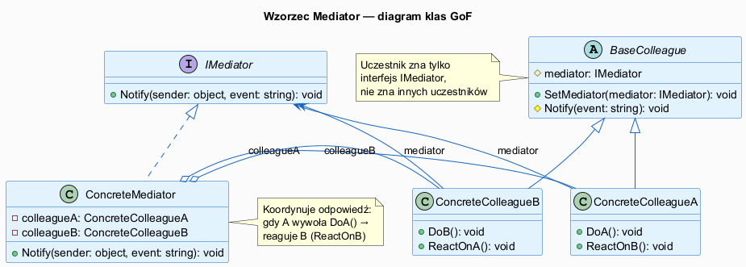
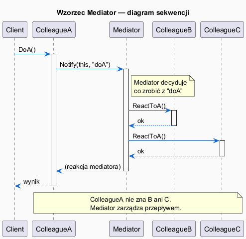
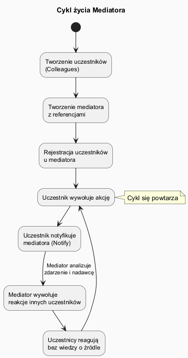

# 03 — Struktura GoF

## Spis treści

1. [Uczestnicy wzorca](#1-uczestnicy)
2. [Diagram klas](#2-diagram-klas)
3. [Diagram sekwencji](#3-diagram-sekwencji)
4. [Cykl życia](#4-cykl-zycia)
5. [Przykład: kontrola lotów](#5-przyklad)
6. [Konsekwencje stosowania](#6-konsekwencje)
7. [Uruchamianie](#7-uruchamianie)
8. [Zadania](#8-zadania)

---

## 1. Uczestnicy wzorca <a name="1-uczestnicy"></a>

| Rola GoF | Klasa w przykładzie | Odpowiedzialność |
|----------|-------------------|-----------------|
| **Mediator** (interfejs) | `IAirTrafficMediator` | Definiuje `Notify(sender, event)` |
| **ConcreteMediator** | `ControlTower` | Zna wszystkich, koordynuje logikę |
| **Colleague** (abstrakcja) | `AirportComponent` | Przechowuje ref do mediatora, woła `NotifyTower()` |
| **ConcreteColleagueA** | `Aircraft` | Samolot — prosi wieżę o zezwolenie |
| **ConcreteColleagueB** | `Runway` | Pas startowy — raportuje stan |
| **ConcreteColleagueC** | `WeatherStation` | Pogoda — raportuje warunki |

---

## 2. Diagram klas <a name="2-diagram-klas"></a>



### Kluczowe relacje

```
IAirTrafficMediator ←── ControlTower      (implementacja)
AirportComponent    ←── Aircraft          (dziedziczenie)
AirportComponent    ←── Runway            (dziedziczenie)
ControlTower        ──→ Aircraft[]        (zna kolekcję)
ControlTower        ──→ Runway[]          (zna kolekcję)
Aircraft            ──→ IAirTrafficMediator  (nie zna ControlTower!)
```

**Zasada:** Uczestnik znają **tylko interfejs** mediatora, nie konkretną klasę. Umożliwia podmianę mediatora bez modyfikacji uczestników.

---

## 3. Diagram sekwencji <a name="3-diagram-sekwencji"></a>



### Wyjaśnienie przepływu:

```
LOT101.RequestLanding()
    │
    └─→ Tower.Notify(LOT101, "land_request")
              │
              ├─→ Runway01.Occupy()
              │       └─→ Tower.Notify(Runway01, "runway_occupied")  ← opcjonalnie
              │
              └─→ LOT101.ClearToLand("Pas 01")
```

**Ważne:** `LOT101` nie wie o `Runway01`. `Runway01` nie wie o `LOT101`. Tylko `Tower` wie o obu.

---

## 4. Cykl życia <a name="4-cykl-zycia"></a>



### Kolejność inicjalizacji:

```csharp
// 1. Tworzenie uczestników
var runway1  = new Runway("Pas 01");
var plane1   = new Aircraft("LOT101");

// 2. Tworzenie mediatora z referencjami do uczestników
IAirTrafficMediator tower = new ControlTower();

// 3. Rejestracja — mediator i uczestnik wzajemnie się poznają
tower.Register(runway1);   // runway.SetMediator(tower) wewnętrznie
tower.Register(plane1);

// 4. Uczestnik inicjuje komunikację
plane1.RequestLanding();
//       → tower.Notify(plane1, "land_request")
//          → runway1.Occupy()
//          → plane1.ClearToLand("Pas 01")
```

---

## 5. Przykład: Kontrola lotów <a name="5-przyklad"></a>

### Wzorzec bez mediatora (problem):

```csharp
class Aircraft
{
    private List<Runway> _allRunways;           // zna pasy
    private List<Aircraft> _otherAircraft;     // zna inne samoloty
    private WeatherStation _weather;            // zna pogodę

    public void RequestLanding()
    {
        // Samolot sam szuka wolnego pasa, sprawdza pogodę, koordynuje z innymi
        var freeRunway = _allRunways.FirstOrDefault(r => !r.IsOccupied);
        if (freeRunway != null && _weather.WindSpeed < 40)
        {
            freeRunway.Occupy();
            Land(freeRunway.Name);
        }
    }
}
```

### Z mediatorem (rozwiązanie):

```csharp
class Aircraft : AirportComponent
{
    public void RequestLanding()
    {
        // Samolot tylko prosi wieżę — nic więcej nie wie
        NotifyTower("land_request");
    }

    public void ClearToLand(string runway)
        => Console.WriteLine($"Lądowanie na pasie {runway}");
}

class ControlTower : IAirTrafficMediator
{
    public void Notify(AirportComponent sender, string @event, object? data = null)
    {
        // Cała logika koordynacji w jednym miejscu
        if (@event == "land_request")
        {
            var freeRunway = _runways.FirstOrDefault(r => !r.IsOccupied);
            if (freeRunway != null)
            {
                freeRunway.Occupy();
                ((Aircraft)sender).ClearToLand(freeRunway.Name);
            }
        }
    }
}
```

---

## 6. Konsekwencje stosowania <a name="6-konsekwencje"></a>

| Konsekwencja | Opis |
|---|---|
| **Eliminacja podklas** | Zamiast podklas Kolegi, nowe zachowanie w mediatorze |
| **Uproszczenie protokołu** | Zastępuje relacje wiele-do-wielu relacją jeden-do-wielu |
| **Hermetyzacja interakcji** | Jak interakcje działają — tylko w mediatorze |
| **Centralizacja kontroli** | Mediator może stać się zbyt skomplikowany |

---

## 7. Uruchamianie <a name="7-uruchamianie"></a>

```bash
cd src/19-mediator/03-struktura-gof/Examples
dotnet run
```

---

## 8. Zadania <a name="8-zadania"></a>

### Zadanie 1 — Nowy uczestnik
Dodaj do systemu kontroli lotów klasę `FuelTruck` (cysterna paliwowa), która informuje wieżę, gdy kończy się jej paliwo. Wieża powinna wtedy zlecić samolocie odczekanie na tankowanie.

### Zadanie 2 — Mapowanie ról
Dla poniższych systemów, wskaż konkretne klasy pełniące role Mediator, Colleague:
- a) Dialog formularza rejestracji w aplikacji WPF
- b) System aukcyjny online
- c) Router HTTP w ASP.NET Core
