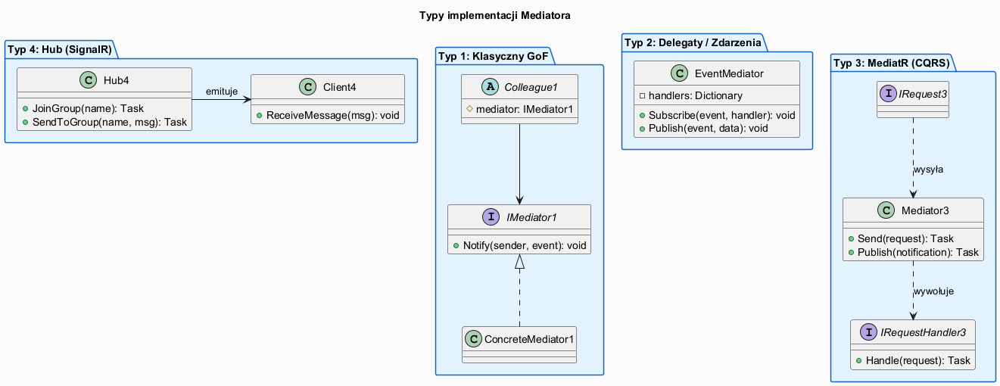
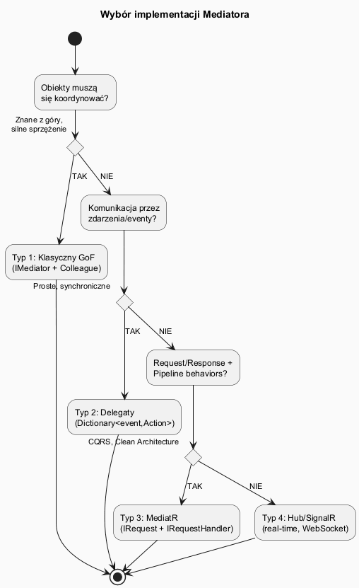

# 04 — Typy implementacji Mediatora

## Spis treści

1. [Przegląd typów](#1-przeglad)
2. [Typ 1: Klasyczny GoF](#2-klasyczny)
3. [Typ 2: Delegaty i zdarzenia](#3-delegaty)
4. [Typ 3: MediatR-style (CQRS)](#4-mediatr)
5. [Typ 4: Mediator funkcyjny](#5-funkcyjny)
6. [Porównanie typów](#6-porownanie)
7. [Diagram wyboru](#7-wybor)
8. [Uruchamianie](#8-uruchamianie)
9. [Zadania](#9-zadania)

---

## 1. Przegląd typów <a name="1-przeglad"></a>



Mediator można zaimplementować na cztery sposoby, zależnie od potrzeb:

| Typ | Kiedy stosować | Przykłady w .NET |
|-----|----------------|-----------------|
| Klasyczny GoF | Dialog, UI, silne sprzężenie obiektów | WinForms, WPF dialogi |
| Delegaty/Eventy | Luźne sprzężenie, proste zdarzenia | Własny EventBus, CAB |
| MediatR-style | CQRS, Clean Architecture, API | MediatR, MediateR |
| Hub/SignalR | Komunikacja w czasie rzeczywistym | SignalR, gRPC streaming |

---

## 2. Typ 1: Klasyczny GoF <a name="2-klasyczny"></a>

Mediator zna konkretnych uczestników przez referencje.

```csharp
interface IDialogMediator
{
    void Notify(object sender, string @event);
}

abstract class DialogComponent(string name)
{
    protected IDialogMediator? Mediator;
    public void SetMediator(IDialogMediator m) => Mediator = m;
    protected void Notify(string @event) => Mediator?.Notify(this, @event);
}

class LoginMediator : IDialogMediator
{
    // Zna wszystkich uczestników przez konkretne typy
    public void Notify(object sender, string @event)
    {
        switch (sender, @event)
        {
            case (LoginButton, "click"): /* logika logowania */ break;
            case (UsernameInput, "input"): /* aktywacja przycisku */ break;
        }
    }
}
```

**Zalety:** Prosta w debugowaniu, czytelny przepływ  
**Wady:** Mediator wie o konkretnych typach (mocniejsze sprzężenie)

---

## 3. Typ 2: Delegaty i zdarzenia <a name="3-delegaty"></a>

Uczestnicy rejestrują się anonimowo. Mediator nie zna typów.

```csharp
class EventMediator
{
    private Dictionary<string, List<Action<string>>> _handlers = new();

    public void Subscribe(string @event, Action<string> handler) { ... }
    public void Publish(string @event, string data) { ... }
}

// Użycie — bardzo luźne sprzężenie
bus.Subscribe("order_placed", id => SendConfirmationEmail(id));
bus.Subscribe("order_placed", id => UpdateInventory(id));
bus.Publish("order_placed", orderId);
```

**Zalety:** Bardzo luźne sprzężenie, łatwe rozszerzanie  
**Wady:** Trudniejsze debugowanie (kto subskrybuje?), brak typowania

---

## 4. Typ 3: MediatR-style <a name="4-mediatr"></a>

Każde żądanie ma dedykowany handler. Możliwe pipeline behaviors (logowanie, walidacja, transakcje).

```csharp
// Request — niesie dane
record CreateUserCommand(string Email, string Name) : IRequest<UserDto>;

// Handler — przetwarza jedno żądanie
class CreateUserHandler : IRequestHandler<CreateUserCommand, UserDto>
{
    public Task<UserDto> Handle(CreateUserCommand cmd)
    {
        var user = new UserDto(Guid.NewGuid(), cmd.Email, cmd.Name);
        return Task.FromResult(user);
    }
}

// Wywołanie przez mediator
var result = await mediator.Send(new CreateUserCommand("jan@firma.pl", "Jan"));
```

### Pipeline Behaviors

```csharp
class LoggingBehavior<TRequest, TResponse>
    : IPipelineBehavior<TRequest, TResponse>
{
    public async Task<TResponse> Handle(TRequest request,
        RequestHandlerDelegate<TResponse> next)
    {
        _logger.LogInformation("Handling {Name}", typeof(TRequest).Name);
        var response = await next();                    // następny w pipeline
        _logger.LogInformation("Handled {Name}", typeof(TRequest).Name);
        return response;
    }
}
```

**Zalety:** Separation of concerns, testowalność, pipeline  
**Wady:** Narzut abstrakcji, wymaga konwencji

---

## 5. Typ 4: Mediator funkcyjny <a name="5-funkcyjny"></a>

Pipeline zbudowany z funkcji wyższego rzędu (podobny do middleware w ASP.NET Core).

```csharp
var pipeline = new FunctionalMediator();

pipeline.Use(async (msg, next) => {
    Console.WriteLine($"Przed: {msg.Type}");
    var result = await next(msg);     // ← przekazuje do następnego
    Console.WriteLine($"Po: {msg.Type}");
    return result;
});

pipeline.Handle(async msg => $"Wynik: {msg.Payload}");
```

**Zalety:** Kompozycja, reużywalność middleware, asynchroniczność  
**Wady:** Trudniejszy do zrozumienia na początku

---

## 6. Porównanie typów <a name="6-porownanie"></a>

| Kryterium | Klasyczny GoF | Delegaty | MediatR | Funkcyjny |
|-----------|:---:|:---:|:---:|:---:|
| Testowalność | ★★★ | ★★★ | ★★★★★ | ★★★★ |
| Czytelność kodu | ★★★★★ | ★★★ | ★★★★ | ★★★ |
| Rozszerzalność | ★★★ | ★★★★ | ★★★★★ | ★★★★ |
| Wydajność | ★★★★★ | ★★★★ | ★★★ | ★★★ |
| Typowanie | ★★★★★ | ★★ | ★★★★★ | ★★★ |

---

## 7. Diagram wyboru <a name="7-wybor"></a>



---

## 8. Uruchamianie <a name="8-uruchamianie"></a>

```bash
cd src/19-mediator/04-typy-implementacji/Examples
dotnet run
```

---

## 9. Zadania <a name="9-zadania"></a>

### Zadanie 1 — Wybór implementacji
Dla każdego scenariusza wybierz typ implementacji i uzasadnij:
- a) System aukcyjny — wiele handlerów reaguje na `BidPlaced`
- b) Formularz meldunkowy w aplikacji desktop z 8 polami
- c) API do tworzenia zamówień z walidacją i logowaniem
- d) Czat dla 1000 użytkowników online

### Zadanie 2 — Pipeline Behavior
Dodaj do `FunctionalMediator` middleware `ValidationMiddleware`, który sprawdza, czy `Message.Payload` nie jest dłuższy niż 100 znaków. Jeśli jest — przerywa pipeline i zwraca błąd.
