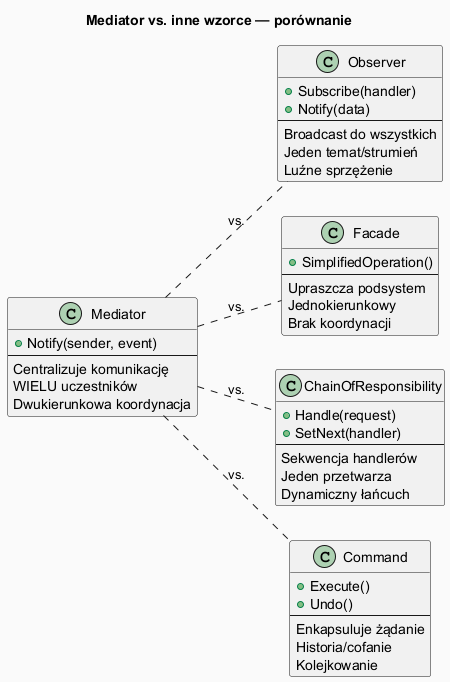
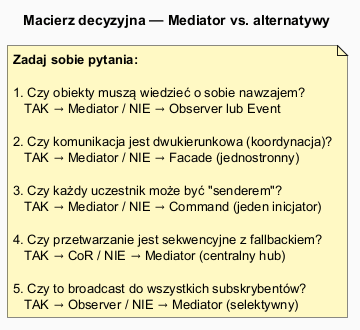

# 05 — Wady, zalety i alternatywy

## Spis treści

1. [Zalety Mediatora](#1-zalety)
2. [Wady Mediatora](#2-wady)
3. [Anty-wzorce](#3-antywzorce)
4. [Mediator vs Observer](#4-vs-observer)
5. [Mediator vs Facade](#5-vs-facade)
6. [Mediator vs CoR](#6-vs-cor)
7. [Mediator vs Command](#7-vs-command)
8. [Macierz decyzyjna](#8-macierz)
9. [Uruchamianie](#9-uruchamianie)
10. [Zadania](#10-zadania)

---

## 1. Zalety Mediatora <a name="1-zalety"></a>

| Zaleta | Opis | Mierzalny efekt |
|--------|------|----------------|
| **Loose coupling** | Klasy nie znają siebie nawzajem | Można wymieniać uczestników niezależnie |
| **Single Responsibility** | Protokół komunikacji w jednym miejscu | Mediator = 1 klasa do zmiany |
| **Open/Closed** | Nowi uczestnicy bez zmiany istniejących | `Register(new Participant())` |
| **Testowalność** | Mock jednego interfejsu `IMediator` | Każda klasa testowalna w izolacji |
| **Centralne logowanie** | Jeden punkt do logowania interakcji | Monitoring, audit trail |

```csharp
// Testowanie uczestnika — ŁATWE z Mediatorem
[Fact]
public void Aircraft_RequestLanding_NotifiesTower()
{
    var mockTower = new Mock<IAirTrafficMediator>();
    var plane = new Aircraft("LOT101");
    plane.SetMediator(mockTower.Object);

    plane.RequestLanding();

    mockTower.Verify(m => m.Notify(plane, "land_request", null), Times.Once);
}
```

---

## 2. Wady Mediatora <a name="2-wady"></a>

| Wada | Opis | Mitygacja |
|------|------|-----------|
| **God Object** | Mediator rośnie bez ograniczeń | Podziel na specjalizowane mediatory |
| **Single Point of Failure** | Błąd w mediatorze → system nie działa | Testy jednostkowe, monitoring |
| **Ukryty przepływ** | Trudno śledzić kto z kim rozmawia | Logi, diagramy sekwencji |
| **Trudność testowania mediatora** | Sam mediator może być skomplikowany | Testy integracyjne |
| **Narzut pośredni** | Każda komunikacja przez mediator | Bezpośrednia referencja dla hot-path |

### Przykład God Object (anty-wzorzec):

```csharp
class GodMediator : IMediator
{
    // ❌ ZA DUŻO odpowiedzialności
    public void Notify(object sender, string @event)
    {
        switch (@event)
        {
            case "login": HandleLogin(); break;
            case "logout": HandleLogout(); break;
            case "order_placed": HandleOrder(); break;
            case "payment": HandlePayment(); break;
            case "shipment": HandleShipment(); break;
            case "return": HandleReturn(); break;
            case "invoice": HandleInvoice(); break;
            // ... 50 więcej przypadków
        }
    }
}
```

### Prawidłowy podział:

```csharp
// ✔ Wyspecjalizowane mediatory
class AuthMediator  : IMediator { /* login, logout, sesje */ }
class OrderMediator : IMediator { /* zamówienia, płatności */ }
class ShipmentMediator : IMediator { /* wysyłka, zwroty */ }
```

---

## 3. Anty-wzorce <a name="3-antywzorce"></a>

### Anty-wzorzec 1: Mediator dla 2 obiektów

```csharp
// ❌ Przesada — 2 obiekty → bezpośrednia referencja wystarczy
class OverengineeredMediator
{
    private readonly A _a;
    private readonly B _b;
    public void Notify(object s, string e) { /* trywialny kod */ }
}
```

### Anty-wzorzec 2: Mediator zamiast bazy danych

```csharp
// ❌ Mediator nie jest stanem aplikacji
class DataStorageMediator
{
    private readonly Dictionary<string, object> _state = new();
    public void Store(string key, object val) => _state[key] = val;
    // Użyj repozytorium lub dependency injection
}
```

### Anty-wzorzec 3: Cykliczne wywołania

```csharp
// ❌ A → Mediator → B → Mediator → A → ...
class A { void DoA() { Notify("doA"); } void ReactToB() { Notify("reactToB"); /* nieskończona pętla */ } }
```

---

## 4. Mediator vs Observer <a name="4-vs-observer"></a>



| Kryterium | Mediator | Observer |
|-----------|----------|---------|
| Komunikacja | Selektywna (mediator decyduje) | Broadcast (wszyscy subskrybenci) |
| Wiedza o uczestnikach | Mediator zna ich konkretne typy | Subject nie zna obserwatorów |
| Kierunek | Dwukierunkowa koordynacja | Jednokierunkowy przepływ danych |
| Użycie | Dialog UI, workflow | Zdarzenia domenowe, eventy |

```csharp
// MEDIATOR: selektywna koordynacja
tower.Notify(plane, "land_request");
// → tower decyduje: przydziel pAS01 konkretnie LOT101

// OBSERVER: broadcast
orderEvent.Raise(order);
// → wszyscy subskrybenci (email, stock, log) dostają powiadomienie
```

---

## 5. Mediator vs Facade <a name="5-vs-facade"></a>

| Kryterium | Mediator | Facade |
|-----------|----------|--------|
| Przepływ | Dwukierunkowy | Jednokierunkowy (klient → podsystem) |
| Uczestnicy | Komunikują się przez mediator | Facade tylko upraszcza API |
| Stan | Mediator przechowuje stan | Facade bezstanowa |

```csharp
// FACADE: upraszcza API dla klienta
facade.ProcessOrder(orderId);  // wywołuje wewnętrznie 5 kroków

// MEDIATOR: koordynuje obiekty, które SAME się komunikują
plane.RequestLanding();        // plane → tower → runway → plane
```

---

## 6. Mediator vs CoR <a name="6-vs-cor"></a>

| Kryterium | Mediator | CoR |
|-----------|----------|-----|
| Struktura | Gwiazda (hub and spoke) | Łańcuch |
| Liczba procesorów | Centralny 1 | Jeden z wielu |
| Fallback | Brak (mediator zawsze odpowiada) | Naturalny (brak handlera = odrzucenie) |

---

## 7. Mediator vs Command <a name="7-vs-command"></a>

| Kryterium | Mediator | Command |
|-----------|----------|---------|
| Cel | Koordynacja między obiektami | Enkapsulacja żądania |
| Cofanie | Nie wspiera | Undo/Redo |
| Typowe użycie | Dialogi, UI | Historia operacji, kolejki |

---

## 8. Macierz decyzyjna <a name="8-macierz"></a>



| Scenariusz | Wzorzec |
|------------|---------|
| N obiektów musi się koordynować | **Mediator** |
| Jeden obiekt broadcast do wielu | **Observer** |
| Uproszczenie API złożonego systemu | **Facade** |
| Sekwencja handlerów z możliwością zatrzymania | **CoR** |
| Kolejkowanie/cofanie operacji | **Command** |

---

## 9. Uruchamianie <a name="9-uruchamianie"></a>

```bash
cd src/19-mediator/05-wady-zalety-alternatywy/Examples
dotnet run
```

---

## 10. Zadania <a name="10-zadania"></a>

### Zadanie 1 — Refaktoryzacja God Object
Dany jest poniższy God Mediator. Podziel go na 2 wyspecjalizowane mediatory:

```csharp
class AppMediator
{
    public void Notify(object s, string e)
    {
        if (e is "login" or "logout" or "register") { /* auth logic */ }
        if (e is "order_placed" or "order_paid" or "order_shipped") { /* order logic */ }
    }
}
```

### Zadanie 2 — Porównanie wzorców
Napisz ten sam system czatu 2 sposobami: Mediator i Observer. Wskaż różnicę: który umożliwia prywatne wiadomości (unicast), który tylko broadcast?
