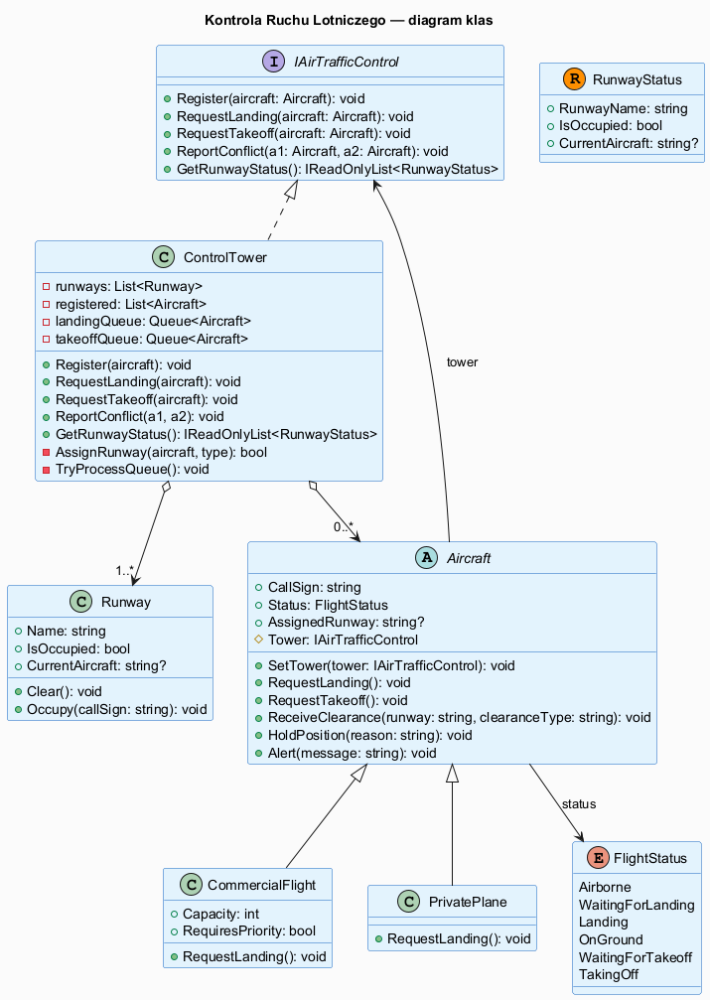
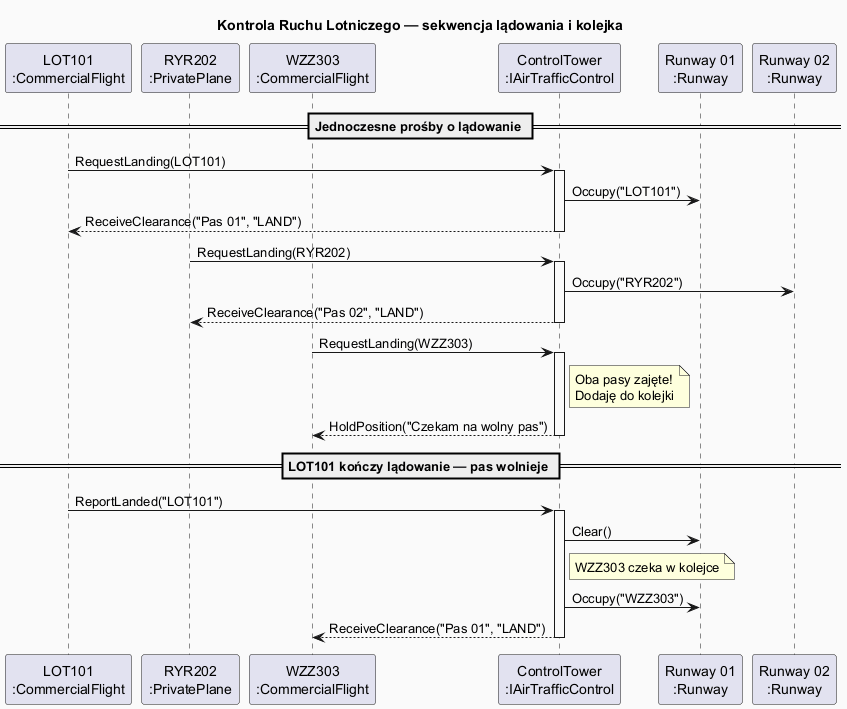

# 06 — Większy przykład: Kontrola Ruchu Lotniczego

## Spis treści

1. [Opis scenariusza](#1-opis)
2. [Diagram klas](#2-diagram-klas)
3. [Diagram sekwencji](#3-diagram-sekwencji)
4. [Analiza wzorca w kodzie](#4-analiza)
5. [Uruchamianie](#5-uruchamianie)
6. [Testy](#6-testy)
7. [Zadania projektowe](#7-zadania)

---

## 1. Opis scenariusza <a name="1-opis"></a>

Kontrola ruchu lotniczego to klasyczny przykład wzorca Mediator z podręcznika:

- **Samoloty** (Colleagues) nie komunikują się bezpośrednio — nie wiedzą o sobie nawzajem
- **Wieża kontrolna** (Mediator) koordynuje dostęp do pasów, zarządza kolejkami, nadaje priorytety
- **Pasy startowe** to zasoby współdzielone — wymagają synchronizacji

### Dlaczego to idealny przypadek dla Mediatora?

```
Bez Mediatora:
  LOT101 sprawdza stan pasa → pyta inne samoloty → sprawdza pogodę → decyduje...
  → N*(N-1)/2 interakcji

Z Mediatorem:
  LOT101 → "proszę o lądowanie" → Wieża
  Wieża → sprawdza pasy, kolejki, priorytety → odpowiada LOT101
  → N interakcji (N = liczba samolotów)
```

---

## 2. Diagram klas <a name="2-diagram-klas"></a>



### Mapowanie ról GoF:

| Rola GoF | Klasa | Opis |
|----------|-------|------|
| `IMediator` | `IAirTrafficControl` | Interfejs wieży |
| `ConcreteMediator` | `ControlTower` | Wieża koordynuje pasy i samoloty |
| `Colleague` (baza) | `Aircraft` | Znają tylko wieżę |
| `ConcreteColleagueA` | `CommercialFlight` | Samolot komercyjny z priorytetem |
| `ConcreteColleagueB` | `PrivatePlane` | Prywatny samolot |

---

## 3. Diagram sekwencji <a name="3-diagram-sekwencji"></a>



---

## 4. Analiza wzorca w kodzie <a name="4-analiza"></a>

### Uczestnik nie zna innych uczestników:

```csharp
// Aircraft (Colleague) — nie ma referencji do innych Aircraft ani do Runway
public abstract class Aircraft(string callSign)
{
    protected IAirTrafficControl? Tower;  // zna TYLKO interfejs mediatora

    public virtual void RequestLanding()
    {
        Status = FlightStatus.WaitingForLanding;
        Tower?.RequestLanding(this);      // deleguje do mediatora
    }
}
```

### Mediator koordynuje:

```csharp
// ControlTower — zna WSZYSTKICH uczestników
public class ControlTower : IAirTrafficControl
{
    private readonly List<Aircraft> _registered = [];
    private readonly List<Runway> _runways = [];
    private readonly Queue<Aircraft> _landingQueue = new();

    public void RequestLanding(Aircraft aircraft)
    {
        var freeRunway = _runways.FirstOrDefault(r => !r.IsOccupied);
        if (freeRunway != null)
        {
            freeRunway.Occupy(aircraft.CallSign);
            aircraft.ReceiveLandingClearance(freeRunway.Name);  // ← bezpośrednie wywołanie
        }
        else
        {
            _landingQueue.Enqueue(aircraft);
            aircraft.HoldPosition("Brak wolnego pasa");
        }
    }
}
```

### Priorytet w Mediatorze (nie w uczestnikach):

```csharp
// Logika priorytetu jest W MEDIATORZE, nie w samolotach
private void TryAssignRunway(Aircraft aircraft, bool isLanding, bool priority)
{
    Runway? freeRunway = priority
        ? _runways.LastOrDefault(r => !r.IsOccupied)   // ostatni pas (bliżej)
        : _runways.FirstOrDefault(r => !r.IsOccupied); // pierwszy dostępny
    // ...
}
```

---

## 5. Uruchamianie <a name="5-uruchamianie"></a>

```bash
cd src/19-mediator/06-wiekszy-przyklad/Examples
dotnet run
```

---

## 6. Testy <a name="6-testy"></a>

```bash
cd src/19-mediator/06-wiekszy-przyklad/Tests
dotnet test
```

Testy pokrywają:
- Rejestrację samolotów
- Przydzielanie pasów gdy są wolne
- Kolejkowanie gdy pasy są zajęte
- Zwalnianie pasów i obsługę kolejki
- Priorytety dla dużych samolotów
- Przejścia stanu `FlightStatus`
- Jednoczesne lądowanie dwóch samolotów

---

## 7. Zadania projektowe <a name="7-zadania"></a>

### Zadanie 1 — Stacja Pogodowa
Dodaj uczestnika `WeatherStation` do systemu. Gdy wiatr przekracza 40 km/h:
- Wieża powinna wstrzymać wszystkie lądowania
- Samoloty w kolejce otrzymują `HoldPosition("Warunki pogodowe")`
- Gdy wiatr spada poniżej 40 km/h — wznawia kolejkę

### Zadanie 2 — Sytuacja awaryjna
Dodaj metodę `DeclareEmergency(Aircraft aircraft)` — samolot awaryjny:
- Automatycznie wysuwa się na początek kolejki
- Dostaje wolny pas natychmiast (jeśli trzeba, drugi samolot czeka)
- Wieża powiadamia inne samoloty o zmianie

### Zadanie 3 — Statystyki
Dodaj do `ControlTower` zliczanie: ilu samolotów wylądowało, ile czekało w kolejce, średni czas czekania. Napisz test sprawdzający statystyki po symulacji 5 lądowań.
