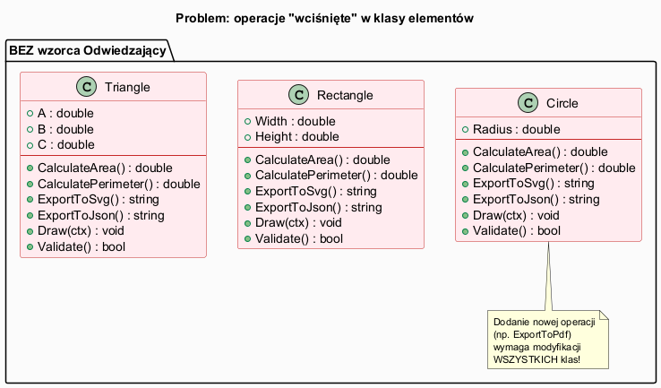
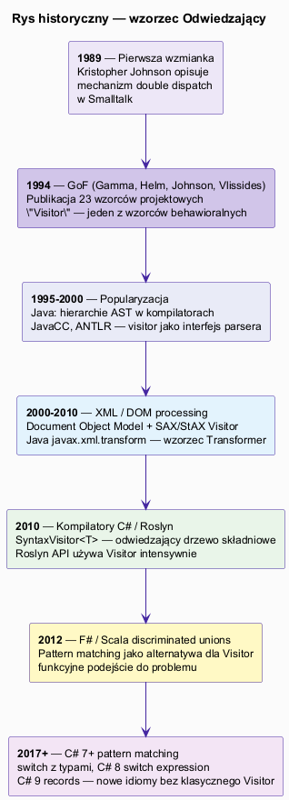
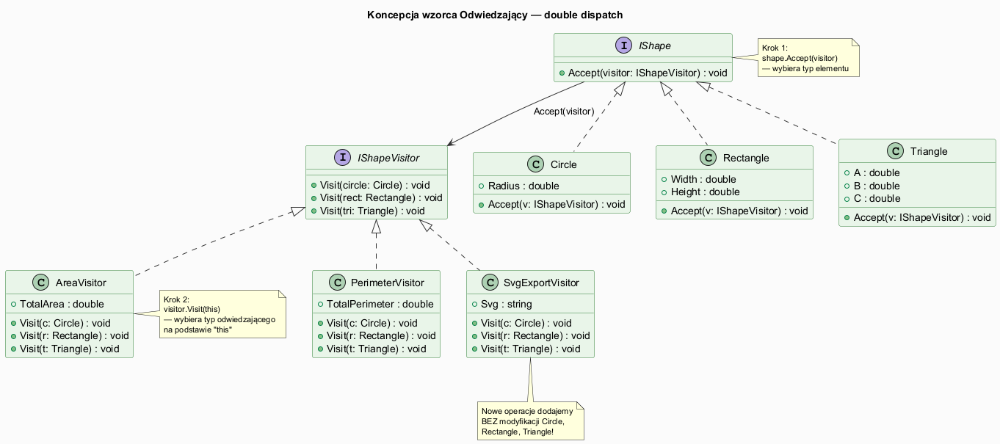

# 01 — Idea i kontekst

## Spis treści

1. [Problem, który rozwiązuje Odwiedzający](#1-problem)
2. [Rys historyczny](#2-historia)
3. [Idea i koncepcja](#3-idea)
4. [Definicja GoF](#4-definicja)
5. [Mechanizm double dispatch](#5-double-dispatch)
6. [Przykłady w .NET 9 / C#](#6-przyklady)
7. [Uruchamianie](#7-uruchamianie)
8. [Zadania](#8-zadania)
9. [Literatura](#9-literatura)

---

## 1. Problem, który rozwiązuje Odwiedzający <a name="1-problem"></a>

Wyobraź sobie hierarchię klas figur geometrycznych: `Circle`, `Rectangle`, `Triangle`. Na początku masz jedną operację — rysowanie. Z czasem pojawiają się kolejne: liczenie pola, obwodu, eksport do SVG, do JSON, walidacja, serializacja...

### Naive podejście — "wcisnąć" wszystko do klas

```csharp
class Circle
{
    // Dane
    public double Radius { get; }

    // Rosnąca lista niezwiązanych operacji
    public double CalculateArea()      { ... }
    public double CalculatePerimeter() { ... }
    public string ExportToSvg()        { ... }
    public string ExportToJson()       { ... }
    public void Draw(IGraphicsContext ctx) { ... }
    public bool Validate()             { ... }
}
```

**Skutki:**
- Każda nowa operacja wymaga modyfikacji **wszystkich** klas w hierarchii
- Klasy naruszają **Single Responsibility Principle** — łączą dane z logiką operacji
- Kod wielu niezwiązanych operacji miesza się w jednej klasie



---

## 2. Rys historyczny <a name="2-historia"></a>



| Rok | Wydarzenie |
|-----|-----------|
| **1989** | Kristopher Johnson opisuje double dispatch w Smalltalk |
| **1994** | GoF publikują *Design Patterns* — Visitor jako jeden z 23 wzorców |
| **1995–2000** | Java: ANTLR, JavaCC generują interfejsy Visitor dla gramatyk |
| **2000–2010** | XML/DOM: `org.w3c.dom.traversal.NodeFilter` jako wariant Visitor |
| **2010** | Microsoft Roslyn — `SyntaxVisitor<T>` dla drzew składniowych C# |
| **2012** | F#, Scala — discriminated unions + pattern matching jako alternatywa |
| **2017+** | C# 7+ pattern matching, C# 9 records — nowe idiomy wypierają Visitor w prostych przypadkach |

---

## 3. Idea i koncepcja <a name="3-idea"></a>



Wzorzec Odwiedzający **wydziela operacje z klas elementów** do osobnych klas zwanych odwiedzającymi.

```
BEZ wzorca:               Z WZORCEM:
────────────────          ─────────────────────────────────────
Circle.Area()             AreaVisitor.Visit(Circle c)
Circle.Perimeter()        PerimeterVisitor.Visit(Circle c)
Circle.ExportSvg()        SvgExportVisitor.Visit(Circle c)

Rectangle.Area()          AreaVisitor.Visit(Rectangle r)
Rectangle.Perimeter()     PerimeterVisitor.Visit(Rectangle r)
Rectangle.ExportSvg()     SvgExportVisitor.Visit(Rectangle r)
```

**Klucz:** klasy figur zostają proste — zawierają tylko dane i metodę `Accept`. Nowe operacje to nowe klasy odwiedzających.

---

## 4. Definicja GoF <a name="4-definicja"></a>

> *"Reprezentuje operację, która ma być wykonana na elementach struktury obiektów. Visitor pozwala zdefiniować nową operację bez zmieniania klas elementów, na których operuje."*
>
> — Gamma, Helm, Johnson, Vlissides, *Design Patterns*, 1994, s. 331

**Uczestnicy wzorca:**

| Uczestnik | Rola |
|-----------|------|
| `IVisitor` | Deklaruje metodę `Visit(ConcreteElement)` dla każdego typu elementu |
| `ConcreteVisitor` | Implementuje operację dla każdego elementu; może gromadzić stan |
| `IElement` | Deklaruje metodę `Accept(IVisitor)` |
| `ConcreteElement` | Implementuje `Accept` wywołując `visitor.Visit(this)` |
| `ObjectStructure` | Kolekcja lub drzewo elementów udostępniające iterację |

---

## 5. Mechanizm double dispatch <a name="5-double-dispatch"></a>

C# (podobnie jak Java, C++) używa **single dispatch** — wywołanie wirtualne zależy tylko od **jednego** obiektu (odbiorcy). Wzorzec Visitor symuluje **double dispatch** (zależy od dwóch typów).

### Jak to działa krok po kroku:

```csharp
List<IShape> shapes = [new Circle(5), new Rectangle(4, 6)];
var areaVisitor = new AreaVisitor();

// ── Krok 1 ──
shapes[0].Accept(areaVisitor);
// Runtime widzi: shapes[0] to Circle → wywołuje Circle.Accept(areaVisitor)

// ── Krok 2 (wewnątrz Circle.Accept) ──
// public void Accept(IShapeVisitor v) => v.Visit(this);
// "this" to Circle → wywołuje AreaVisitor.Visit(Circle c)

// ── Wynik ──
// AreaVisitor.Visit(Circle c) { TotalArea += Math.PI * c.Radius * c.Radius; }
```

Dwa niezależne wybory przeciążenia:
1. `Accept` — wybór na podstawie **typu elementu** (Circle, Rectangle...)
2. `Visit` — wybór na podstawie **typu odwiedzającego** (AreaVisitor, PerimeterVisitor...)

---

## 6. Przykłady w .NET 9 / C# <a name="6-przyklady"></a>

Pełny kod w [`Examples/Program.cs`](Examples/Program.cs).

### Interfejsy

```csharp
interface IShape
{
    void Accept(IShapeVisitor visitor);
}

interface IShapeVisitor
{
    void Visit(Circle circle);
    void Visit(Rectangle rectangle);
    void Visit(Triangle triangle);
}
```

### Elementy — minimalne, tylko dane + Accept

```csharp
record Circle(double Radius) : IShape
{
    public void Accept(IShapeVisitor visitor) => visitor.Visit(this);
}

record Rectangle(double Width, double Height) : IShape
{
    public void Accept(IShapeVisitor visitor) => visitor.Visit(this);
}

record Triangle(double A, double B, double C) : IShape
{
    public void Accept(IShapeVisitor visitor) => visitor.Visit(this);
}
```

### Odwiedzający — operacja 1: pole

```csharp
class AreaVisitor : IShapeVisitor
{
    public double TotalArea { get; private set; }

    public void Visit(Circle c)
        => TotalArea += Math.PI * c.Radius * c.Radius;

    public void Visit(Rectangle r)
        => TotalArea += r.Width * r.Height;

    public void Visit(Triangle t)
    {
        double s = (t.A + t.B + t.C) / 2.0;
        TotalArea += Math.Sqrt(s * (s - t.A) * (s - t.B) * (s - t.C));
    }
}
```

### Odwiedzający — operacja 2: obwód

```csharp
class PerimeterVisitor : IShapeVisitor
{
    public double TotalPerimeter { get; private set; }

    public void Visit(Circle c)    => TotalPerimeter += 2 * Math.PI * c.Radius;
    public void Visit(Rectangle r) => TotalPerimeter += 2 * (r.Width + r.Height);
    public void Visit(Triangle t)  => TotalPerimeter += t.A + t.B + t.C;
}
```

### Nowa operacja BEZ modyfikacji figur

```csharp
class SvgExportVisitor : IShapeVisitor
{
    private readonly StringBuilder _sb = new();
    public string Svg => $"<svg>{_sb}</svg>";

    public void Visit(Circle c)
        => _sb.Append($"<circle cx=\"50\" cy=\"50\" r=\"{c.Radius}\"/>");
    public void Visit(Rectangle r)
        => _sb.Append($"<rect width=\"{r.Width}\" height=\"{r.Height}\"/>");
    public void Visit(Triangle t)
        => _sb.Append($"<polygon .../>");
}
```

### Użycie

```csharp
var shapes = new List<IShape>
{
    new Circle(5.0),
    new Rectangle(4.0, 6.0),
    new Triangle(3.0, 4.0, 5.0),
};

var area = new AreaVisitor();
shapes.ForEach(s => s.Accept(area));
Console.WriteLine($"Łączne pole = {area.TotalArea:F2}");
// → Łączne pole = 108.54

var svg = new SvgExportVisitor();
shapes.ForEach(s => s.Accept(svg));
Console.WriteLine(svg.Svg);
```

---

## 7. Uruchamianie <a name="7-uruchamianie"></a>

```bash
cd src/20-odwiedzajacy/01-idea-i-kontekst/Examples
dotnet run
```

Oczekiwane wyjście:

```
=== Wzorzec Odwiedzający — Idea i kontekst ===

--- Opisy figur ---
  Koło       : promień = 5.00
  Prostokąt  : 4.00 × 6.00
  Trójkąt    : boki 3.00, 4.00, 5.00
  Koło       : promień = 2.50
  Prostokąt  : 8.00 × 3.00

--- Pole powierzchni ---
  Łączne pole = 133.54

--- Obwód ---
  Łączny obwód = 96.27

--- Eksport SVG ---
  <svg>...</svg>
```

---

## 8. Zadania <a name="8-zadania"></a>

1. Dodaj nową figurę `Ellipse(double A, double B)` (elipsa). Które klasy musisz zmodyfikować?
2. Zaimplementuj `JsonExportVisitor` eksportujący figury do JSON.
3. Napisz `ValidationVisitor` sprawdzający, czy parametry figur są poprawne (np. promień > 0).

---

## 9. Literatura <a name="9-literatura"></a>

- E. Gamma et al., *Design Patterns*, Addison-Wesley, 1994, s. 331–344
- [Visitor — refactoring.guru](https://refactoring.guru/pl/design-patterns/visitor)
- [Double dispatch w C# — Jon Skeet](https://codeblog.jonskeet.uk/2008/02/14/c-and-the-visitor-pattern/)
- [Roslyn SyntaxVisitor — Microsoft Docs](https://learn.microsoft.com/en-us/dotnet/api/microsoft.codeanalysis.csharp.csharpsyntaxvisitor)
