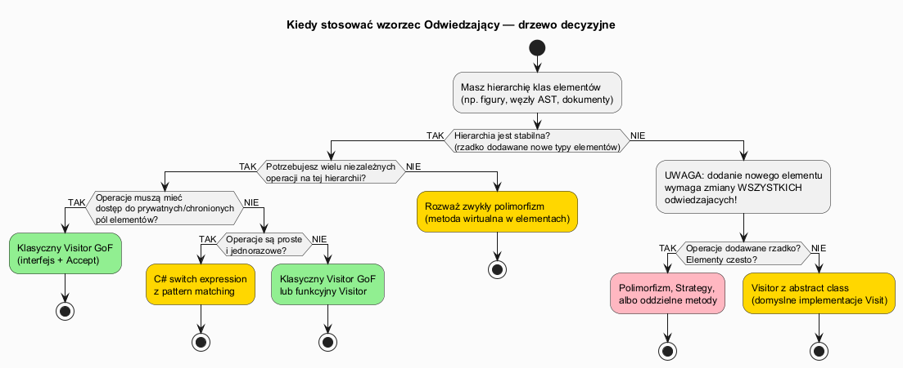
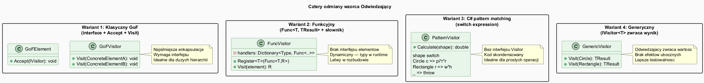

# 02 — Kiedy stosować, zalety i wady

## Spis treści

1. [Sygnały wskazujące na Visitor](#1-sygnaly)
2. [Sygnały ostrzegawcze](#2-ostrzezenia)
3. [Zalety](#3-zalety)
4. [Wady](#4-wady)
5. [Odmiany wzorca](#5-odmiany)
6. [Przykłady kodu](#6-przyklady)
7. [Uruchamianie](#7-uruchamianie)
8. [Literatura](#8-literatura)

---

## 1. Sygnały wskazujące na Visitor <a name="1-sygnaly"></a>



Stosuj wzorzec Visitor gdy:

| Sygnał | Opis | Przykład |
|--------|------|---------|
| **Stabilna hierarchia** | Typy elementów nie zmieniają się, operacje tak | Węzły AST — nowe operacje (optymalizacja, generacja kodu) bez zmian w węzłach |
| **Wiele niezwiązanych operacji** | ≥ 3 różne operacje na tej samej hierarchii | Dokument: zliczanie słów, eksport HTML, PDF, walidacja, drukowanie |
| **Rozdzielenie danych od operacji** | Klasy elementów mają być "czyste" | `Circle` zawiera tylko `Radius`, operacje są zewnętrzne |
| **Gromadzenie stanu podczas przejścia** | Odwiedzający zbiera dane ze wszystkich elementów | `TotalPriceVisitor` sumuje ceny w koszyku zakupowym |
| **Rekurencyjne struktury** | Drzewo lub graf z różnymi typami węzłów | Drzewo katalogów: `File`, `Directory`, `SymLink` |

---

## 2. Sygnały ostrzegawcze <a name="2-ostrzezenia"></a>

**Nie stosuj Visitor gdy:**

| Sygnał | Problem | Alternatywa |
|--------|---------|-------------|
| Hierarchia często się rozrasta | Każdy nowy typ wymaga zmiany WSZYSTKICH odwiedzających | Polimorfizm (virtual method) |
| Jedna lub dwie operacje | Wzorzec jest przerostem formy | Zwykła metoda lub metoda wirtualna |
| Elementy nie mają jasnej hierarchii | Trudno zdefiniować interfejs `IVisitor` | Strategy, Command |
| Potrzebujesz dostępu do prywatnych pól | `Visit` ma tylko dostęp do publicznego API | `friend` class (C++) lub wydzielenie pól publicznych |

---

## 3. Zalety <a name="3-zalety"></a>

1. **Open/Closed Principle** — nowe operacje bez modyfikacji klas elementów
2. **Single Responsibility** — każda operacja w osobnej klasie
3. **Gromadzenie stanu** — odwiedzający może akumulować dane podczas obchodzenia struktury
4. **Grupowanie powiązanej logiki** — wszystkie przypadki danej operacji w jednej klasie
5. **Łatwe testowanie** — każdy odwiedzający testowany niezależnie

```csharp
// Przykład SRP: każda operacja w osobnej klasie
class AreaVisitor     : IShapeVisitor { ... }  // odpowiada tylko za pole
class PerimeterVisitor: IShapeVisitor { ... }  // odpowiada tylko za obwód
class SvgVisitor      : IShapeVisitor { ... }  // odpowiada tylko za SVG
```

---

## 4. Wady <a name="4-wady"></a>

1. **Zamknięta hierarchia elementów** — dodanie nowego elementu łamie wszystkich odwiedzających
2. **Naruszenie enkapsulacji** — `Visit` operuje na publicznych polach elementu
3. **Wzrost złożoności** — dla małych hierarchii (2–3 typy) narzut jest niepotrzebny
4. **God Visitor** — przy dużych hierarchiach odwiedzający może mieć dziesiątki metod

```csharp
// Dodanie VideoNode wymusza zmianę WSZYSTKICH odwiedzających:
interface IDocVisitor
{
    void Visit(TextNode n);
    void Visit(ImageNode n);
    void Visit(LinkNode n);
    void Visit(VideoNode n);  // ← nowa linia → WordCountVisitor, HtmlVisitor, ValidateVisitor... muszą się zmienić
}
```

---

## 5. Odmiany wzorca <a name="5-odmiany"></a>



### Wariant 1: Klasyczny GoF

```csharp
interface IShapeVisitor
{
    void Visit(Circle c);
    void Visit(Rectangle r);
}

class AreaVisitor : IShapeVisitor
{
    public double Total { get; private set; }
    public void Visit(Circle c)    => Total += Math.PI * c.Radius * c.Radius;
    public void Visit(Rectangle r) => Total += r.Width * r.Height;
}
```

**Kiedy:** hierarchia duża, operacji wiele, elementy mają stan.

### Wariant 2: Funkcyjny (delegaty)

```csharp
class FuncVisitor<T>
{
    private readonly Dictionary<Type, Func<object, T>> _handlers = [];

    public void Register<TElement>(Func<TElement, T> handler)
        => _handlers[typeof(TElement)] = e => handler((TElement)e);

    public T Visit(object element)
        => _handlers[element.GetType()](element);
}

// Użycie:
var area = new FuncVisitor<double>();
area.Register<Circle>(c => Math.PI * c.Radius * c.Radius);
area.Register<Rectangle>(r => r.Width * r.Height);
```

**Kiedy:** brak kontroli nad elementami (nie możemy dodać `Accept`), dynamiczny rejestr operacji.

### Wariant 3: C# pattern matching

```csharp
static double CalculateArea(IShape shape) => shape switch
{
    Circle c    => Math.PI * c.Radius * c.Radius,
    Rectangle r => r.Width * r.Height,
    Triangle t  => HeronsFormula(t.A, t.B, t.C),
    _           => throw new ArgumentException($"Nieznany kształt: {shape}")
};
```

**Kiedy:** prosta operacja, mała hierarchia, jednorazowe użycie.

### Wariant 4: Generyczny Visitor (z wynikiem)

```csharp
interface IShapeVisitor<TResult>
{
    TResult Visit(Circle c);
    TResult Visit(Rectangle r);
    TResult Visit(Triangle t);
}

class AreaVisitor : IShapeVisitor<double>
{
    public double Visit(Circle c)    => Math.PI * c.Radius * c.Radius;
    public double Visit(Rectangle r) => r.Width * r.Height;
    public double Visit(Triangle t)  => HeronsFormula(t.A, t.B, t.C);
}
```

**Kiedy:** operacja zwraca wartość (bez efektów ubocznych), lepsza testowalność.

---

## 6. Przykłady kodu <a name="6-przyklady"></a>

Pełny kod w [`Examples/Program.cs`](Examples/Program.cs).

Fragment ilustrujący wadę — niestabilna hierarchia:

```csharp
// Przed: 3 typy → wszystkie odwiedzające mają 3 metody Visit
interface IDocVisitor
{
    void Visit(TextNode n);
    void Visit(ImageNode n);
    void Visit(LinkNode n);
}

// Po dodaniu VideoNode: MUSIMY zmienić KAŻDĄ implementację IDocVisitor
interface IDocVisitor
{
    void Visit(TextNode n);
    void Visit(ImageNode n);
    void Visit(LinkNode n);
    void Visit(VideoNode n);  // ← zmiana wymagana w WordCountVisitor, HtmlVisitor, ValidateVisitor...
}
```

---

## 7. Uruchamianie <a name="7-uruchamianie"></a>

```bash
cd src/20-odwiedzajacy/02-kiedy-stosowac-zalety-wady/Examples
dotnet run
```

---

## 8. Literatura <a name="8-literatura"></a>

- E. Gamma et al., *Design Patterns*, Addison-Wesley, 1994, s. 331–344
- [Visitor — refactoring.guru (wady i zalety)](https://refactoring.guru/pl/design-patterns/visitor)
- [When to use Visitor pattern — Stack Overflow](https://stackoverflow.com/questions/255214/when-should-i-use-the-visitor-design-pattern)
- [C# pattern matching — Microsoft Docs](https://learn.microsoft.com/en-us/dotnet/csharp/language-reference/operators/patterns)
