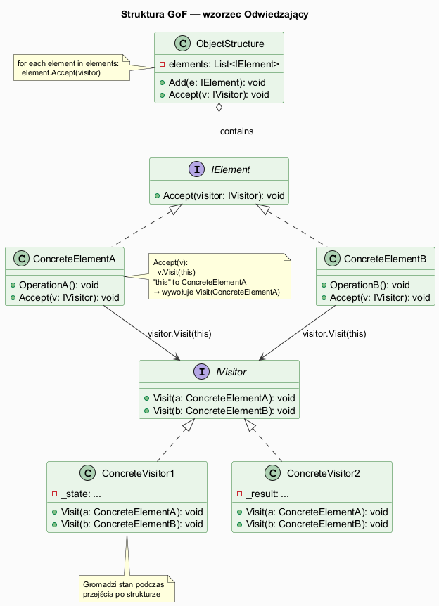
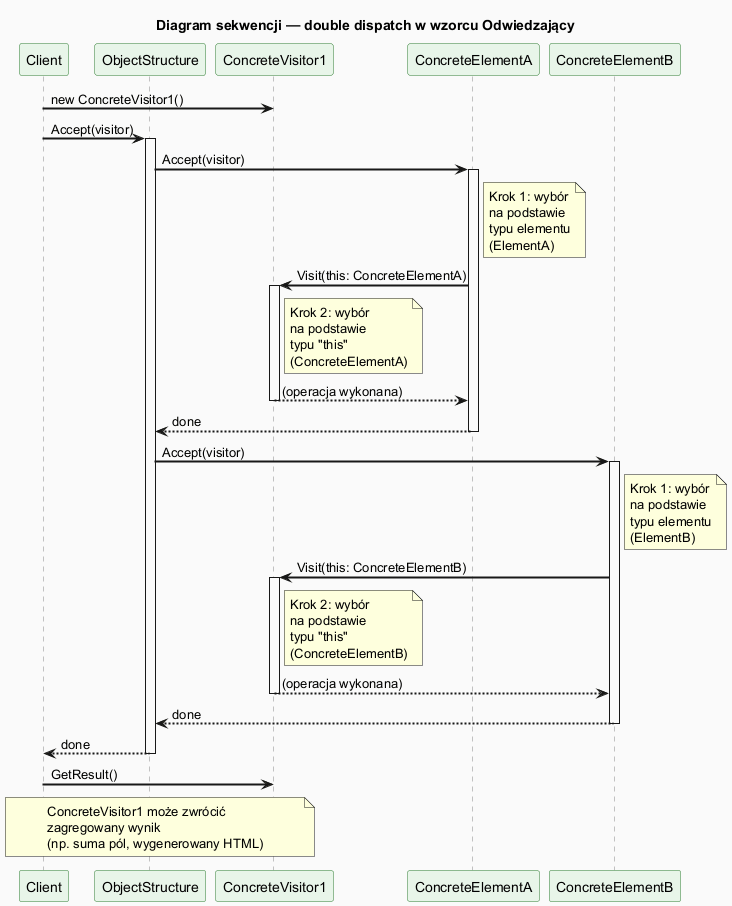
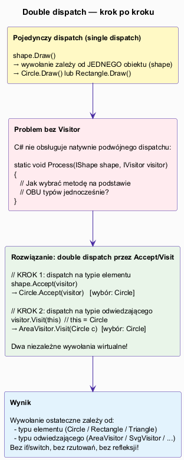

# 03 — Struktura GoF

## Spis treści

1. [Uczestnicy wzorca](#1-uczestnicy)
2. [Diagram klas](#2-diagram-klas)
3. [Diagram sekwencji — double dispatch](#3-sekwencja)
4. [Wyjaśnienie mechanizmu](#4-mechanizm)
5. [Konsekwencje stosowania](#5-konsekwencje)
6. [Przykłady kodu](#6-przyklady)
7. [Uruchamianie](#7-uruchamianie)
8. [Literatura](#8-literatura)

---

## 1. Uczestnicy wzorca <a name="1-uczestnicy"></a>

| Uczestnik GoF | Rola | Przykład z kodu |
|--------------|------|----------------|
| **Visitor** | Interfejs definiujący `Visit` dla każdego elementu | `IDocVisitor` |
| **ConcreteVisitor** | Implementacja operacji dla wszystkich typów elementów | `HtmlExportVisitor`, `MarkdownExportVisitor`, `DocumentStatsVisitor` |
| **Element** | Interfejs z metodą `Accept(IVisitor)` | `IDocElement` |
| **ConcreteElement** | Implementuje `Accept`, wywołując `visitor.Visit(this)` | `Paragraph`, `Heading`, `CodeBlock`, `Image` |
| **ObjectStructure** | Kolekcja elementów, umożliwia iterację | `Document` |

---

## 2. Diagram klas <a name="2-diagram-klas"></a>



### Kluczowe zależności

- `IDocVisitor` deklaruje metody `Visit` dla **każdego** konkretnego elementu
- Każdy `ConcreteElement` implementuje `Accept` przez wywołanie `visitor.Visit(this)`
- `Document` (ObjectStructure) iteruje po elementach i wywołuje `Accept`

---

## 3. Diagram sekwencji <a name="3-sekwencja"></a>



Sekwencja wywołań dla `doc.Accept(htmlVisitor)`:

```
Client         Document           Paragraph          HtmlExportVisitor
   |                |                  |                      |
   |--Accept(v)---->|                  |                      |
   |                |--Accept(v)------>|                      |
   |                |                 |--Visit(this: Para)-->  |
   |                |                 |                      | (generuje <p>)
   |                |                 |<---------------------|
   |                |<-----------------|                      |
   |                |  (inne elementy...)                     |
   |<---------------|                                         |
   |--Html--------->|                                         |
```

---

## 4. Wyjaśnienie mechanizmu double dispatch <a name="4-mechanizm"></a>



C# używa **single dispatch** — jedno wywołanie wirtualne. Visitor symuluje **double dispatch** przez dwa kolejne wywołania:

```csharp
// Wywołanie 1: w oparciu o typ elementu
doc.Accept(visitor);
// → doc iteruje: element.Accept(visitor)
// → dla Paragraph: Paragraph.Accept(visitor) jest wywołane

// Wywołanie 2 (wewnątrz Paragraph.Accept):
public void Accept(IDocVisitor visitor) => visitor.Visit(this);
// "this" to Paragraph → wywołuje HtmlExportVisitor.Visit(Paragraph p)
```

**Dlaczego to ważne?**

```csharp
// BEZ double dispatch (nie działa poprawnie w C#):
static void Process(IDocElement elem, IDocVisitor vis)
{
    vis.Visit(elem);  // Błąd kompilacji: IDocVisitor.Visit(IDocElement) nie istnieje
                      // Nie ma przeciążenia przyjmującego interfejs!
}
```

Wzorzec Visitor rozwiązuje to przez `Accept` — element sam "informuje" odwiedzającego o swoim **konkretnym** typie.

---

## 5. Konsekwencje stosowania <a name="5-konsekwencje"></a>

### Pozytywne

| Konsekwencja | Opis |
|-------------|------|
| **Łatwe dodawanie operacji** | Nowy odwiedzający = nowa klasa. Zero zmian w elementach |
| **Gromadzenie stanu** | `DocumentStatsVisitor` akumuluje liczniki podczas jednego przejścia |
| **Separacja logiki** | Każda operacja (`Html`, `Markdown`, `Stats`) w osobnej klasie |

### Negatywne

| Konsekwencja | Opis |
|-------------|------|
| **Dodanie elementu kosztuje** | `Document` + nowy typ `Table` → zmiana KAŻDEGO odwiedzającego |
| **Dostęp do publicznych pól** | `Visit(Paragraph p)` widzi tylko publiczne pola `Paragraph` |
| **Cykliczne zależności** | `IVisitor` zna wszystkie `ConcreteElement`, `ConcreteElement` zna `IVisitor` |

---

## 6. Przykłady kodu <a name="6-przyklady"></a>

Pełny kod: [`Examples/Program.cs`](Examples/Program.cs).

### Fragment ConcreteElement

```csharp
record Paragraph(string Text) : IDocElement
{
    // Jedyna odpowiedzialność względem wzorca: delegacja do odwiedzającego
    public void Accept(IDocVisitor visitor) => visitor.Visit(this);
    // "this" jest typem Paragraph — to klucz double dispatch!
}
```

### Fragment ConcreteVisitor

```csharp
class HtmlExportVisitor : IDocVisitor
{
    private readonly StringBuilder _html = new();
    public string Html => $"<!DOCTYPE html><html><body>\n{_html}</body></html>";

    public void Visit(Paragraph p)  => _html.AppendLine($"  <p>{p.Text}</p>");
    public void Visit(Heading h)    => _html.AppendLine($"  <h{h.Level}>{h.Text}</h{h.Level}>");
    public void Visit(CodeBlock cb) => _html.AppendLine($"  <pre><code>{cb.Code}</code></pre>");
    public void Visit(Image img)    => _html.AppendLine($"  ");
}
```

### Fragment ObjectStructure

```csharp
class Document
{
    private readonly List<IDocElement> _elements = [];

    public void Add(IDocElement element) => _elements.Add(element);

    // Jeden przebieg → wywołuje Accept na każdym elemencie
    public void Accept(IDocVisitor visitor)
        => _elements.ForEach(e => e.Accept(visitor));
}
```

---

## 7. Uruchamianie <a name="7-uruchamianie"></a>

```bash
cd src/20-odwiedzajacy/03-struktura-gof/Examples
dotnet run
```

---

## 8. Literatura <a name="8-literatura"></a>

- E. Gamma et al., *Design Patterns*, Addison-Wesley, 1994, s. 331–344
- [Visitor pattern — Wikipedia EN](https://en.wikipedia.org/wiki/Visitor_pattern)
- [Double dispatch — Wikipedia EN](https://en.wikipedia.org/wiki/Double_dispatch)
- [C# pattern matching vs Visitor — Microsoft Blog](https://devblogs.microsoft.com/dotnet/whats-new-in-csharp-8-0/#switch-expressions)
