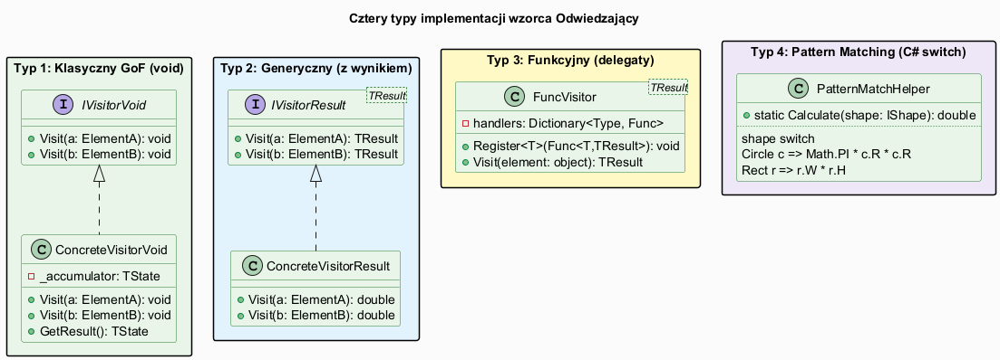
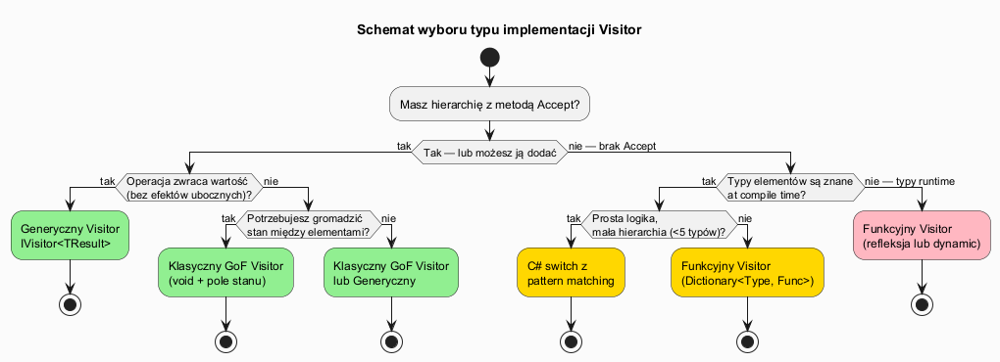

# 04 — Typy implementacji

## Spis treści

1. [Przegląd czterech typów](#1-przeglad)
2. [Typ 1: Klasyczny GoF (void)](#2-gof-void)
3. [Typ 2: Generyczny Visitor (TResult)](#3-generyczny)
4. [Typ 3: Funkcyjny Visitor (delegaty)](#4-funkcyjny)
5. [Typ 4: C# pattern matching](#5-pattern-matching)
6. [Schemat wyboru](#6-schemat)
7. [Porównanie](#7-porownanie)
8. [Uruchamianie](#8-uruchamianie)
9. [Literatura](#9-literatura)

---

## 1. Przegląd czterech typów <a name="1-przeglad"></a>



---

## 2. Typ 1: Klasyczny GoF (void) <a name="2-gof-void"></a>

Interfejs `IVisitor` z metodami `Visit(ConcreteElement)` zwracającymi `void`. Stan gromadzony w polach odwiedzającego.

```csharp
interface IShapeVisitor
{
    void Visit(Circle c);
    void Visit(Rectangle r);
    void Visit(Triangle t);
}

class AreaVisitor : IShapeVisitor
{
    public double TotalArea { get; private set; }  // akumulacja

    public void Visit(Circle c)    => TotalArea += Math.PI * c.Radius * c.Radius;
    public void Visit(Rectangle r) => TotalArea += r.Width * r.Height;
    public void Visit(Triangle t)
    {
        double s = (t.A + t.B + t.C) / 2.0;
        TotalArea += Math.Sqrt(s * (s - t.A) * (s - t.B) * (s - t.C));
    }
}
```

**Użycie:**
```csharp
var v = new AreaVisitor();
shapes.ForEach(s => s.Accept(v));
Console.WriteLine(v.TotalArea);
```

**Kiedy:** potrzebujesz gromadzić stan podczas całego przejścia.

---

## 3. Typ 2: Generyczny Visitor (TResult) <a name="3-generyczny"></a>

Interfejs `IVisitor<TResult>` — każda metoda `Visit` zwraca wartość. Brak efektów ubocznych, lepsza testowalność.

```csharp
interface IShapeVisitor<TResult>
{
    TResult Visit(Circle c);
    TResult Visit(Rectangle r);
    TResult Visit(Triangle t);
}

class AreaVisitor : IShapeVisitor<double>
{
    public double Visit(Circle c)    => Math.PI * c.Radius * c.Radius;
    public double Visit(Rectangle r) => r.Width * r.Height;
    public double Visit(Triangle t)
    {
        double s = (t.A + t.B + t.C) / 2.0;
        return Math.Sqrt(s * (s - t.A) * (s - t.B) * (s - t.C));
    }
}

// Element z metodą Accept:
record Circle(double Radius) : IShape
{
    public TResult Accept<TResult>(IShapeVisitor<TResult> v) => v.Visit(this);
}
```

**Użycie:**
```csharp
var area = new AreaVisitor();
double total = shapes.Sum(s => s.Accept(area));

var desc = new DescriptionVisitor();
var descriptions = shapes.Select(s => s.Accept(desc)).ToList();
```

**Kiedy:** operacja zwraca wartość, chcesz używać LINQ (`.Select`, `.Sum`).

---

## 4. Typ 3: Funkcyjny Visitor (delegaty) <a name="4-funkcyjny"></a>

Dynamiczny rejestr handlerów. Nie wymaga interfejsu `Accept` na elementach — przydatne gdy nie masz kontroli nad klasami elementów.

```csharp
class FuncVisitor<TResult>
{
    private readonly Dictionary<Type, Func<object, TResult>> _handlers = [];

    public FuncVisitor<TResult> Register<T>(Func<T, TResult> handler)
    {
        _handlers[typeof(T)] = obj => handler((T)obj);
        return this;
    }

    public TResult Visit(object element)
    {
        if (_handlers.TryGetValue(element.GetType(), out var handler))
            return handler(element);
        throw new InvalidOperationException($"Brak handlera dla {element.GetType().Name}");
    }
}

// Użycie — fluent API:
var areaV = new FuncVisitor<double>()
    .Register<Circle>(c => Math.PI * c.Radius * c.Radius)
    .Register<Rectangle>(r => r.Width * r.Height)
    .Register<Triangle>(t =>
    {
        double s = (t.A + t.B + t.C) / 2;
        return Math.Sqrt(s * (s - t.A) * (s - t.B) * (s - t.C));
    });

double total = shapes.Sum(s => areaV.Visit(s));
```

**Kiedy:** elementy to klasy zewnętrzne (np. z biblioteki), operacje rejestrowane dynamicznie.

**Wada:** brak weryfikacji kompilacji — pominięcie `Register<Triangle>` skończy się wyjątkiem w runtime.

---

## 5. Typ 4: C# pattern matching <a name="5-pattern-matching"></a>

Użycie wyrażeń `switch` w C# 8+. Nie wymaga ani interfejsu `IVisitor`, ani metody `Accept`.

```csharp
static double CalculateArea(IShape shape) => shape switch
{
    Circle c    => Math.PI * c.Radius * c.Radius,
    Rectangle r => r.Width * r.Height,
    Triangle t  => HeronsFormula(t.A, t.B, t.C),
    _           => throw new ArgumentException($"Nieznany kształt: {shape}")
};

static string Describe(IShape shape) => shape switch
{
    Circle c    => $"Koło(r={c.Radius:F2})",
    Rectangle r => $"Prostokąt({r.Width:F2}x{r.Height:F2})",
    Triangle t  => $"Trójkąt({t.A:F2},{t.B:F2},{t.C:F2})",
    _           => "Nieznany"
};
```

**Kiedy:** prosta operacja, mała hierarchia (< 5 typów), jednorazowe użycie.

**Wada:** przy wielu operacjach kod rozpraszamy po wielu funkcjach statycznych — trudno to utrzymać.

---

## 6. Schemat wyboru <a name="6-schemat"></a>



---

## 7. Porównanie <a name="7-porownanie"></a>

| Kryterium | GoF void | Generyczny | Funkcyjny | Pattern matching |
|-----------|----------|------------|-----------|-----------------|
| Wymaga `Accept` | tak | tak | nie | nie |
| Weryfikacja kompilacji | tak | tak | nie | tak |
| Zwraca wartość | nie (stan) | tak | tak | tak |
| Łatwy do rozszerzenia | tak | tak | tak | tak |
| Fluent/LINQ | nie | tak | tak | tak |
| Złożoność kodu | średnia | średnia | wysoka | niska |
| Najlepszy dla | dużych hierarchii ze stanem | czystych funkcji | zewnętrznych klas | prostych operacji |

---

## 8. Uruchamianie <a name="8-uruchamianie"></a>

```bash
cd src/20-odwiedzajacy/04-typy-implementacji/Examples
dotnet run
```

---

## 9. Literatura <a name="9-literatura"></a>

- [C# switch expression — Microsoft Docs](https://learn.microsoft.com/en-us/dotnet/csharp/language-reference/operators/switch-expression)
- [Generic Visitor pattern in C# — StackOverflow](https://stackoverflow.com/questions/5860037/generic-visitor-pattern-in-c-sharp)
- [Visitor vs. pattern matching — Eric Lippert blog](https://ericlippert.com/2015/04/27/wizards-and-warriors-part-one/)
