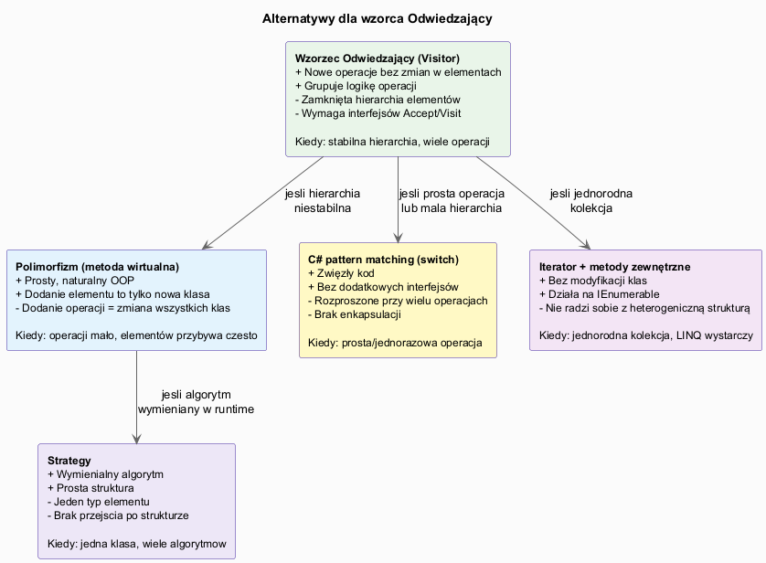
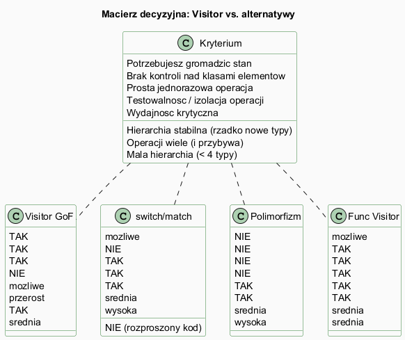

# 05 — Wady, zalety, alternatywy

## Spis treści

1. [Zalety wzorca](#1-zalety)
2. [Wady wzorca](#2-wady)
3. [Alternatywy](#3-alternatywy)
4. [Kiedy wybrać co](#4-kiedy)
5. [Przykłady kodu](#5-przyklady)
6. [Uruchamianie](#6-uruchamianie)
7. [Literatura](#7-literatura)

---

## 1. Zalety wzorca <a name="1-zalety"></a>



| Zaleta | Opis | Przykład |
|--------|------|---------|
| **Open/Closed Principle** | Nowe operacje bez modyfikacji hierarchii | `SvgExportVisitor` bez zmiany `Circle`, `Rectangle`, `Triangle` |
| **Single Responsibility** | Każda operacja w osobnej klasie | `WordCountVisitor`, `HtmlVisitor`, `ValidateVisitor` — trzy klasy |
| **Gromadzenie stanu** | Odwiedzający akumuluje dane przez całe przejście | `TotalPriceVisitor` → suma cen wszystkich pozycji |
| **Testowalność** | Każdy odwiedzający testowany niezależnie | `new AreaVisitor(); circle.Accept(v); Assert.Equal(...)` |
| **Grupowanie logiki** | Cała logika operacji w jednym miejscu | Wszystkie przypadki `HtmlExport` razem |

---

## 2. Wady wzorca <a name="2-wady"></a>

### Wada 1: Zamknięta hierarchia elementów

```csharp
// Hierarchia: Circle, Rectangle, Triangle
interface IShapeVisitor
{
    void Visit(Circle c);
    void Visit(Rectangle r);
    void Visit(Triangle t);
}

// Dodajemy Ellipse — musisz zmienić KAŻDĄ implementację IShapeVisitor
// AreaVisitor, PerimeterVisitor, SvgVisitor, JsonVisitor... wszystkie!
interface IShapeVisitor
{
    void Visit(Circle c);
    void Visit(Rectangle r);
    void Visit(Triangle t);
    void Visit(Ellipse e);  // ← ZMIANA ŁAMIĄCA (breaking change)
}
```

**Reguła:** Visitor jest dobry gdy operacje przybywa, a typy elementów są stabilne.

### Wada 2: Naruszenie enkapsulacji

```csharp
// Visit widzi tylko publiczne pola — jeśli pole jest private, mamy problem
class Circle
{
    private double _internalRadius;  // Visit nie ma do tego dostępu!
    public double Radius => _internalRadius;  // musimy udostępnić
}
```

### Wada 3: Złożoność dla prostych przypadków

```csharp
// Dla jednej operacji na 2 typach — Visitor to przerost formy!
// Prostsze bez wzorca:
static double Area(IShape s) => s switch
{
    Circle c    => Math.PI * c.Radius * c.Radius,
    Rectangle r => r.Width * r.Height,
    _           => 0
};
```

---

## 3. Alternatywy <a name="3-alternatywy"></a>

### Polimorfizm (metoda wirtualna)

```csharp
abstract class Shape
{
    public abstract double GetArea();        // operacja w klasie
    public abstract double GetPerimeter();   // operacja w klasie
}

class Circle : Shape
{
    public double Radius { get; }
    public override double GetArea()      => Math.PI * Radius * Radius;
    public override double GetPerimeter() => 2 * Math.PI * Radius;
}
```

**Kiedy lepszy:** nowe typy przybywa często, operacji mało.
**Wada:** dodanie nowej operacji = modyfikacja wszystkich klas.

### C# pattern matching

```csharp
static double GetArea(IShape s) => s switch
{
    Circle c    => Math.PI * c.Radius * c.Radius,
    Rectangle r => r.Width * r.Height,
    Triangle t  => HeronsFormula(t.A, t.B, t.C),
    _           => throw new NotSupportedException()
};
```

**Kiedy lepszy:** ≤ 3 operacje, mała hierarchia, jednorazowy kod.
**Zaleta C# 9+:** `switch` daje ostrzeżenie kompilacji przy niekompletnej obsłudze typów.

### Strategy

```csharp
interface IAreaCalculator
{
    double Calculate(double a, double b);
}

class CircleAreaCalculator : IAreaCalculator
{
    public double Calculate(double r, double _) => Math.PI * r * r;
}
```

**Kiedy lepszy:** jedna klasa z wymienialnym algorytmem, nie cała hierarchia.

---

## 4. Kiedy wybrać co <a name="4-kiedy"></a>



| Sytuacja | Wybór |
|---------|-------|
| Stabilna hierarchia + wiele operacji | **Visitor GoF** |
| Niestabilna hierarchia (często nowe typy) | **Polimorfizm** |
| Prosta jednorazowa operacja | **switch/match** |
| Brak kontroli nad elementami | **Funkcyjny Visitor lub switch** |
| Algorytm wymieniany w runtime | **Strategy** |
| Jednorodna kolekcja + LINQ | **Iterator + metody rozszerzające** |

---

## 5. Przykłady kodu <a name="5-przyklady"></a>

Pełny kod: [`Examples/Program.cs`](Examples/Program.cs).

Fragment ilustrujący **zaletę Visitor** — dodawanie operacji:

```csharp
// Istniejące klasy Circle, Rectangle, Triangle NIE są modyfikowane
class PdfExportVisitor : IShapeVisitor  // nowa operacja = nowa klasa
{
    public string Pdf { get; private set; } = "";

    public void Visit(Circle c)    => Pdf += $"PDF: okrąg r={c.Radius}\n";
    public void Visit(Rectangle r) => Pdf += $"PDF: prostokąt {r.Width}x{r.Height}\n";
    public void Visit(Triangle t)  => Pdf += $"PDF: trójkąt {t.A},{t.B},{t.C}\n";
}
```

Fragment ilustrujący **wadę** — dodanie nowego elementu:

```csharp
// Dodajemy Pentagon — WSZYSTKIE odwiedzające muszą się zmienić
interface IShapeVisitor
{
    void Visit(Circle c);
    void Visit(Rectangle r);
    void Visit(Triangle t);
    void Visit(Pentagon p);  // ← AreaVisitor, PerimeterVisitor, SvgVisitor... wszystkie
}
```

---

## 6. Uruchamianie <a name="6-uruchamianie"></a>

```bash
cd src/20-odwiedzajacy/05-wady-zalety-alternatywy/Examples
dotnet run
```

---

## 7. Literatura <a name="7-literatura"></a>

- E. Gamma et al., *Design Patterns*, Addison-Wesley, 1994, s. 331–344
- [Visitor — refactoring.guru (wady/zalety)](https://refactoring.guru/pl/design-patterns/visitor)
- [When NOT to use the Visitor pattern — Stack Overflow](https://stackoverflow.com/questions/255214/when-should-i-use-the-visitor-design-pattern)
- [C# discriminated unions proposal](https://github.com/dotnet/csharplang/issues/113)
- [Sealed classes and pattern matching — Microsoft Docs](https://learn.microsoft.com/en-us/dotnet/csharp/fundamentals/functional/pattern-matching)
