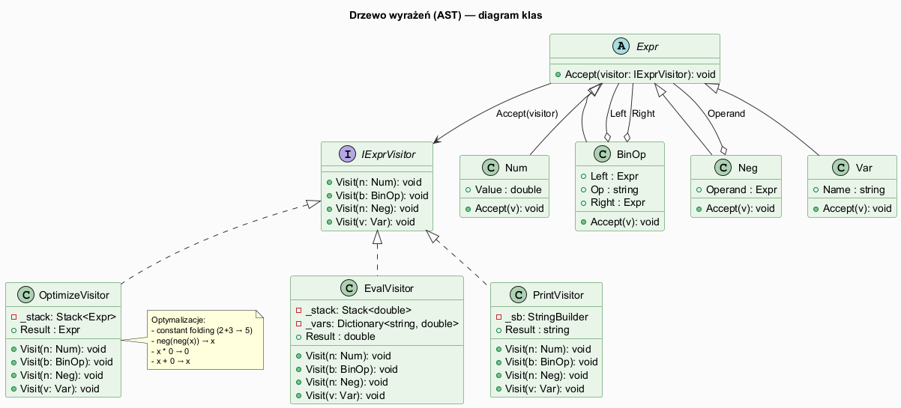
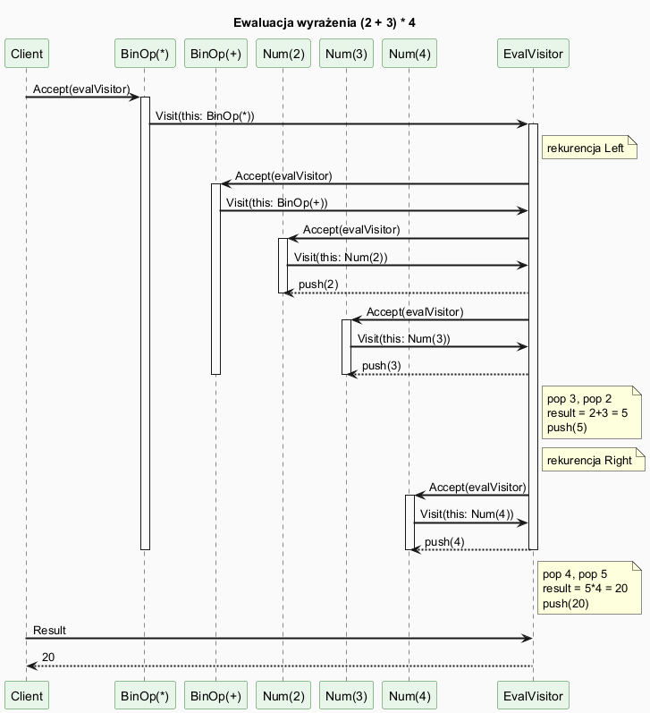

# 06 — Większy przykład: Drzewo wyrażeń (AST)

## Spis treści

1. [Kontekst i problem](#1-kontekst)
2. [Struktura AST](#2-struktura)
3. [Odwiedzający](#3-odwiedzajacy)
4. [Diagramy](#4-diagramy)
5. [Kod](#5-kod)
6. [Testy](#6-testy)
7. [Uruchamianie](#7-uruchamianie)

---

## 1. Kontekst i problem <a name="1-kontekst"></a>

Drzewa wyrażeń (AST — *Abstract Syntax Tree*) to klasyczny przypadek użycia wzorca Visitor. Problem jest następujący:

- Mamy **stabilną hierarchię węzłów**: `Num`, `BinOp`, `Neg`, `Var`
- Chcemy wykonywać **wiele różnych operacji**: ewaluacja, drukowanie, optymalizacja, statystyki, kompilacja…
- Węzłów NIE możemy modyfikować — są "dane", operacje są "zachowaniami"

Bez Visitora każda operacja wymagałaby rozbudowania węzłów lub użycia `if/else is`:

```csharp
// BEZ wzorca — fat node lub rozproszony switch
double Eval(Expr e) => e switch
{
    Num n    => n.Value,
    BinOp b  => Apply(b.Op, Eval(b.Left), Eval(b.Right)),
    Neg n    => -Eval(n.Operand),
    Var v    => vars[v.Name],
    _        => throw new NotSupportedException()
};
// Każda nowa operacja = nowy switch w innym miejscu
```

---

## 2. Struktura AST <a name="2-struktura"></a>

```
Expr (abstrakcyjny rekord)
├── Num(double Value)            — stała: 3.14, 42
├── BinOp(Expr Left, Op, Right)  — operacja: a + b, a * b
├── Neg(Expr Operand)            — negacja: -x
└── Var(string Name)             — zmienna: x, y
```

Każdy węzeł implementuje `Accept(IExprVisitor)` — jedno wywołanie uruchamia **podwójny dispatch**.

---

## 3. Odwiedzający <a name="3-odwiedzajacy"></a>

| Odwiedzający | Akcja | Struktura wewnętrzna |
|-------------|-------|---------------------|
| `EvalVisitor` | Oblicza wartość wyrażenia | `Stack<double>` — gromadzi wyniki |
| `PrintVisitor` | Drukuje wyrażenie z nawiasami | `StringBuilder` |
| `OptimizeVisitor` | Upraszcza drzewo (constant folding) | `Stack<Expr>` — buduje nowe drzewo |
| `StatsVisitor` | Zlicza węzły, mierzy głębokość | Liczniki + bieżąca głębokość |

### Optymalizacje w `OptimizeVisitor`

| Reguła | Przed | Po |
|--------|-------|----|
| Constant folding | `(2 + 3)` | `5` |
| Mnożenie przez 0 | `x * 0` | `0` |
| Dodawanie 0 | `x + 0` | `x` |
| Podwójna negacja | `-(-(x))` | `x` |
| Negacja stałej | `-(5)` | `-5` |

---

## 4. Diagramy <a name="4-diagramy"></a>

### Diagram klas



### Diagram sekwencji — ewaluacja (2 + 3) * 4



Kluczowy moment: `EvalVisitor.Visit(BinOp)` sam wywołuje `Left.Accept(this)` i `Right.Accept(this)` — to jest **rekurencja sterowana przez odwiedzającego**, nie przez węzeł.

---

## 5. Kod <a name="5-kod"></a>

### Interfejs i węzły (Library/Expressions.cs)

```csharp
public interface IExprVisitor
{
    void Visit(Num n);
    void Visit(BinOp b);
    void Visit(Neg n);
    void Visit(Var v);
}

public abstract record Expr
{
    public abstract void Accept(IExprVisitor visitor);
}

public record Num(double Value) : Expr
{
    public override void Accept(IExprVisitor visitor) => visitor.Visit(this);
}

public record BinOp(Expr Left, string Op, Expr Right) : Expr
{
    public override void Accept(IExprVisitor visitor) => visitor.Visit(this);
}
```

### EvalVisitor — stos wyników

```csharp
public class EvalVisitor(IReadOnlyDictionary<string, double>? variables = null) : IExprVisitor
{
    private readonly Stack<double> _stack = new();
    public double Result => _stack.Peek();

    public void Visit(Num n) => _stack.Push(n.Value);

    public void Visit(BinOp b)
    {
        b.Left.Accept(this);   // push left
        b.Right.Accept(this);  // push right
        double right = _stack.Pop();
        double left  = _stack.Pop();
        _stack.Push(b.Op switch
        {
            "+" => left + right,
            "-" => left - right,
            "*" => left * right,
            "/" => left / right,
            _   => throw new InvalidOperationException()
        });
    }

    public void Visit(Neg n)
    {
        n.Operand.Accept(this);
        _stack.Push(-_stack.Pop());
    }

    public void Visit(Var v) => _stack.Push(variables![v.Name]);
}
```

### OptimizeVisitor — constant folding

```csharp
public class OptimizeVisitor : IExprVisitor
{
    private readonly Stack<Expr> _stack = new();
    public Expr Result => _stack.Peek();

    public void Visit(BinOp b)
    {
        b.Left.Accept(this);
        b.Right.Accept(this);
        var right = _stack.Pop();
        var left  = _stack.Pop();

        // Oba operandy to stałe → połącz
        if (left is Num(var l) && right is Num(var r))
        {
            _stack.Push(new Num(b.Op switch
            {
                "+" => l + r, "-" => l - r,
                "*" => l * r, "/" => l / r,
                _ => throw new InvalidOperationException()
            }));
            return;
        }

        // x * 0 = 0
        if (b.Op == "*" && (IsZero(left) || IsZero(right)))
        { _stack.Push(new Num(0)); return; }

        _stack.Push(new BinOp(left, b.Op, right));
    }

    public void Visit(Neg n)
    {
        n.Operand.Accept(this);
        var inner = _stack.Pop();
        // -(-x) = x
        if (inner is Neg(var x)) { _stack.Push(x); return; }
        _stack.Push(new Neg(inner));
    }

    private static bool IsZero(Expr e) => e is Num(0.0);
    // ... Visit(Num), Visit(Var)
}
```

---

## 6. Testy <a name="6-testy"></a>

Pełny zestaw testów: [`Tests/ExprVisitorTests.cs`](Tests/ExprVisitorTests.cs).

Łącznie **21 testów** podzielonych na 4 klasy:

| Klasa | Liczba | Zakres |
|-------|--------|--------|
| `EvalVisitorTests` | 9 | Num, BinOp, Neg, Var, wyjątki, Theory |
| `PrintVisitorTests` | 5 | Num, BinOp, Neg, Var, zagnieżdżone |
| `OptimizeVisitorTests` | 7 | constant folding, x*0, x+0, -(-(x)), nested |
| `StatsVisitorTests` | 3 | liczniki, głębokość |

---

## 7. Uruchamianie <a name="7-uruchamianie"></a>

```bash
# Przykład
cd src/20-odwiedzajacy/06-wiekszy-przyklad/Examples
dotnet run

# Testy
cd src/20-odwiedzajacy/06-wiekszy-przyklad/Tests
dotnet test

# lub z wynikami szczegółowymi
dotnet test --logger "console;verbosity=detailed"
```

Oczekiwany wynik przykładu:
```
=== Wzorzec Odwiedzający — Drzewo wyrażeń (AST) ===

─── Przykład 1: (2 + 3) * 4
  Druk:     ((2 + 3) * 4)
  Wynik:    20
  Po opt.:  20

─── Przykład 2: x * (y + 2) przy x=3, y=4
  Druk:     (x * (y + 2))
  Wynik:    18
...
```
