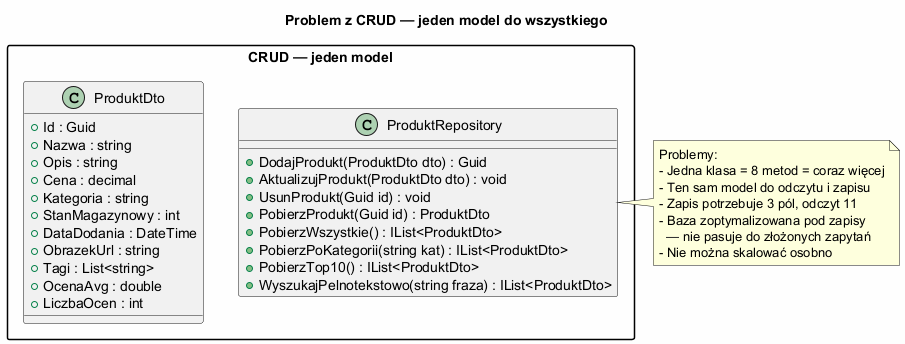
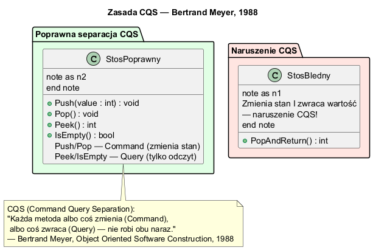
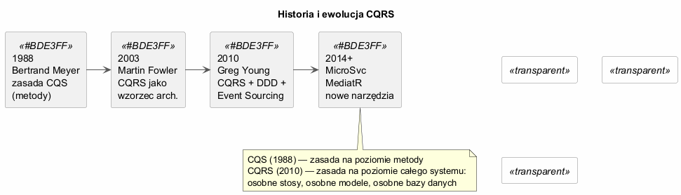

# Temat 01 — Idea i kontekst CQRS

## Problem z CRUD

W tradycyjnej architekturze CRUD ten sam model danych służy zarówno do **zapisu**, jak i do **odczytu**. Prowadzi to do kilku problemów:

- **Zbędne dane przy odczycie** — widok listy produktów potrzebuje tylko `Id, Nazwa, Cena`, ale wczytywany jest cały obiekt z opisem, tagami, zdjęciami
- **Konflikt optymalizacji** — bazy relacyjne zoptymalizowane pod zapisy (normalizacja) są nieoptymalne pod złożone zapytania
- **Jeden model nie pasuje do wszystkich przypadków** — zapis wymaga bogatej walidacji, odczyt wymaga szybkości
- **Problem skalowania** — nie można skalować reads i writes niezależnie

```csharp
// CRUD — jeden model do wszystkiego
class ProduktRepository
{
    // Zapis — potrzebujemy walidacji, reguł biznesowych
    public Guid Dodaj(ProduktDto dto) { ... }
    public void Aktualizuj(ProduktDto dto) { ... }
    public void Usun(Guid id) { ... }

    // Odczyt — potrzebujemy szybkości, różnych projekcji
    public ProduktDto PobierzJeden(Guid id) { ... }
    public IList<ProduktDto> PobierzWszystkie() { ... }
    public IList<ProduktDto> WyszukajPelnotekstowo(string fraza) { ... }
    public IList<ProduktDto> PobierzTop10NajpopularniejszychPoKategorii() { ... }
}
```

### Diagram — Problem CRUD



---

## Zasada CQS — Bertrand Meyer (1988)

**CQS** (Command Query Separation) to zasada programowania obiektowego sformułowana przez Bertranda Meyera w książce *Object Oriented Software Construction* (1988):

> „Każda metoda albo **coś zmienia** (*Command*), albo **coś zwraca** (*Query*) — nie robi obu naraz."

### Przykłady naruszenia CQS

```csharp
// ZŁAMANIE CQS — metoda zmienia I zwraca
int PopAndReturn()        // usuwa ze stosu i zwraca wartość
bool SetAndCheck(int v)   // ustawia wartość i sprawdza poprawność

// POPRAWNE CQS
void Push(int value);   // Command — zmienia stan
void Pop();             // Command — zmienia stan
int Peek();             // Query  — nie zmienia stanu
bool IsEmpty();         // Query  — nie zmienia stanu
```

### Diagram — Zasada CQS



---

## CQRS — Greg Young (2010)

**CQRS** (Command Query Responsibility Segregation) rozszerza zasadę CQS na poziom całego systemu:

> „Stosujemy dwa osobne obiekty tam, gdzie wcześniej był jeden."
> — Greg Young, 2010

| | CQS | CQRS |
|---|---|---|
| **Poziom** | Metoda | System/architektura |
| **Separacja** | Metody Commands vs Queries | Osobne stosy (klasy, modele, bazy) |
| **Autor** | Bertrand Meyer (1988) | Greg Young (2010) |
| **Zakres** | Jedna klasa | Cały system |

### Podstawowy podział

```
Żądanie użytkownika
       │
       ├─── Command (zmiana) ──► CommandHandler ──► Write Model ──► Baza zapisu
       │
       └─── Query (odczyt)   ──► QueryHandler   ──► Read Model  ──► Baza odczytu
```

```csharp
// CQRS — osobne modele
class ProduktWriteRepository   // bogaty model domenowy
{
    public void Dodaj(ProduktDomena p) { /* walidacja, reguły */ }
    public void ZmienCene(Guid id, decimal cena) { /* sprawdź niezmienniki */ }
}

class ProduktReadRepository    // lekkie DTO do odczytu
{
    public IReadOnlyList<ProduktListaDto> PobierzListe() { /* prosta projekcja */ }
}
```

### Historia wzorca



---

## Przykład do uruchomienia

```bash
cd src/A01-cqrs/01-idea-i-kontekst/Examples
dotnet run
```

Przykład demonstruje:
1. Problem z jednym modelem CRUD
2. Zasadę CQS na stosie
3. Podstawową separację Write/Read w stylu CQRS

---

## Kluczowe pojęcia

| Pojęcie | Definicja |
|---------|-----------|
| **CQS** | Zasada: metoda albo zmienia stan, albo zwraca dane |
| **CQRS** | Wzorzec: osobne modele i stosy dla zapisu i odczytu |
| **Command** | Intencja zmiany stanu systemu; zwykle bez wartości zwrotnej |
| **Query** | Pytanie o stan; nie może zmieniać stanu |
| **Write Model** | Bogaty model domenowy z walidacją i regułami biznesowymi |
| **Read Model** | Uproszczone DTO zoptymalizowane pod wyświetlanie |

---

## Literatura

- Bertrand Meyer — *Object Oriented Software Construction* (1988) — rozdział o CQS
- [Martin Fowler — CQRS (2011)](https://martinfowler.com/bliki/CQRS.html)
- [Greg Young — CQRS Documents (2010)](https://cqrs.files.wordpress.com/2010/11/cqrs_documents.pdf)
- [Microsoft — CQRS Pattern](https://learn.microsoft.com/en-us/azure/architecture/patterns/cqrs)
