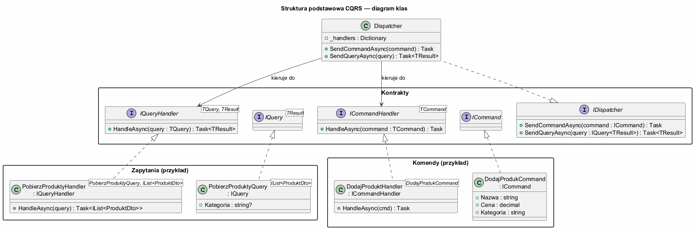
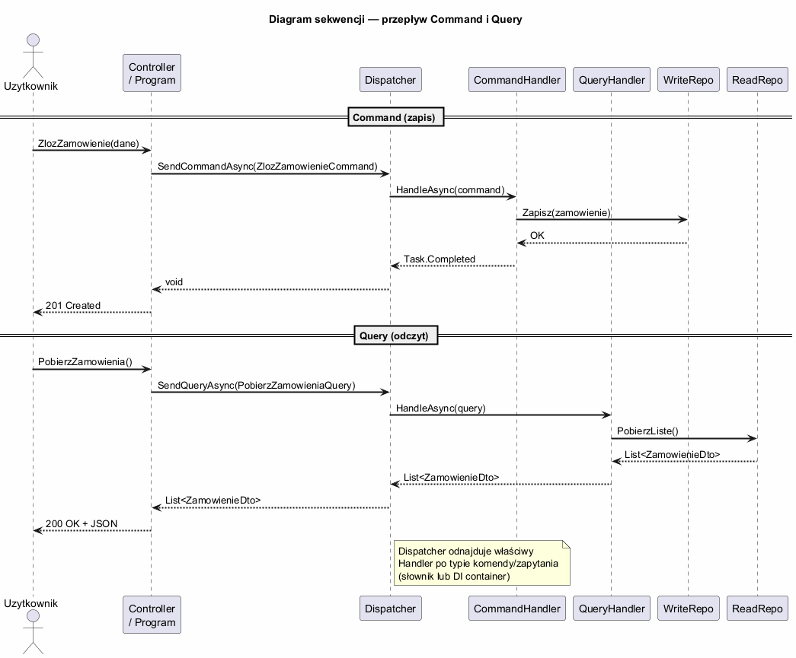

# Temat 02 — Struktura podstawowa CQRS

## Uczestnicy wzorca

| Uczestnik | Rola |
|-----------|------|
| **ICommand** | Znacznik — klasa implementująca jest komendą (zmianą stanu) |
| **IQuery\<TResult\>** | Zapytanie z typem wyniku — klasa jest zapytaniem o dane |
| **ICommandHandler\<TCommand\>** | Wykonuje logikę biznesową dla danej komendy |
| **IQueryHandler\<TQuery, TResult\>** | Pobiera i transformuje dane dla danego zapytania |
| **Dispatcher** | Kieruje komendy/zapytania do odpowiednich handlerów |

### Diagram klas



### Diagram sekwencji



---

## Interfejsy CQRS

```csharp
// Znacznik komendy — nie zwraca danych
public interface ICommand { }

// Zapytanie — zawsze zwraca TResult
public interface IQuery<TResult> { }

// Handler komendy — wykonuje logikę biznesową
public interface ICommandHandler<TCommand>
    where TCommand : ICommand
{
    Task HandleAsync(TCommand command);
}

// Handler zapytania — pobiera i transformuje dane
public interface IQueryHandler<TQuery, TResult>
    where TQuery : IQuery<TResult>
{
    Task<TResult> HandleAsync(TQuery query);
}
```

**Kluczowe reguły:**
- `ICommandHandler` nie zwraca danych domenowych (tylko `Task` lub ewentualnie ID nowego zasobu)
- `IQueryHandler` nie może modyfikować stanu systemu
- Jeden handler = jedna odpowiedzialność

---

## Definiowanie komend i zapytań

Komendy i zapytania to **proste obiekty transferu danych** (DTO). Najlepiej jako `record` — niemutowalne, z automatycznym `Equals` i `ToString`.

```csharp
// Komendy — opisują intencję, tryb rozkazujący
record DodajProduktCommand(string Nazwa, decimal Cena, string Kategoria) : ICommand;
record ZmienCeneCommand(Guid ProduktId, decimal NowaCena) : ICommand;
record UsunProduktCommand(Guid ProduktId) : ICommand;

// Zapytania — pytają o stan systemu
record PobierzWszystkieProduktyQuery() : IQuery<IReadOnlyList<ProduktDto>>;
record PobierzPoKategoriiQuery(string Kategoria) : IQuery<IReadOnlyList<ProduktDto>>;
record PobierzProduktQuery(Guid Id) : IQuery<ProduktDto?>;
```

---

## Implementacja handlerów

```csharp
// Handler komendy — zawiera logikę biznesową zapisu
class DodajProduktHandler(BazaDanych db) : ICommandHandler<DodajProduktCommand>
{
    public Task HandleAsync(DodajProduktCommand cmd)
    {
        // Walidacja
        if (string.IsNullOrWhiteSpace(cmd.Nazwa))
            throw new ArgumentException("Nazwa nie może być pusta");
        if (cmd.Cena <= 0)
            throw new ArgumentException("Cena musi być dodatnia");

        // Logika biznesowa + zapis
        db.Produkty.Add(new ProduktEntity { Nazwa = cmd.Nazwa, Cena = cmd.Cena, Kategoria = cmd.Kategoria });
        return Task.CompletedTask;
    }
}

// Handler zapytania — mapuje encje na DTO
class PobierzPoKategoriiHandler(BazaDanych db)
    : IQueryHandler<PobierzPoKategoriiQuery, IReadOnlyList<ProduktDto>>
{
    public Task<IReadOnlyList<ProduktDto>> HandleAsync(PobierzPoKategoriiQuery q)
    {
        IReadOnlyList<ProduktDto> wynik = db.Produkty
            .Where(p => p.Kategoria.Equals(q.Kategoria, StringComparison.OrdinalIgnoreCase))
            .Select(p => new ProduktDto(p.Id, p.Nazwa, p.Cena, p.Kategoria))
            .ToList()
            .AsReadOnly();
        return Task.FromResult(wynik);
    }
}
```

---

## Dispatcher — kierowanie do handlerów

Dispatcher to centralny punkt routingu. Może być oparty na:

1. **Słowniku typów** (podejście demonstracyjne)
2. **DI Container** (produkcyjne — Microsoft.Extensions.DI)
3. **MediatR** (gotowa biblioteka)

```csharp
class Dispatcher
{
    private readonly Dictionary<Type, object> _commandHandlers = [];
    private readonly Dictionary<Type, object> _queryHandlers = [];

    public void RegisterCommand<TCommand>(ICommandHandler<TCommand> handler)
        where TCommand : ICommand
        => _commandHandlers[typeof(TCommand)] = handler;

    public Task SendCommandAsync<TCommand>(TCommand command)
        where TCommand : ICommand
    {
        if (!_commandHandlers.TryGetValue(typeof(TCommand), out var h))
            throw new InvalidOperationException($"Brak handlera dla {typeof(TCommand).Name}");
        return ((ICommandHandler<TCommand>)h).HandleAsync(command);
    }

    // analogicznie dla query...
}

// Użycie
await dispatcher.SendCommandAsync(new DodajProduktCommand("Laptop", 4500m, "Elektronika"));
var lista = await dispatcher.SendQueryAsync<PobierzWszystkieProduktyQuery, IReadOnlyList<ProduktDto>>(
    new PobierzWszystkieProduktyQuery());
```

---

## Przykład do uruchomienia

```bash
cd src/A01-cqrs/02-struktura-podstawowa/Examples
dotnet run
```

---

## Dobre praktyki

- **Nazwa komendy** — tryb rozkazujący: `DodajProdukt`, `ZmienCene`, `Usun`
- **Nazwa zapytania** — pytanie: `PobierzProdukty`, `ZnajdzPoKategorii`
- **Jeden handler = jedna komenda/zapytanie** — Single Responsibility
- **Komendy jako `record`** — niemutowalne, proste DTO
- **Walidacja w handlerze** — nie w klasie komendy

---

## Literatura

- [Greg Young — CQRS Documents](https://cqrs.files.wordpress.com/2010/11/cqrs_documents.pdf)
- [Microsoft — CQRS Pattern](https://learn.microsoft.com/en-us/azure/architecture/patterns/cqrs)
- [MediatR — gotowa implementacja CQRS w .NET](https://github.com/jbogard/MediatR)
