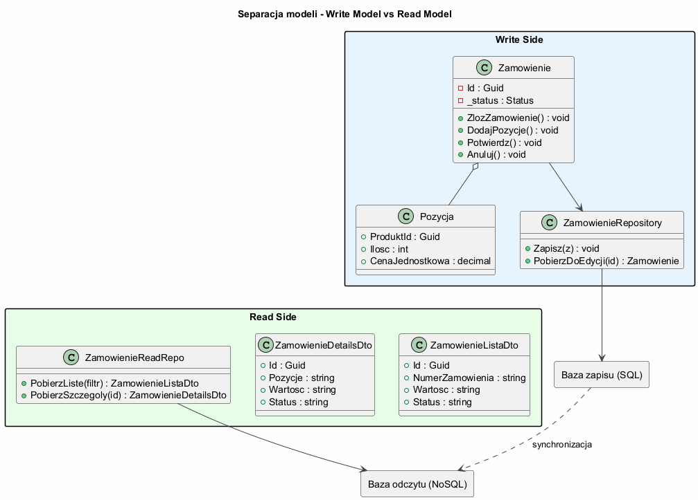
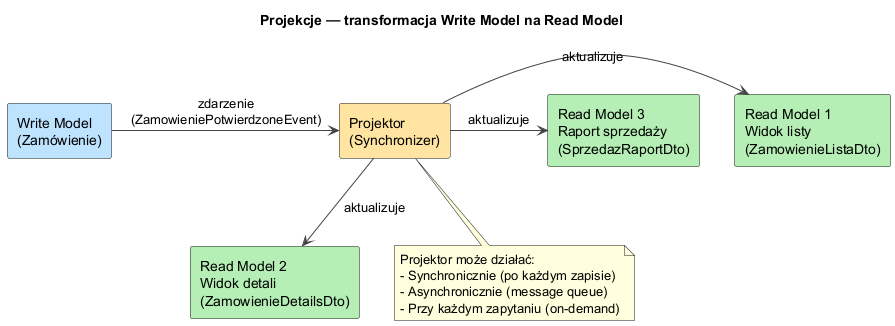

# Temat 03 — Separacja modeli Write/Read

## Dwa modele — jeden system

CQRS wprowadza fundamentalną separację między modelem **zapisu** (Write Model, strona Command)
a modelem **odczytu** (Read Model, strona Query).

| Cecha | Write Model | Read Model |
|-------|------------|------------|
| **Cel** | Ochrona niezmienników biznesowych | Efektywny odczyt danych |
| **Forma** | Bogaty obiekt domenowy (Aggregate) | Płaskie DTO |
| **Walidacja** | W metodach domenowych | Brak (dane już zwalidowane) |
| **Zoptymalizowany pod** | Spójność danych | Szybkość i elastyczność odczytu |
| **Zmiana** | Przez metody (nie publiczne settery) | Immutable (record) |
| **Liczba na widok** | Jedna klasa domenowa | Wiele DTO (jedna per widok) |

---

## Write Model — bogaty model domenowy

Write Model chroni **niezmienniki biznesowe** — reguły, które zawsze muszą być prawdziwe.

```csharp
class ZamowienieAggregate   // Aggregate Root
{
    private readonly List<PozycjaZamowienia> _pozycje = [];
    public IReadOnlyList<PozycjaZamowienia> Pozycje => _pozycje.AsReadOnly();
    public StatusZamowienia Status { get; private set; } = StatusZamowienia.Oczekujace;

    public void DodajPozycje(string nazwa, int ilosc, decimal cena)
    {
        // Niezmiennik: nie można dodawać do potwierdzonego
        if (Status != StatusZamowienia.Oczekujace)
            throw new InvalidOperationException("Można dodawać pozycje tylko do oczekujących zamówień");
        if (ilosc <= 0) throw new ArgumentException("Ilość musi być dodatnia");
        _pozycje.Add(new PozycjaZamowienia { Nazwa = nazwa, Ilosc = ilosc, CenaJedn = cena });
    }

    public void Potwierdz()
    {
        // Niezmiennik: zamówienie musi mieć pozycje
        if (!_pozycje.Any()) throw new InvalidOperationException("Zamówienie musi mieć pozycje");
        Status = StatusZamowienia.Potwierdzone;
    }
}
```

### Diagram — separacja modeli



---

## Read Model — lekkie DTO

Read Model jest zoptymalizowany pod **konkretny widok**. Różne widoki mają różne DTO.

```csharp
// Widok listy — tylko to co potrzebne
record ZamowienieListaDto(
    Guid Id, string NumerZamowienia, string KlientNazwa,
    string DataZlozenia,   // sformatowana data, gotowa do wyświetlenia
    string Wartosc,        // "4 698,00 zł" — gotowy string
    string Status);        // "Potwierdzone" — gotowy string

// Widok szczegółów — pełne dane
record ZamowienieDetailsDto(
    Guid Id, string NumerZamowienia, string KlientNazwa,
    IReadOnlyList<PozycjaDto> Pozycje,
    string Wartosc, string Status);

// Raport — agregaty
record SprzedazDto(string Status, int LiczbaZamowien, string Wartosc);
```

**Kluczowe cechy Read Model:**
- Dane sformatowane do wyświetlenia (string zamiast decimal)
- Denormalizacja — NumerZamowienia, KlientNazwa w jednym DTO
- Jeden DTO per widok — nie próbujemy jednego DTO do wszystkiego
- `record` — niemutowalne

---

## Projekcje

Projekcja to transformacja Write Model → Read Model.

```csharp
class ZamowienieQuerySide(InMemoryBaza db)
{
    // Projekcja na widok listy
    public IReadOnlyList<ZamowienieListaDto> PobierzListe()
        => db.Zamowienia
             .Select(z => new ZamowienieListaDto(
                 z.Id,
                 $"ZAM-{z.Numer}",           // formatowanie
                 z.KlientNazwa,
                 z.DataZlozenia.ToString("yyyy-MM-dd"),
                 $"{z.Wartosc:F2} zł",        // sformatowana kwota
                 z.Status.ToString()))
             .ToList()
             .AsReadOnly();
}
```

### Diagram — projekcje



---

## Różne bazy dla Read i Write

W zaawansowanych implementacjach Write i Read mogą korzystać z **różnych technologii przechowywania**:

```
Write Side:
  SQL Server (transakcyjny, ACID, znormalizowany)
       │
       │ zdarzenia / projektor
       ▼
Read Side:
  Redis (cache) — widok listy
  Elasticsearch — wyszukiwanie pełnotekstowe
  MongoDB — widok szczegółów (dokumenty)
  SQL Views — raporty
```

Ta elastyczność jest jedną z głównych korzyści CQRS przy dużej skali.

---

## Przykład do uruchomienia

```bash
cd src/A01-cqrs/03-separacja-modeli/Examples
dotnet run
```

---

## Literatura

- [Greg Young — CQRS Documents](https://cqrs.files.wordpress.com/2010/11/cqrs_documents.pdf) — sekcja o Read/Write Models
- [Martin Fowler — CQRS](https://martinfowler.com/bliki/CQRS.html)
- [Microsoft — CQRS Pattern](https://learn.microsoft.com/en-us/azure/architecture/patterns/cqrs)
