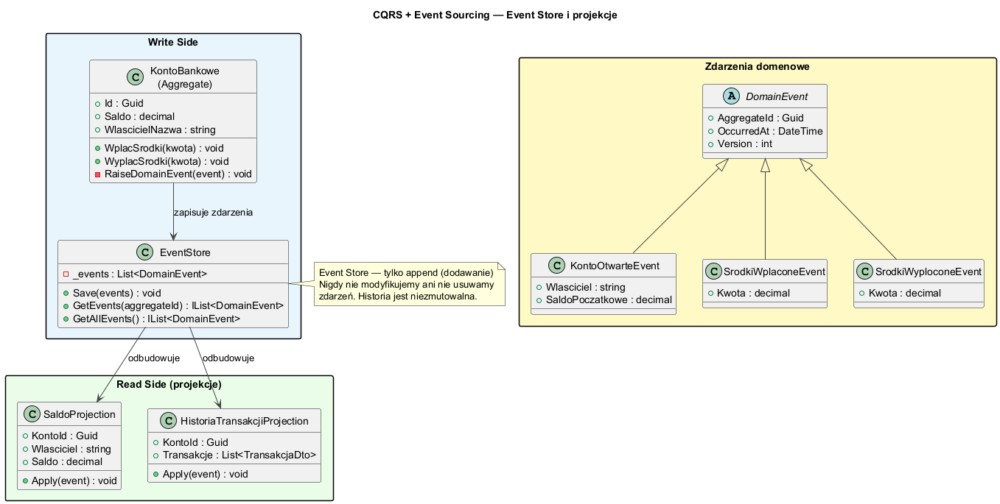
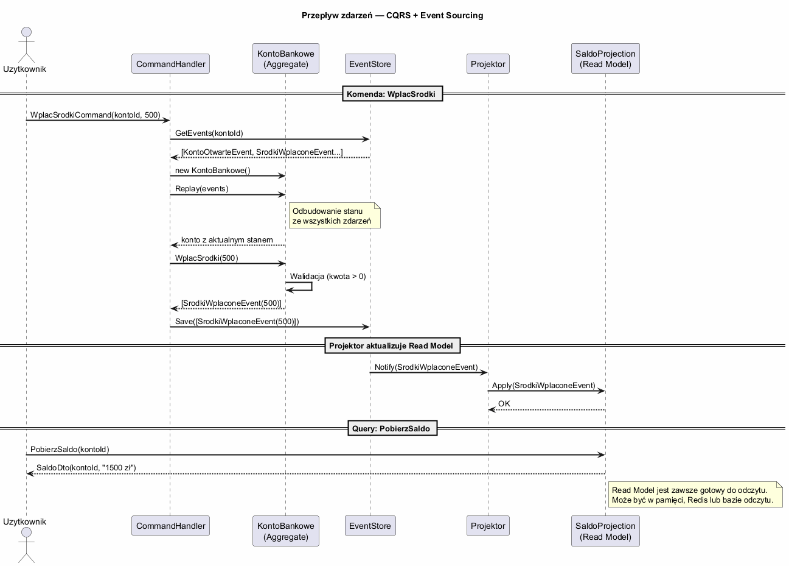

# Temat 04 — CQRS + Event Sourcing

## Co to jest Event Sourcing?

**Event Sourcing** to wzorzec przechowywania danych, w którym zamiast zapisywać aktualny **stan** (jak w CRUD),
zapisujemy **historię zdarzeń**, które do tego stanu doprowadziły.

```
CRUD:     Konto { Saldo: 1500 }                    ← tylko aktualny stan

Event Sourcing:
  KontoOtwarteEvent   { Saldo: 1000 }
  SrodkiWplaconeEvent { Kwota:  500 }
  SrodkiWyploconeEvent{ Kwota:  300 }
  SrodkiWplaconeEvent { Kwota:  300 }
  ──────────────────────────────────
  Wynik:              { Saldo: 1500 }               ← odbudowany ze zdarzeń
```

---

## Dlaczego CQRS i Event Sourcing pasują do siebie?

| | CQRS | Event Sourcing |
|--|------|----------------|
| **Write Side** | CommandHandler zmienia stan | Agregat generuje zdarzenia |
| **Zdarzenia** | (opcjonalnie) | Są fundamentem — jedyne źródło prawdy |
| **Read Side** | QueryHandler pobiera z Read Model | Projekcja odbudowuje Read Model ze zdarzeń |
| **Historia** | Opcjonalna | Wbudowana — Event Store jest pełnym logiem |

---

## Diagram — Event Store



## Diagram — Przepływ zdarzeń



---

## Implementacja

### Zdarzenia domenowe

```csharp
// Zdarzenia są niemutowalne — record
abstract record DomainEvent(Guid AggregateId, DateTime OccurredAt, int Version);

record KontoOtwarteEvent(Guid KontoId, string Wlasciciel, decimal SaldoPoczatkowe, int Version)
    : DomainEvent(KontoId, DateTime.UtcNow, Version);

record SrodkiWplaconeEvent(Guid KontoId, decimal Kwota, int Version)
    : DomainEvent(KontoId, DateTime.UtcNow, Version);
```

### Event Store — tylko append

```csharp
class EventStore
{
    private readonly List<DomainEvent> _events = [];
    public event Action<DomainEvent>? OnEventSaved;

    // Nigdy nie edytujemy, nigdy nie usuwamy — tylko dodajemy
    public void Save(DomainEvent e)
    {
        _events.Add(e);
        OnEventSaved?.Invoke(e);  // powiadomienie projektora
    }

    public IEnumerable<DomainEvent> GetEvents(Guid aggregateId)
        => _events.Where(e => e.AggregateId == aggregateId).OrderBy(e => e.Version);
}
```

### Agregat z Event Replay

```csharp
class KontoBankowe
{
    public decimal Saldo { get; private set; }
    private int _version;

    // Odbudowanie stanu przez odtworzenie zdarzeń
    public void Apply(DomainEvent e)
    {
        switch (e)
        {
            case KontoOtwarteEvent o: Saldo = o.SaldoPoczatkowe; break;
            case SrodkiWplaconeEvent w: Saldo += w.Kwota; break;
            case SrodkiWyploconeEvent wy: Saldo -= wy.Kwota; break;
        }
        _version = e.Version;
    }

    // Komenda — waliduje i generuje zdarzenia
    public IEnumerable<DomainEvent> WplacSrodki(decimal kwota)
    {
        if (kwota <= 0) throw new ArgumentException("Kwota musi być dodatnia");
        var e = new SrodkiWplaconeEvent(Id, kwota, _version + 1);
        Apply(e);   // aktualizuje własny stan
        yield return e;  // oddaje zdarzenie do zapisu
    }
}
```

### Projekcje — Read Model

```csharp
class SaldoProjection
{
    private readonly Dictionary<Guid, SaldoDto> _salda = [];

    public void Handle(DomainEvent e)
    {
        switch (e)
        {
            case KontoOtwarteEvent o:
                _salda[o.KontoId] = new SaldoDto(o.KontoId, o.Wlasciciel, o.SaldoPoczatkowe); break;
            case SrodkiWplaconeEvent w:
                _salda[w.KontoId] = _salda[w.KontoId] with { Saldo = _salda[w.KontoId].Saldo + w.Kwota }; break;
        }
    }

    public decimal PobierzSaldo(Guid kontoId) => _salda[kontoId].Saldo;
}
```

---

## Korzyści Event Sourcing

| Korzyść | Opis |
|---------|------|
| **Pełna historia** | Każda zmiana zapisana — idealny audit log |
| **Cofanie i powtarzanie** | Można odtworzyć stan z dowolnego punktu w czasie |
| **Debugowanie** | "Dlaczego saldo wynosi X?" — sprawdź zdarzenia |
| **Nowe projekcje** | Można dodać nowy Read Model i odbudować z historii |
| **Integracja** | Zdarzenia = naturalny bus integracyjny |

---

## Eventual Consistency

W podejściu CQRS + Event Sourcing pojawia się **eventual consistency** (spójność ostateczna):

```
1. Użytkownik wysyła komendę WplacSrodki
2. Komenda jest zapisana → zdarzenie w Event Store
3. Projektor aktualizuje Read Model (może zająć chwilę)
4. Użytkownik pyta o saldo → może dostać stare saldo
5. Po chwili → saldo jest aktualne
```

Jest to akceptowalne w wielu scenariuszach (social media, e-commerce), ale **niedopuszczalne** w systemach wymagających natychmiastowej spójności (np. transfery bankowe w czasie rzeczywistym).

---

## Przykład do uruchomienia

```bash
cd src/A01-cqrs/04-event-sourcing/Examples
dotnet run
```

---

## Literatura

- [Greg Young — CQRS Documents](https://cqrs.files.wordpress.com/2010/11/cqrs_documents.pdf)
- [Microsoft — Event Sourcing Pattern](https://learn.microsoft.com/en-us/azure/architecture/patterns/event-sourcing)
- [Martin Fowler — Event Sourcing](https://martinfowler.com/eaaDev/EventSourcing.html)
