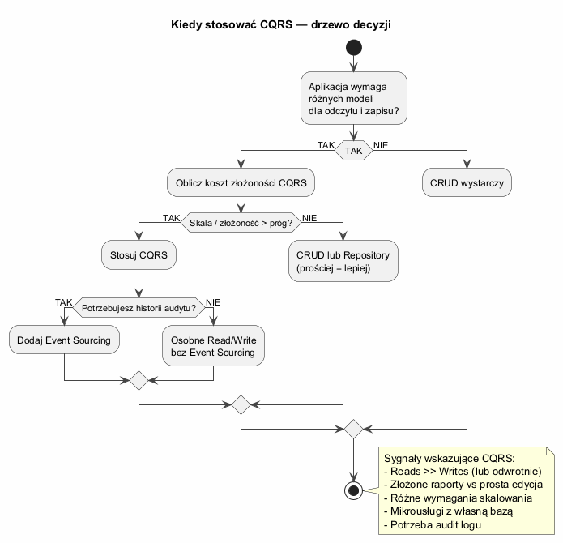
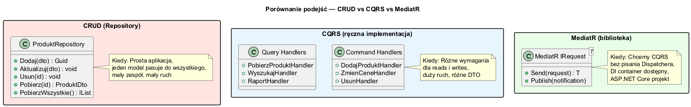

# Temat 05 — Wady, zalety i alternatywy CQRS

## Zalety CQRS

| Zaleta | Opis |
|--------|------|
| **Optymalizacja niezależna** | Reads i writes można optymalizować osobno (indeksy, cache, skalowanie) |
| **Wiele projekcji** | Jeden Write Model → wiele Read Models (lista, szczegóły, raporty) |
| **Skalowanie niezależne** | Read Side może mieć wiele instancji, Write Side mniej |
| **Przejrzysty podział** | Komenda = intencja zmiany, Zapytanie = pytanie o stan |
| **Naturalna integracja z DDD** | Aggregate Roots, Domain Events, Bounded Contexts |
| **Audit log gratis** | Przy Event Sourcing pełna historia operacji |

## Wady CQRS

| Wada | Opis |
|------|------|
| **Złożoność kodu** | Więcej klas: osobne Command, CommandHandler, Query, QueryHandler |
| **Eventual consistency** | Read Model może być chwilowo nieaktualny |
| **Overhead dla małych projektów** | Prosta aplikacja CRUD z CQRS = overengineering |
| **Trudniejsze debugowanie** | Śledzenie przepływu przez Dispatcher → Handler → Repository |

---

## Kiedy CQRS jest właściwy?

### Sygnały wskazujące na CQRS

```
Reads >> Writes:      10 000 reads/s vs 100 writes/s → osobne skalowanie
Złożone raporty:      Widok listy potrzebuje danych z 5 tabel → denormalizacja
Wiele widoków:        Lista, szczegóły, raport — każdy z innymi danymi
Mikrousługi:          Każda usługa z własną bazą i modelem
Audit log:            Kto, kiedy, co zmienił → Event Sourcing + CQRS
```

### Sygnały wskazujące NIE stosować CQRS

```
Prosta aplikacja CRUD:   Blog, todo, mała baza danych
Mały zespół:             Jeden deweloper = overhead organizacyjny
MVP / prototyp:          Najpierw zrób działające, potem optymalizuj
Natychmiastowa spójność: Transakcje finansowe w czasie rzeczywistym
```

### Diagram — drzewo decyzji



---

## Alternatywy

### CRUD z Repository Pattern

```csharp
// Najprostsze — jeden model do wszystkiego
class ProduktRepository
{
    public Guid Dodaj(ProduktDto dto) { ... }
    public ProduktDto Pobierz(Guid id) { ... }
    public IList<ProduktDto> PobierzWszystkie() { ... }
}
// Kiedy: prosta aplikacja, mały ruch, jeden model pasuje
```

### MediatR — biblioteka dla CQRS

```csharp
// MediatR to narzędzie — implementuje Dispatcher automatycznie
// przez DI container ASP.NET Core

public record DodajProduktCommand(string Nazwa, decimal Cena)
    : IRequest<Guid>;  // MediatR IRequest

public class DodajProduktHandler : IRequestHandler<DodajProduktCommand, Guid>
{
    public Task<Guid> Handle(DodajProduktCommand cmd, CancellationToken ct)
    {
        // logika...
        return Task.FromResult(Guid.NewGuid());
    }
}

// W kontrolerze
var id = await mediator.Send(new DodajProduktCommand("Laptop", 4500m));
```

**MediatR nie jest CQRS** — to biblioteka, która ułatwia implementację CQRS przez automatyczny routing requestów do handlerów przez DI.

### Porównanie podejść



| | CRUD | CQRS ręcznie | MediatR |
|---|---|---|---|
| **Prostota** | Tak | Nie | Średnio |
| **Elastyczność** | Mała | Duża | Duża |
| **Overhead** | Minimalny | Duży | Mały |
| **Testowanie** | Trudniejsze | Łatwiejsze | Łatwiejsze |
| **DI wymagane** | Nie | Nie | Tak |
| **Kiedy** | Małe projekty | Pełna kontrola | ASP.NET Core |

---

## Reguły wyboru

```
Aplikacja prosta (<5 encji, mały ruch)     → CRUD + Repository
Aplikacja średnia (reads ≈ writes)         → CRUD lub CQRS opcjonalnie
Aplikacja duża (reads >> writes)           → CQRS z osobnym Read Model
Mikrousługi z Event Sourcing               → CQRS + ES + MediatR
```

---

## Przykład do uruchomienia

```bash
cd src/A01-cqrs/05-wady-zalety-alternatywy/Examples
dotnet run
```

---

## Literatura

- [Martin Fowler — CQRS (2011)](https://martinfowler.com/bliki/CQRS.html)
- [Microsoft — CQRS Pattern](https://learn.microsoft.com/en-us/azure/architecture/patterns/cqrs)
- [MediatR dokumentacja](https://github.com/jbogard/MediatR)
- [Greg Young — Simple CQRS (kiedy nie stosować)](https://cqrs.files.wordpress.com/2010/11/cqrs_documents.pdf)
