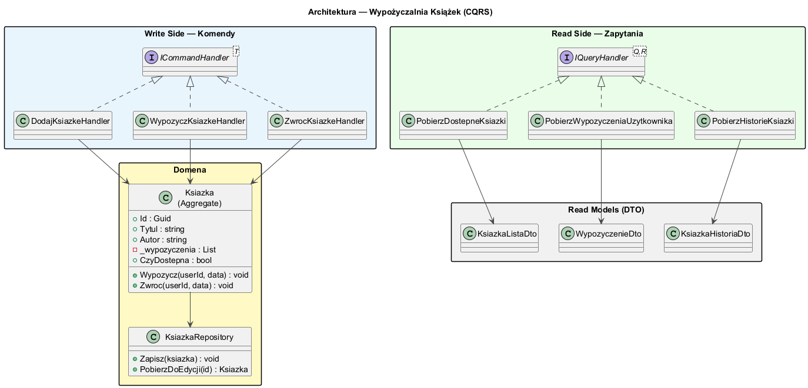
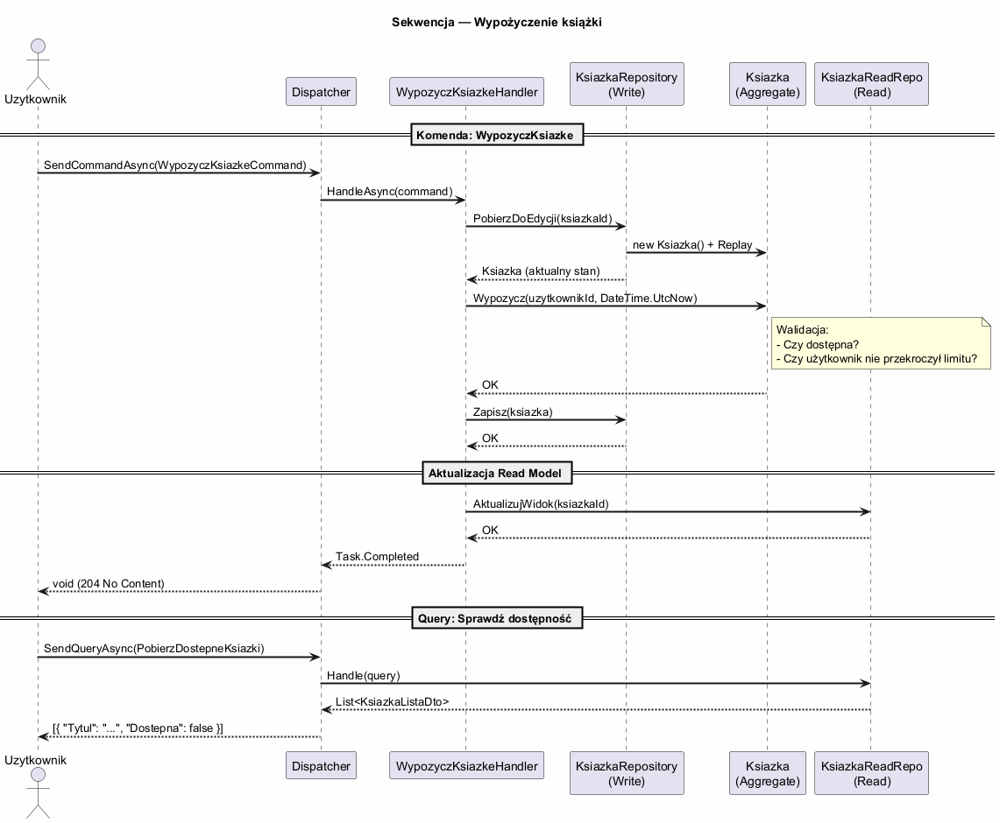

# Temat 06 — Większy przykład: Wypożyczalnia Książek

## Opis

Kompletna implementacja CQRS dla systemu wypożyczalni książek — z bogatym modelem domenowym,
oddzielnymi handlerami komend i zapytań oraz testami jednostkowymi.

## Architektura

### Diagram — architektura



### Diagram — sekwencja wypożyczenia



---

## Struktura projektu

```
06-wiekszy-przyklad/
├── Library/
│   ├── Library.csproj
│   └── Biblioteka.cs        — domena, komendy, zapytania, handlery
├── Examples/
│   ├── Examples.csproj
│   └── Program.cs           — demonstracja działania
├── Tests/
│   ├── Tests.csproj
│   └── BibliotekaTests.cs   — 20 testów jednostkowych
└── diagrams/
    ├── 01-architecture.puml/png
    └── 02-sequence-borrow.puml/png
```

---

## Domena (Write Model)

Domena chroni kluczowy niezmiennik: **każda książka może być wypożyczona tylko przez jednego użytkownika na raz**.

```csharp
public class Ksiazka  // Aggregate Root
{
    private readonly List<Wypozyczenie> _wypozyczenia = [];

    public bool CzyDostepna =>
        Aktywna && !_wypozyczenia.Any(w => w.Status == StatusWypozyczenia.Aktywne);

    public void Wypozycz(Guid uzytkownikId, string uzytkownikNazwa, DateTime dataTx)
    {
        if (!Aktywna)
            throw new InvalidOperationException("Książka jest wycofana ze zbiorów");
        if (!CzyDostepna)
        {
            var aktywne = _wypozyczenia.First(w => w.Status == StatusWypozyczenia.Aktywne);
            throw new InvalidOperationException(
                $"Książka jest aktualnie wypożyczona przez {aktywne.UzytkownikNazwa}");
        }
        _wypozyczenia.Add(new Wypozyczenie(uzytkownikId, uzytkownikNazwa, dataTx));
    }
}
```

---

## Komendy

| Komenda | Opis |
|---------|------|
| `DodajKsiazkeCommand` | Dodaje nową książkę do zbiorów |
| `WypozyczKsiazkeCommand` | Wypożycza książkę użytkownikowi |
| `ZwrocKsiazkeCommand` | Zwraca wypożyczoną książkę |
| `WycofajKsiazkeCommand` | Wycofuje książkę ze zbiorów |

```csharp
// Komendy jako niemutowalne rekordy
public record WypozyczKsiazkeCommand(
    Guid KsiazkaId, Guid UzytkownikId, string UzytkownikNazwa) : ICommand;

// Handler — zawiera logikę biznesową
public class WypozyczKsiazkeHandler(IKsiazkaWriteRepository repo)
    : ICommandHandler<WypozyczKsiazkeCommand>
{
    public async Task HandleAsync(WypozyczKsiazkeCommand cmd, CancellationToken ct = default)
    {
        var ksiazka = await repo.PobierzAsync(cmd.KsiazkaId)
            ?? throw new InvalidOperationException($"Książka {cmd.KsiazkaId} nie istnieje");
        ksiazka.Wypozycz(cmd.UzytkownikId, cmd.UzytkownikNazwa, DateTime.UtcNow);
        await repo.ZapiszAsync(ksiazka);
    }
}
```

---

## Zapytania i Read Models

| Zapytanie | Wynik |
|-----------|-------|
| `PobierzDostepneKsiazki` | `IReadOnlyList<KsiazkaListaDto>` — tylko dostępne |
| `PobierzWszystkieKsiazki` | `IReadOnlyList<KsiazkaListaDto>` — wszystkie |
| `PobierzWypozyczeniaUzytkownikaQuery` | `IReadOnlyList<WypozyczenieDto>` — historia użytkownika |
| `PobierzHistorieKsiazkiQuery` | `KsiazkaHistoriaDto?` — pełna historia danej książki |

```csharp
// Różne DTO dla różnych widoków
public record KsiazkaListaDto(
    Guid Id, string Tytul, string Autor, string ISBN,
    bool DostepnaDoWypozyczenia, string? AktualnyWypozyczajacy);

public record WypozyczenieDto(
    Guid KsiazkaId, string KsiazakTytul, string KsiazkaAutor,
    DateTime DataWypozyczenia, DateTime? DataZwrotu, string Status);

public record WypozyczenieHistoriaItem(
    string UzytkownikNazwa, DateTime DataWypozyczenia, DateTime? DataZwrotu,
    string Status, int? LiczbaDniWypozyczenia);
```

---

## Testy

Moduł zawiera **20 testów jednostkowych** podzielonych na trzy klasy:

| Klasa testów | Zakres | Liczba testów |
|---|---|---|
| `KsiazkaAggregateTests` | Logika domeny (agregat) | 9 |
| `CommandHandlerTests` | Handlery komend | 5 |
| `QueryHandlerTests` | Handlery zapytań | 6 |

Przykładowe testy:

```csharp
[Fact]
public void Wypozycz_WypozyczonaKsiazka_RzucaInvalidOperationException()
{
    var k = UtworzKsiazke();
    k.Wypozycz(Guid.NewGuid(), "Jan", DateTime.UtcNow);
    var ex = Assert.Throws<InvalidOperationException>(() =>
        k.Wypozycz(Guid.NewGuid(), "Anna", DateTime.UtcNow));
    Assert.Contains("aktualnie wypożyczona", ex.Message);
}

[Fact]
public async Task PobierzDostepneKsiazki_JednaWypozyczona_ZwracaDwie()
{
    var repo = await SetupRepoAsync();
    await wypozyczH.HandleAsync(new WypozyczKsiazkeCommand(k1Id, Guid.NewGuid(), "Jan"));
    var wynik = await handler.HandleAsync(new PobierzDostepneKsiazki());
    Assert.Equal(2, wynik.Count);  // z 3 → 2 dostępne
}
```

---

## Uruchomienie

```bash
# Demonstracja
cd src/A01-cqrs/06-wiekszy-przyklad/Examples
dotnet run

# Testy
cd src/A01-cqrs/06-wiekszy-przyklad/Tests
dotnet test
```

---

## Literatura

- [Greg Young — CQRS Documents](https://cqrs.files.wordpress.com/2010/11/cqrs_documents.pdf)
- [Microsoft — CQRS Pattern](https://learn.microsoft.com/en-us/azure/architecture/patterns/cqrs)
- [Martin Fowler — CQRS](https://martinfowler.com/bliki/CQRS.html)
