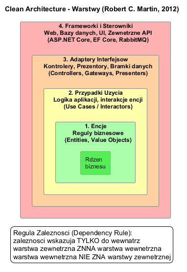
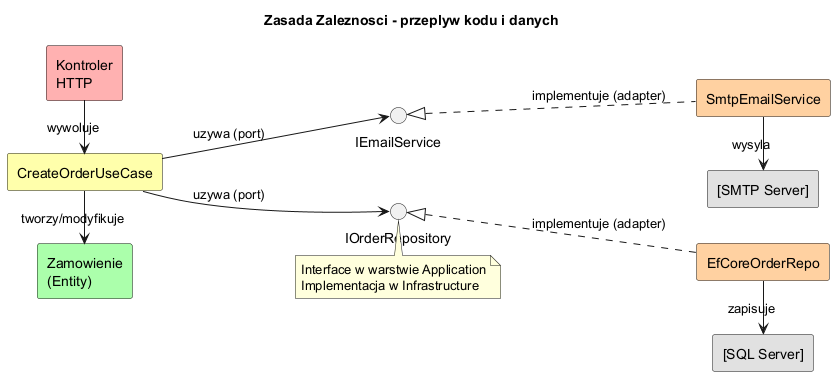

# Temat 01 — Idea i warstwy Clean Architecture

## Motywacja: Problem z architekturą N-Tier

Klasyczna architektura N-Tier (3-warstwowa) dzieli aplikację na warstwę prezentacji,
logiki biznesowej i danych. W praktyce często prowadzi to do **silnego sprzężenia**:
warstwa logiki zależy bezpośrednio od infrastruktury (SQL, SMTP, itp.):

```csharp
class OrderService {
    // PROBLEM: ścisłe sprzężenie do bazy danych w warstwie biznesowej!
    private SqlConnection _db = new("Server=prod;Database=shop;...");

    public void CreateOrder(string item, decimal price) {
        _db.Open();
        // SQL bezpośrednio w logice biznesowej — brak testowalności!
        var cmd = new SqlCommand($"INSERT INTO Orders VALUES ('{item}', {price})", _db);
        cmd.ExecuteNonQuery();
        // Zmiana bazy = zmiana tej klasy = ryzyko błędów
    }
}
```

**Konsekwencje:**
- Nie można przetestować bez uruchomienia bazy danych
- Zmiana silnika DB wymaga modyfikacji klasy biznesowej
- Trudne wdrożenie w środowisku chmurowym
- Naruszenie zasady Single Responsibility

---

## Historia i kontekst

| Rok | Wzorzec | Autor |
|-----|---------|-------|
| 2005 | Hexagonal Architecture (Ports & Adapters) | Alistair Cockburn |
| 2008 | Onion Architecture | Jeffrey Palermo |
| 2012 | Clean Architecture | Robert C. Martin (Uncle Bob) |

Clean Architecture łączy idee wszystkich poprzedników i formalizuje je jako
**Zasadę Zależności** (Dependency Rule).

---

## Cztery warstwy Clean Architecture

### Diagram



### Opis warstw

**1. Entities (Warstwa Domain)**
- Obiekty biznesowe z regułami biznesowymi (`Order`, `Product`, `Customer`)
- Niezależne od frameworków, baz danych, protokołów
- Mogą być współdzielone przez wiele aplikacji w organizacji

```csharp
class Product {
    public decimal Price { get; private set; }
    public int Stock { get; private set; }

    public void Reserve(int quantity) {
        if (quantity > Stock)
            throw new InvalidOperationException("Niewystarczający stan magazynu");
        Stock -= quantity;  // reguła biznesowa: nie sprzedajesz więcej niż masz
    }
}
```

**2. Use Cases (Warstwa Application)**
- Przypadki użycia specyficzne dla danej aplikacji
- Orchestrują encje domeny
- Definiują interfejsy (porty) dla infrastruktury — ale ich nie implementują

```csharp
class ReserveProductUseCase(IProductRepository repo) {
    public void Execute(Guid productId, int quantity) {
        var product = repo.FindById(productId)
            ?? throw new NotFoundException(productId);
        product.Reserve(quantity); // logika biznesowa w encji!
        repo.Save(product);
    }
}
```

**3. Interface Adapters (Adaptery Interfejsów)**
- Kontrolery HTTP (mapują żądania HTTP na komendy Use Case)
- Prezentory (mapują wyniki Use Case na format JSON/HTML)
- Implementacje repozytoriów (ale nie same interfejsy!)

**4. Frameworks & Drivers (Frameworki i Sterowniki)**
- ASP.NET Core, Entity Framework Core
- Bazy danych, kolejki wiadomości, zewnętrzne API
- Konfiguracja, DI Container (Microsoft.Extensions.DependencyInjection)

---

## Zasada Zależności

### Diagram



> **Dependency Rule:** Zależności kodu źródłowego mogą wskazywać tylko *do wewnątrz*.
> Nic w warstwie wewnętrznej nie może wiedzieć czegokolwiek o warstwie zewnętrznej.

Oznacza to:
- `Domain` nie importuje nic z `Application`, `Infrastructure`, ani `Presentation`
- `Application` nie importuje nic z `Infrastructure` ani `Presentation`
- `Infrastructure` może importować z `Application` (implementuje jej interfejsy)

```
Infrastructure → Application → Domain     ✓ poprawne zależności
Domain → Application                      ✗ naruszenie zasady!
```

---

## Przykład kodu — porównanie

Pełny kod przykładu znajduje się w [Examples/Program.cs](Examples/Program.cs).

Kluczowy fragment pokazujący podmienianie implementacji:

```csharp
// Warstwa Application — Use Case zależy od interfejsu (portu)
class AddProductUseCase(IProductRepository repository) {
    public Product Execute(string name, decimal price, int stock) {
        var product = new Product(Guid.NewGuid(), name, price, stock);
        repository.Save(product);  // nie wiemy, jak to jest zapisywane!
        return product;
    }
}

// Ten sam Use Case działa z DOWOLNĄ implementacją:
IProductRepository repo1 = new InMemoryProductRepository(); // testy
IProductRepository repo2 = new EfCoreProductRepository();   // produkcja
IProductRepository repo3 = new FakeProductRepository();     // demo
var uc = new AddProductUseCase(repo1); // podmiana bez zmiany kodu Use Case!
```

---

## Uruchomienie

```bash
cd src/A02-clean-architecture/01-idea-i-warstwy/Examples
dotnet run
```

---

## Literatura

- [Robert C. Martin — The Clean Architecture (blog, 2012)](https://blog.cleancoder.com/uncle-bob/2012/08/13/the-clean-architecture.html)
- [Robert C. Martin — *Clean Architecture* (Informit, 2017)](https://www.informit.com/store/clean-architecture-a-craftsmans-guide-to-software-structure-9780134494166)
- [Microsoft — Architektura N-Tier](https://learn.microsoft.com/en-us/azure/architecture/guide/architecture-styles/n-tier)
