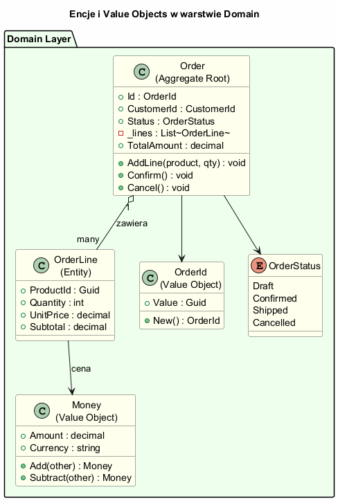
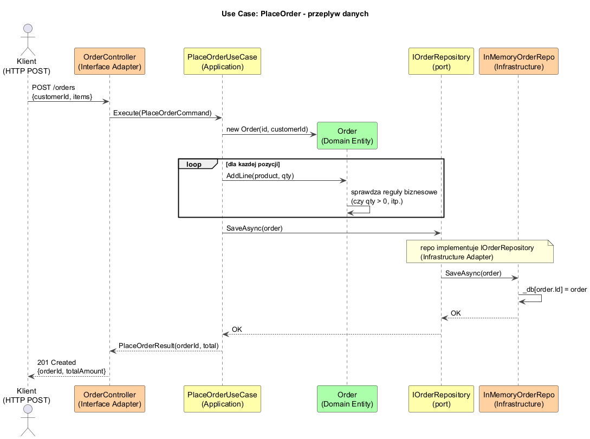

# Temat 02 — Encje i przypadki użycia

## Encje (Entities) i Value Objects

W warstwie Domain wyróżniamy dwa rodzaje obiektów:

### Value Objects (Obiekty Wartości)
- Nie mają tożsamości — dwa obiekty o tych samych wartościach są **równe**
- **Niezmienne** (immutable) — operacje tworzą nowe obiekty
- Przykłady: `Money`, `Address`, `DateRange`, `Email`

```csharp
record Money(decimal Amount, string Currency)
{
    public Money Add(Money other) {
        if (Currency != other.Currency)
            throw new InvalidOperationException($"Nie można dodać {Currency} i {other.Currency}");
        return new Money(Amount + other.Amount, Currency); // nowy obiekt!
    }
}

var m1 = new Money(100m, "PLN");
var m2 = new Money(100m, "PLN");
Console.WriteLine(m1 == m2); // true — równość przez wartość (record)
```

### Entities (Encje)
- Mają **tożsamość** (Identity) — dwa obiekty z tym samym `Id` są tym samym obiektem
- Mogą zmieniać swój stan w czasie
- Chronią **niezmienniki biznesowe** (invariants) — reguły, które zawsze muszą być spełnione

```csharp
class Order {                                    // Aggregate Root
    private List<OrderLine> _lines = [];

    public void AddLine(ProductInfo product, int qty) {
        if (Status != OrderStatus.Draft)
            throw new InvalidOperationException("Nie można modyfikować potwierdzonego zamówienia");
        if (_lines.Any(l => l.ProductId == product.Id))
            throw new InvalidOperationException("Produkt już istnieje w zamówieniu");
        _lines.Add(new OrderLine(product.Id, qty, product.Price));
    }
}
```

### Diagram



---

## Przypadki użycia (Use Cases)

Use Case (Interactor) **orchestruje encje** aby zrealizować konkretny scenariusz biznesowy.
Definiuje **porty** (interfejsy), przez które komunikuje się z zewnętrznymi systemami.

```csharp
class PlaceOrderUseCase(IOrderRepository orders, IProductCatalog catalog)
{
    public async Task<PlaceOrderResult> ExecuteAsync(PlaceOrderCommand cmd)
    {
        // Walidacja danych wejściowych (Application, nie Domain)
        if (cmd.CustomerId == Guid.Empty)
            throw new ArgumentException("CustomerId jest wymagane");

        var order = new Order(OrderId.New(), cmd.CustomerId);

        foreach (var item in cmd.Items) {
            var product = catalog.FindByName(item.ProductName)
                ?? throw new InvalidOperationException($"Produkt '{item.ProductName}' nie istnieje");
            order.AddLine(product, item.Quantity);  // reguły biznesowe w encji!
        }

        order.Confirm();                    // zmiana stanu encji
        await orders.SaveAsync(order);      // przez port/interfejs — nie bezpośrednio do DB!
        return new PlaceOrderResult(...);
    }
}
```

### Diagram przepływu danych



---

## Przepływ danych: Input vs Output

Dane przepływają przez warstwy w sposób **zgodny z Zasadą Zależności**:

```
HTTP Request
    ↓
Controller (Interface Adapter) — mapuje HTTP → Command
    ↓
PlaceOrderUseCase (Application) — logika aplikacji
    ↓
Order (Domain) — reguły biznesowe
    ↓
IOrderRepository (port) ← implementuje → InMemoryOrderRepository (Infrastructure)
    ↓
Odpowiedź: PlaceOrderResult (DTO)
    ↓
Controller — mapuje Result → HTTP Response
    ↓
HTTP Response (JSON)
```

**Ważne:** Dane wracające z Use Case to **DTO** (Data Transfer Object), nie encja Domain.
Encje domeny **nie powinny** opuszczać warstwy Application.

---

## Gdzie powinna być walidacja?

| Co walidujemy | Gdzie | Przykład |
|---|---|---|
| Niezmienniki biznesowe | Domain (encja) | „Nie można dodać produktu po potwierdzeniu" |
| Dane wejściowe komendy | Application (Use Case) | „CustomerId jest wymagane" |
| Format/typ | Presentation/Controller | „Pole price musi być liczbą" |
| Spójność danych w DB | Infrastructure | Unique constraint w bazie |

---

## Uruchomienie

```bash
cd src/A02-clean-architecture/02-encje-i-przypadki-uzycia/Examples
dotnet run
```

---

## Literatura

- [Robert C. Martin — Clean Architecture (2017), rozdz. 20–22 — Use Cases](https://www.informit.com/store/clean-architecture-a-craftsmans-guide-to-software-structure-9780134494166)
- [Martin Fowler — Value Object](https://martinfowler.com/bliki/ValueObject.html)
- [Eric Evans — Domain-Driven Design (2003)](https://www.amazon.com/Domain-Driven-Design-Tackling-Complexity-Software/dp/0321125215) — Entities i Value Objects
