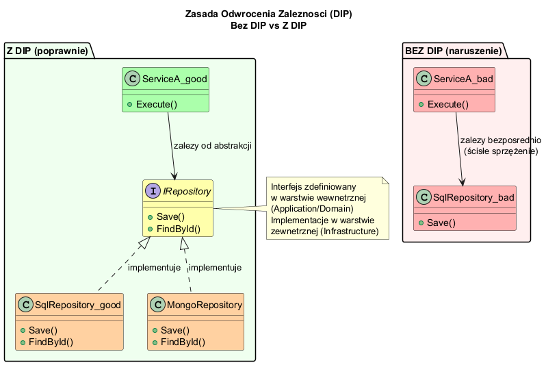
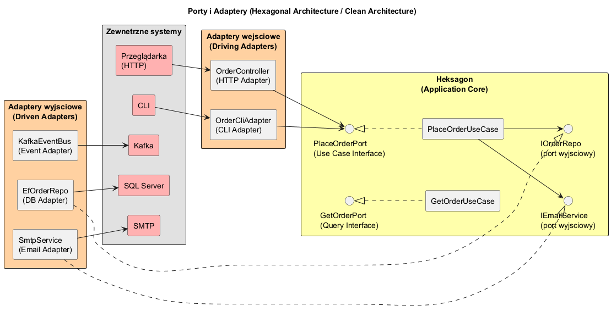

# Temat 03 — Zależności i wstrzykiwanie zależności

## Zasada Odwrócenia Zależności (DIP)

**Dependency Inversion Principle** — jedna z zasad SOLID i fundament Clean Architecture:

> „Moduły wysokiego poziomu nie powinny zależeć od modułów niskiego poziomu.  
> Oba powinny zależeć od **abstrakcji**."

### Problem bez DIP

```csharp
class UserService {
    // ZŁE: bezpośrednia zależność od konkretu
    private readonly SqlUserRepository _repo = new SqlUserRepository("connectionString");
    private readonly SmtpEmailSender _email = new SmtpEmailSender("smtp.gmail.com");

    public void Register(string email) {
        // Ten kod jest nierozerwalnie związany z SQL i SMTP!
    }
}
```

**Problemy:**
- Nie można przetestować bez bazy danych i serwera SMTP
- Zmiana bazy = zmiana kodu biznesowego
- Naruszenie SRP (Single Responsibility)

### Rozwiązanie: DIP + Interfejsy

```csharp
// Interfejsy (porty) definiowane w warstwie Application/Domain
interface IUserRepository { Task<bool> ExistsAsync(string email); Task AddAsync(User user); }
interface IEmailService   { Task SendAsync(string to, string subject, string body); }

// Use Case zależy tylko od interfejsów
class RegisterUserUseCase(IUserRepository repo, IEmailService email) {
    public async Task ExecuteAsync(RegisterUserCommand cmd) {
        // nie wie NIC o SQL, SMTP, In-Memory itd.
        await repo.AddAsync(new User(...));
        await email.SendAsync(cmd.Email, "Witamy!", "...");
    }
}
```

### Diagram



---

## Porty i Adaptery

**Port** = interfejs zdefiniowany w warstwie Application (co system potrzebuje)  
**Adapter** = implementacja portu w Infrastructure (jak to zrobić)

```
Application (wewnątrz)          Infrastructure (zewnątrz)
───────────────────────          ─────────────────────────
IUserRepository     ←─────────  SqlUserRepository
IEmailService       ←─────────  SmtpEmailService
IEventBus           ←─────────  KafkaEventBus
ISmsService         ←─────────  TwilioSmsService
```

Adaptery **zależą** od portów (nie odwrotnie) — zgodnie z Zasadą Zależności.

### Diagram



---

## Composition Root

**Composition Root** = jedyne miejsce w aplikacji, gdzie tworzymy konkrety i wstrzykujemy zależności.  
Zazwyczaj to `Program.cs` lub `Startup.cs`.

```csharp
// TYLKO tutaj tworzymy konkrety — nigdzie indziej w kodzie!
var builder = WebApplication.CreateBuilder(args);

// Rejestracja (np. Microsoft.Extensions.DependencyInjection):
builder.Services.AddScoped<IUserRepository, SqlUserRepository>();
builder.Services.AddScoped<IEmailService, SmtpEmailService>();
builder.Services.AddScoped<RegisterUserUseCase>();

// Albo ręcznie (bez kontenera DI):
IUserRepository repo  = new InMemoryUserRepository();
IEmailService   email = new ConsoleEmailService();
var useCase = new RegisterUserUseCase(repo, email);
```

**Reguła:** Poza Composition Root — **nigdy** `new ConkretnaKlasa()` dla zależności!

---

## Wstrzykiwanie zależności (DI)

Trzy rodzaje wstrzykiwania:

| Typ | Jak | Kiedy |
|---|---|---|
| **Constructor injection** (zalecane) | `class UC(IRepo repo)` | Zależności wymagane |
| **Method injection** | `Execute(IRepo repo)` | Zależności opcjonalne/kontekstowe |
| **Property injection** | `public IRepo Repo { set; }` | Rzadko — trudne do śledzenia |

```csharp
// Constructor injection — preferowane
class RegisterUserUseCase(IUserRepository repo, IEmailService email) {
    // Zależności zawsze dostępne, brak stanu null
}
```

---

## Podmiana adaptera bez zmiany logiki

```csharp
// Test — bez prawdziwego e-maila
IEmailService fake = new FakeEmailService();
var uc = new RegisterUserUseCase(new InMemoryUserRepository(), fake);
await uc.ExecuteAsync(new RegisterUserCommand("test@test.com", "Tester"));

// Produkcja — prawdziwy SMTP
IEmailService smtp = new SmtpEmailService("smtp.gmail.com", 587);
var uc2 = new RegisterUserUseCase(new SqlUserRepository(connStr), smtp);
```

Kod `RegisterUserUseCase` **nie zmienia się** — tylko composition root.

---

## Uruchomienie

```bash
cd src/A02-clean-architecture/03-zaleznosci-i-di/Examples
dotnet run
```

---

## Literatura

- [Robert C. Martin — Clean Architecture, rozdz. 11 (DIP)](https://www.informit.com/store/clean-architecture-a-craftsmans-guide-to-software-structure-9780134494166)
- [Mark Seemann — Dependency Injection in .NET](https://www.manning.com/books/dependency-injection-principles-practices-patterns)
- [Martin Fowler — Inversion of Control Containers](https://martinfowler.com/articles/injection.html)
