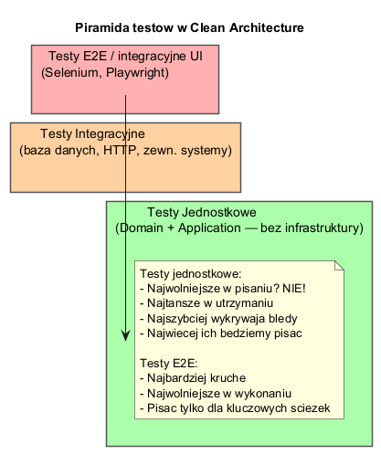
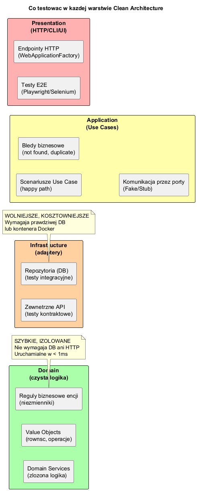

# Temat 04 — Testowanie w Clean Architecture

## Dlaczego Clean Architecture ułatwia testowanie?

Główna zaleta Clean Architecture z perspektywy testowania:  
**Warstwa Domain i Application nie mają żadnych zależności od infrastruktury.**

Oznacza to, że możemy testować **całą logikę biznesową** bez:
- bazy danych
- serwisu HTTP
- plików konfiguracyjnych
- kontenera DI

```csharp
// Test warstwy Application — ZERO infrastruktury!
var fakeRepo   = new FakeAccountRepository();   // Fake, nie SQL
var fakeNotify = new FakeNotificationService(); // Fake, nie SMTP

var uc = new TransferFundsUseCase(fakeRepo, fakeNotify);
await uc.ExecuteAsync(new TransferCommand(senderId, receiverId, new Money(400m)));

Assert.Equal(600m, (await fakeRepo.FindByIdAsync(senderId))!.Balance);
```

---

## Piramida testów



| Poziom | Co testujemy | Narzędzia | Szybkość | Ilość |
|---|---|---|---|---|
| Jednostkowe | Domain + Application | xUnit, NUnit | < 1 ms | Dużo |
| Integracyjne | Infrastructure (DB, HTTP) | xUnit + TestContainers | Sekundy | Umiarkowanie |
| E2E / UI | Cały system | Playwright, Selenium | Minuty | Mało |

---

## Co testować w każdej warstwie



### Domain — niezmienniki encji

```csharp
[Fact]
public void Withdraw_WhenInsufficientFunds_Throws()
{
    var account = new BankAccount(Guid.NewGuid(), "jan@email.com");
    account.Deposit(new Money(100m));

    Assert.Throws<InvalidOperationException>(() =>
        account.Withdraw(new Money(200m)));
}
```

### Application — scenariusze Use Case z Fake

```csharp
[Fact]
public async Task TransferFunds_HappyPath_UpdatesBothBalances()
{
    // Arrange
    var fakeRepo = new FakeAccountRepository();
    var sender   = new BankAccount(...); sender.Deposit(new Money(1000m));
    var receiver = new BankAccount(...);
    await fakeRepo.AddAsync(sender);
    await fakeRepo.AddAsync(receiver);

    // Act
    var uc = new TransferFundsUseCase(fakeRepo, new FakeNotificationService());
    await uc.ExecuteAsync(new TransferCommand(sender.Id, receiver.Id, new Money(400m)));

    // Assert
    Assert.Equal(600m, (await fakeRepo.FindByIdAsync(sender.Id))!.Balance);
    Assert.Equal(400m, (await fakeRepo.FindByIdAsync(receiver.Id))!.Balance);
}
```

### Infrastructure — testy integracyjne (prawdziwa DB)

```csharp
// Wymaga uruchomionej bazy danych lub kontenera Docker
public class SqlAccountRepositoryTests(DatabaseFixture db) : IClassFixture<DatabaseFixture>
{
    [Fact]
    public async Task SaveAsync_PersistsAccount()
    {
        var repo    = new SqlAccountRepository(db.ConnectionString);
        var account = new BankAccount(Guid.NewGuid(), "test@test.com");
        account.Deposit(new Money(500m));

        await repo.SaveAsync(account);
        var loaded = await repo.FindByIdAsync(account.Id);

        Assert.Equal(500m, loaded!.Balance);
    }
}
```

---

## Typy Fake vs Mock vs Stub

| Typ | Opis | Użycie |
|---|---|---|
| **Fake** | Działająca implementacja (np. In-Memory) | Testy Application |
| **Stub** | Zwraca predefiniowane wartości | Proste scenariusze |
| **Mock** | Sprawdza jak był wywołany | Gdy liczy się samo wywołanie |
| **Spy** | Nagrywa wywołania | Weryfikacja interakcji |

W Clean Architecture preferujemy **Fake** — działają jak prawdziwa implementacja,
ale są proste i nie wymagają bibliotek mockowania.

```csharp
// Fake — działająca implementacja w pamięci
class FakeAccountRepository : IAccountRepository
{
    private readonly Dictionary<Guid, BankAccount> _db = [];
    public Task<BankAccount?> FindByIdAsync(Guid id) { _db.TryGetValue(id, out var acc); return Task.FromResult(acc); }
    public Task SaveAsync(BankAccount account) { _db[account.Id] = account; return Task.CompletedTask; }
}
```

---

## Wzorzec AAA (Arrange-Act-Assert)

Każdy test powinien mieć trzy sekcje:

```csharp
[Fact]
public async Task Example()
{
    // Arrange — przygotuj dane i serwisy
    var fakeRepo = new FakeAccountRepository();
    var account  = new BankAccount(Guid.NewGuid(), "owner@email.com");
    account.Deposit(new Money(1000m));
    await fakeRepo.AddAsync(account);

    // Act — wykonaj testowaną akcję
    account.Withdraw(new Money(200m));

    // Assert — sprawdź wynik
    Assert.Equal(800m, account.Balance);
}
```

---

## Uruchomienie

```bash
cd src/A02-clean-architecture/04-testowanie/Examples
dotnet run
```

---

## Literatura

- [Robert C. Martin — Clean Architecture, rozdz. 28 (The Test Boundary)](https://www.informit.com/store/clean-architecture-a-craftsmans-guide-to-software-structure-9780134494166)
- [Martin Fowler — TestDouble](https://martinfowler.com/bliki/TestDouble.html)
- [Vladimir Khorikov — Unit Testing Principles, Practices, and Patterns](https://www.manning.com/books/unit-testing)
