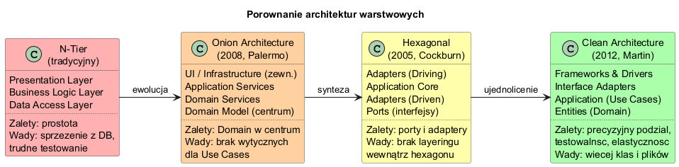
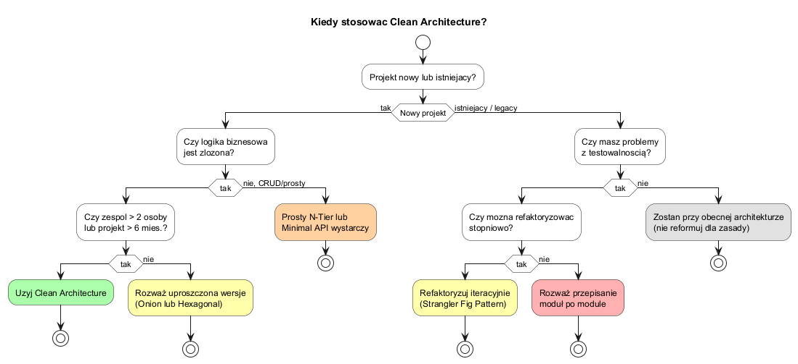

# Temat 05 — Porównanie architektur

## Ewolucja architektur warstwowych

Architektura Clean Architecture jest syntezą wcześniejszych podejść:

```
N-Tier (1990s) → Onion (2008) → Hexagonal (2005) → Clean (2012)
```

### Diagram ewolucji



---

## N-Tier (tradycyjna architektura warstwowa)

```
┌─────────────────────────┐
│   Presentation Layer    │  (ASP.NET MVC Controllers)
├─────────────────────────┤
│  Business Logic Layer   │  (Services, Managers)
├─────────────────────────┤
│   Data Access Layer     │  (Repositories, ORM)
└─────────────────────────┘
        ↕ Database
```

**Problem:** Każda warstwa **zależy od warstwy poniżej**. BLL zna DAL. Jeśli zmienimy ORM, musimy modyfikować BLL.

```csharp
// ZŁE: BLL bezpośrednio zależy od DAL
class ProductService {
    private readonly SqlProductRepository _repo = new(); // ścisłe sprzężenie!
    public List<Product> GetActive() => _repo.GetAll().Where(p => p.IsActive).ToList();
}
```

---

## Onion Architecture (Palermo, 2008)

Domain Model w centrum, Infrastructure na zewnątrz. Interfejsy definiowane w Domain.

```
        ┌──────────────────────────────────────────┐
        │              Infrastructure               │  (DB, Email, HTTP)
        │   ┌──────────────────────────────────┐   │
        │   │        Application Services       │   │
        │   │   ┌──────────────────────────┐   │   │
        │   │   │      Domain Services      │   │   │
        │   │   │  ┌──────────────────┐    │   │   │
        │   │   │  │   Domain Model   │    │   │   │
        │   │   │  └──────────────────┘    │   │   │
        │   │   └──────────────────────────┘   │   │
        │   └──────────────────────────────────┘   │
        └──────────────────────────────────────────┘
```

**Różnica od N-Tier:** Zależności skierowane **do centrum**, nie w dół.

---

## Hexagonal Architecture (Cockburn, 2005)

Inaczej: **Ports & Adapters**. Aplikacja ma „porty" — interfejsy do komunikacji.  
Adaptery podłączają zewnętrzne systemy przez te porty.

```
    [Browser]  [CLI]  [Test]
         ↓       ↓      ↓
    [HTTP Adapter] [CLI Adapter]    ← Driving Adapters (wejście)
              ↓
    ╔════════════════════╗
    ║   Application Core ║
    ║  (Hexagon)         ║
    ╚════════════════════╝
              ↓
    [DB Adapter] [Email Adapter]   ← Driven Adapters (wyjście)
         ↓            ↓
     [SQL DB]     [SMTP Server]
```

**Różnica od Onion:** Precyzyjne rozróżnienie portów wejściowych (driving) i wyjściowych (driven).

---

## Clean Architecture (Martin, 2012)

Precyzyjny podział na 4 koncentryczne kręgi z **Zasadą Zależności**:

```
┌───────────────────────────────────────────────────────────┐
│                  Frameworks & Drivers                      │  (DB, Web, UI)
│  ┌────────────────────────────────────────────────────┐   │
│  │                Interface Adapters                   │   │  (Controllers, Presenters)
│  │  ┌─────────────────────────────────────────────┐   │   │
│  │  │           Application Business Rules         │   │   │  (Use Cases)
│  │  │  ┌──────────────────────────────────────┐   │   │   │
│  │  │  │     Enterprise Business Rules         │   │   │   │  (Entities)
│  │  │  └──────────────────────────────────────┘   │   │   │
│  │  └─────────────────────────────────────────────┘   │   │
│  └────────────────────────────────────────────────────┘   │
└───────────────────────────────────────────────────────────┘
        Zależności wskazują tylko DO ŚRODKA ↑
```

---

## Porównanie tabelaryczne

| Kryterium | N-Tier | Onion | Hexagonal | Clean |
|---|---|---|---|---|
| Kiedy powstał | ~1990s | 2008 | 2005 | 2012 |
| Domain w centrum | Nie | Tak | Tak | Tak |
| Precyzyjny podział warstw | Tak | Częściowo | Nie | Tak |
| Porty i adaptery | Nie | Nie | Tak | Tak (inaczej) |
| Testowanie logiki bez DB | Trudne | Łatwe | Łatwe | Bardzo łatwe |
| Overhead dla małych proj. | Niski | Średni | Średni | Wysoki |

---

## Kiedy stosować Clean Architecture?



### Stosuj Clean Architecture gdy:
- Złożona domena biznesowa (finanse, ubezpieczenia, logistyka)
- Długi czas życia projektu (> 2 lata)
- Duży zespół (> 3 programistów)
- Wiele źródeł danych lub systemów zewnętrznych
- Wymagania dotyczące testowalności

### N-Tier lub Minimal API wystarczy gdy:
- Prosty CRUD (blog, todo list, landing page)
- MVP / Proof of Concept
- Projekt jednej osoby na krótki czas
- Klient oczekuje szybkiego delivery, nie skalowalności

### Złota zasada
> „Clean Architecture to narzędzie, nie cel sam w sobie.  
> Złożoność architektury powinna być proporcjonalna do złożoności domeny."

---

## Uruchomienie

```bash
cd src/A02-clean-architecture/05-porownanie-architektur/Examples
dotnet run
```

---

## Literatura

- [Jeffrey Palermo — Onion Architecture (2008)](https://jeffreypalermo.com/2008/07/the-onion-architecture-part-1/)
- [Alistair Cockburn — Hexagonal Architecture (2005)](https://alistair.cockburn.us/hexagonal-architecture/)
- [Robert C. Martin — Clean Architecture (2017)](https://www.informit.com/store/clean-architecture-a-craftsmans-guide-to-software-structure-9780134494166)
- [Herberto Graca — DDD, Hexagonal, Onion, Clean, CQRS — How I put it all together](https://herbertograca.com/2017/11/16/explicit-architecture-01-ddd-hexagonal-onion-clean-cqrs-how-i-put-it-all-together/)
