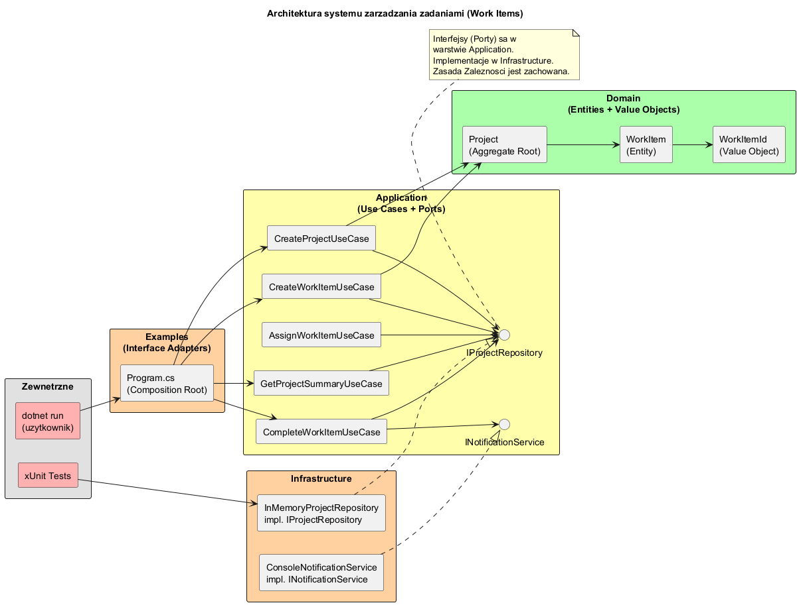
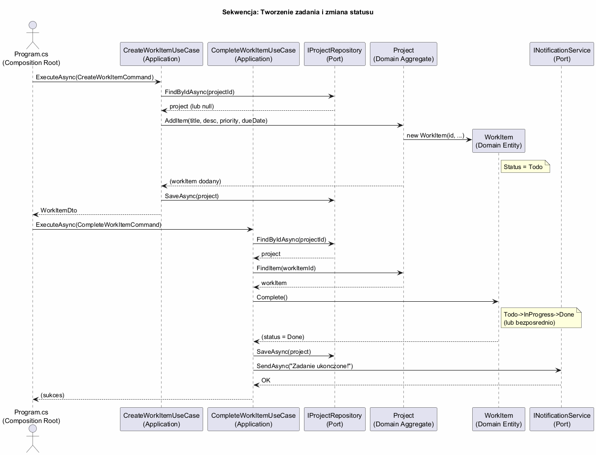

# Temat 06 — Większy przykład: System zarządzania zadaniami

## Architektura projektu

Pełna implementacja Clean Architecture w C# .NET 9 z 5 projektami:

```
06-wiekszy-przyklad/
├── Domain/           — Encje, Value Objects, wyjątki domeny (zero zależności zewnętrznych)
├── Application/      — Porty, Use Cases, DTO, Komendy (zależy tylko od Domain)
├── Infrastructure/   — Adaptery (zależy od Application → Domain)
├── Examples/         — Composition Root + demo (zależy od Infrastructure)
└── Tests/            — Testy xUnit (zależy od Infrastructure, używa Fake)
```

### Diagram architektury



### Diagram sekwencji



---

## Warstwa Domain

Czysta logika biznesowa — **zero zależności** od zewnętrznych bibliotek.

### Value Objects
```csharp
public record WorkItemId(Guid Value) {
    public static WorkItemId New() => new(Guid.NewGuid());
}
```

### Encja WorkItem — maszyna stanów
```
Todo → InProgress → Done
         ↓
      Cancelled
```
Niezmienniki:
- Nie można uruchomić zadania, które nie jest w stanie `Todo`
- Nie można ukończyć anulowanego zadania
- `IsOverdue` = `DueDate` w przeszłości AND status != Done/Cancelled

### Agregat Project
- Jest korzeniem agregatu (`Aggregate Root`)
- Zarządza kolekcją `WorkItem` — jedynym sposobem dodania zadania jest `project.AddItem(...)`
- `FindItem(id)` rzuca `WorkItemNotFoundException` gdy nie znajdzie — nie `null`!

---

## Warstwa Application

Definuje **porty** (interfejsy) i **Use Cases**.

### Porty (Out-Ports)
```csharp
public interface IProjectRepository {
    Task<Project?> FindByIdAsync(ProjectId id);
    Task SaveAsync(Project project);
    // ...
}
public interface INotificationService {
    Task SendAsync(string recipient, string subject, string message);
}
```

### Use Cases
| Use Case | Typ | Opis |
|---|---|---|
| `CreateProjectUseCase` | Command | Tworzy nowy projekt |
| `CreateWorkItemUseCase` | Command | Dodaje zadanie do projektu |
| `StartWorkItemUseCase` | Command | Zmienia status na InProgress |
| `CompleteWorkItemUseCase` | Command | Zmienia status na Done, wysyła powiadomienie |
| `AssignWorkItemUseCase` | Command | Przypisuje zadanie do użytkownika |
| `CancelWorkItemUseCase` | Command | Anuluje zadanie |
| `GetProjectWorkItemsUseCase` | Query | Zwraca wszystkie zadania projektu |
| `GetOverdueItemsUseCase` | Query | Zwraca przeterminowane zadania |
| `GetProjectSummaryUseCase` | Query | Podsumowanie projektu (statystyki) |

---

## Warstwa Infrastructure

Implementacje portów — adaptery do zewnętrznych systemów.

```csharp
// Adapter repozytorium — tutaj zastąpiłbyś bazą danych
public class InMemoryProjectRepository : IProjectRepository {
    private readonly Dictionary<Guid, Project> _db = [];
    public Task<Project?> FindByIdAsync(ProjectId id) { ... }
    public Task SaveAsync(Project project) { _db[project.Id.Value] = project; ... }
}
```

W produkcyjnej aplikacji `InMemoryProjectRepository` zastąpiłbyś np. `EfProjectRepository` (Entity Framework) — **bez zmiany ani jednej linii** w Domain/Application.

---

## Testy

Testy korzystają z `FakeProjectRepository` i `FakeNotificationService` zamiast prawdziwej infrastruktury.

```
Tests/WorkItemTests.cs:
  WorkItemEntityTests     (9 testów)  — niezmienniki encji, maszyna stanów, IsOverdue
  ProjectAggregateTests   (4 testy)   — AddItem, FindItem, GetOverdueItems
  CreateWorkItemUseCaseTests (4 testy) — happy path, błędy walidacji, persystencja
  CompleteWorkItemUseCaseTests (5 testów) — ukończenie, powiadomienia, błędy
  QueryUseCaseTests       (4 testy)   — GetAll, GetOverdue, GetSummary
```

---

## Uruchomienie

```bash
# Uruchomienie demo
cd src/A02-clean-architecture/06-wiekszy-przyklad/Examples
dotnet run

# Uruchomienie testów
cd src/A02-clean-architecture/06-wiekszy-przyklad/Tests
dotnet test

# Lub wszystkie testy z poziomu głównego katalogu tematu
cd src/A02-clean-architecture/06-wiekszy-przyklad
dotnet test Tests/Tests.csproj
```

---

## Ćwiczenie rozszerzające

1. Dodaj `Priority.Critical` — taskie krytyczne nie mogą być anulowane
2. Dodaj `EfProjectRepository` używając Entity Framework In-Memory (bez zmiany Application/Domain)
3. Dodaj Use Case `UpdateWorkItemPriorityUseCase`
4. Zaimplementuj `GetAllProjectsUseCase` zwracający listę `ProjectSummaryDto` dla wszystkich projektów

---

## Literatura

- [Robert C. Martin — Clean Architecture (2017)](https://www.informit.com/store/clean-architecture-a-craftsmans-guide-to-software-structure-9780134494166)
- [Vaughn Vernon — Implementing Domain-Driven Design (2013)](https://www.amazon.com/Implementing-Domain-Driven-Design-Vaughn-Vernon/dp/0321834577) — Aggregate Root
- [Microsoft — eShopOnContainers (referencyjny przykład)](https://github.com/dotnet-architecture/eShopOnContainers)
